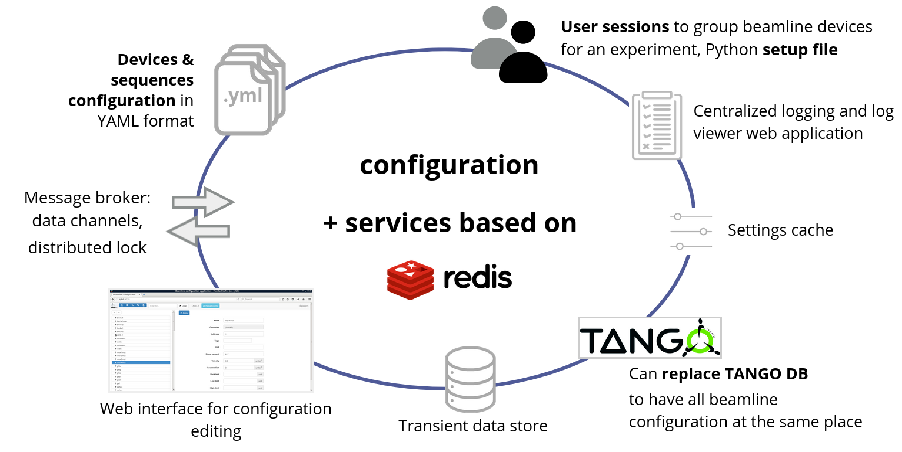

# Introduction to Beacon

*Beacon* is the server process, the corner stone of BLISS, since it
provides services, upon which essential features of BLISS are built:

* **configuration database**
    - text files in **YAML** format
        * Official YAML documentation: https://yaml.org
        * BLISS YAML documentation: [YAML in Beacon](beacon_db.md).
    - **complete description of an entire beamline
    experimental setup at a centralized place**: devices, sessions, etc.
* **configuration editor** web application
* *settings*, i.e. **runtime configuration properties**
* *channels*, to **exchange data between different BLISS objects instantiated in different processes**
* **distributed lock management**, to be able to lock and release resources for a particular Beacon client
* **publishing of data produced during scans**, for online data analysis or visualisation

Beacon relies on [*Redis*](https://redis.io) for most of those services. Redis
is an open source, in-memory data structure store, used as a database, cache and
message broker.

In addition, Beacon can be used as a **TANGO database-compatible server**,
storing TANGO configuration information in Beacon YAML files.

## Beacon services overview

!!! note
    Many BLISS features depend on Beacon. In practice it is not possible to use
    BLISS without a Beacon server.
