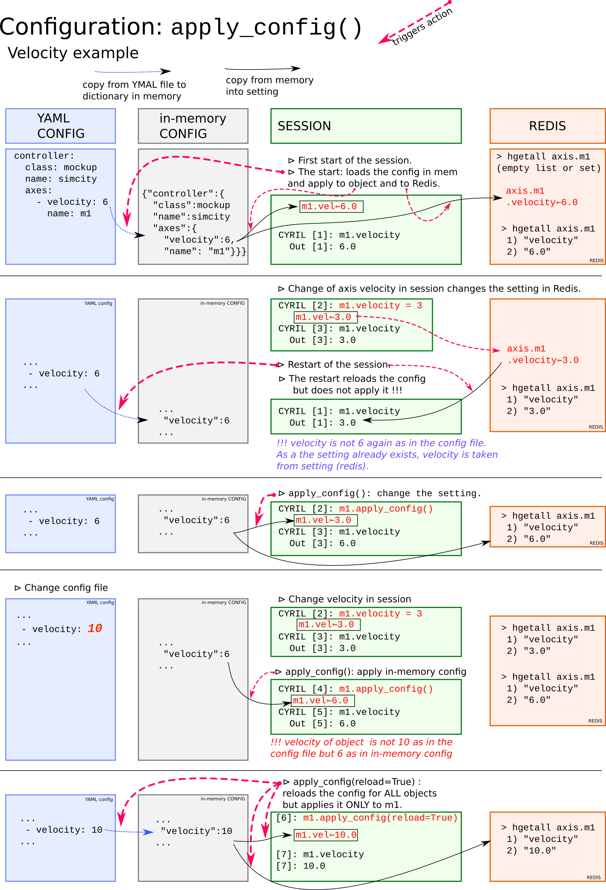

The path specified with `--db_path` on the beacon server command line
points to the root directory of the **configuration database**.

Beacon uses plain text files in [YAML](http://yaml.org/) format (with `.yml`
extension) to describe the set of objects representing a BLISS system.
The idea is to have **a centralized configuration database per beamline**.

!!! info
    YAML has been chosen because the standard native types (list,
    dictionary, numbers, unicode strings...) can be easily mapped to Python
    equivalents. It handles comments (contrary to JSON) and is
    optimized for human-readability (contrary to XML).

Beacon goes all over the configuration database directories, and builds
an internal representation of the objects that are defined in YAML
mapping nodes from the files. Ultimately this structure is flattened and
exposed as a Python dictionary with key-value pairs, keys being object names
and values being the corresponding configuration information.


## YAML items

A *YAML item* is a key-value pair, using `key: value` syntax. A *YAML mapping*
is a set of YAML items:

```yaml
# example YAML mapping node with 3 nodes
example_key: 1 #float value
example_key2: ['a', 'b', 'c'] # list value
example_key3: a string #string value
```

!!! info
    An [online YAML parser](http://yaml-online-parser.appspot.com/) can help finding YAML syntax errors.

## Beacon YAML references

In a Beacon YAML file, an already defined object can be referenced using the '$'
character as a prefix.

`$front_blade` refers to the object named `front_blade`.

As a real example, here are defined 'slits' ie. calculational motors based on
real axes. The references to the real axes are denoted by the `$` character.

```yaml
-
  controller:
    class: slits
    name: secondary_slits
    axes:
        -
            name: $ssf  <----------  A reference to existing 'ssf' axis,
            tags: real front  <----  has got the role of *real front* axis.
        -
            name: $ssb
            tags: real back
        -
            name: sshg <------------ The (new) virtual axis 'sshg',
            tags: hgap      <------- is the *horizontal gap* axis.
            tolerance: 0.04
```

## Definition of a Beacon object

A Beacon object is simply defined by creating a `name` item within a YAML mapping:

```yaml
# example BLISS object
name: my_bliss_object
param1: 42
param2: example string
```
!!! warning
    **name** items values must be unique for the whole configuration

Multiple objects can be defined in one file by using the YAML list notation `-`
to declare a sequence of mappings:

```yaml
# example of multiple objects
- name: object1
  param1: ...
  ...
- name: object2
  param1: ...
  ...
```

!!! note
    **Files are *transparent***

      - for each mapping defined in the configuration, **Beacon is only sensitive
      to the presence of a `name` key**
      - multiple files are just a convenient way of grouping related objects
      within a container


## Tree structure

### Directories

Contrary to files, directories play a role in the organization of the
configuration database. Beacon's **internal tree structure** mirrors the
file-system directories.

The following database files:

    beamline_configuration/
    └── directory_1
        └── file_1.yml

```YAML
# file_1.yml contents:
-
  name: object_1
  param: 42
-
  name: object_2
  param: 43
```

Produce the following internal representation:

```py
>>> from bliss.config.static import get_config
>>> config = get_config()  # loads YAML tree from Beacon server,
                           # and parse it to create a 'config' object
>>> config.pprint()

{ filename: None
  directory_1:
   [
    { filename: 'directory_1/file_1.yml'
      name: object_1
      param: 42
    },
    { filename: 'directory_1/file_1.yml'
      name: object_2
      param: 43
    }
   ]
}

>>> config.names_list # get existing names from config
['object_1', 'object_2']
```

Each YAML mapping is attached to a **parent node**. In this case, the parent
node of the two mappings defined in `file_1.yml` is `directory_1`.

### `__init__.yml` files

It is possible to associate mappings to a directory itself by adding a
`__init__.yml` file.

This can be used to define **global items**, with a scope limited to their
children:

    beamline_configuration/
    └── directory_1
        └── file_1.yml
        └── __init__.yml

```YAML
# __init__.yml file contents
my_global: hello
```

```python
>>> config.reload() # since the files changed, reload all config from server
>>> object_1 = config.get("object_1") #indexing by name (flattened dictionary)
>>> object_1.get_inherited("my_global")
hello
```

## SPEC vs BLISS

When restarting a SPEC session, all the config was reloaded and
parameters taken into account automatically.

For performance considerations, in BLISS:

* the config is reloaded:
    * on-demand: `config.reload()`
    * at the (re)start of a session
* the parameters **from config** of an object are taken into account:
    * at first start of a session
    * on demand with `obj.apply_config()`
* it is possible to mix both reload and apply with: `obj.apply_config(reload=True)`


## configuration behavior

Changing a configuration parameter, example of the velocity of a BlissAxis.




## Saving parameters

Example to save the velocity of an axis into YAML configuration file:

```python
DEMO [1]: m1.config.set("velocity", 9)
DEMO [2]: m1.config.save()
```


