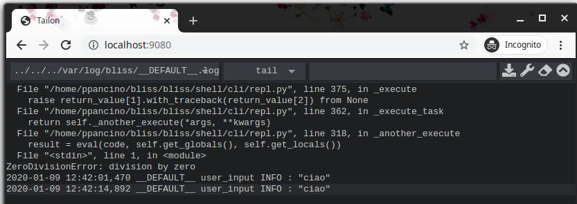

# Beacon Log Service

*Beacon* provides some log services that, if configured allows to:

- automatically save log messages to files
- gather messages from different clients working on the same session
- display log messages with a web application

To run these services you must run beacon with specific command line arguments, ([see beacon install](beacon_install.md#log-server-and-log-viewer)).

## Log Viewer application ##

If the Log Viewer option is activated you can use a Browser and connect to the beacon host computer (normally on port 9080) with `http://beacon_host:9080`.

Every session has a different file. When the file reaches a size limit a new empty one is created and the current one is renamed in the same folder. Only ten backups are keep and if needed the older one is overwritten.

## Log Server ##

If the Log Server option is activated Beacon listens for log messages that are sent automatically by Bliss Shell clients. All messages are saved to files, one different file per session; the default folder is `/var/log/bliss`.

The Log Server can be used without launching the Log Viewer as logs can be read using any other text editor software.

Under the hood there is a socket on Beacon Host normally listening on port 9030.
Every Bliss Shell on startup will interrogate Beacon to know if Log Server is active
and if so will forward log messages to it.  
