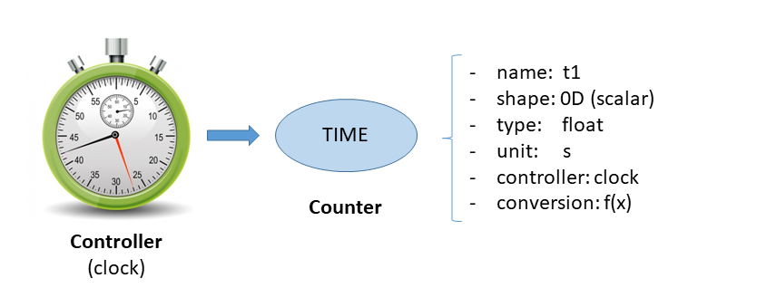
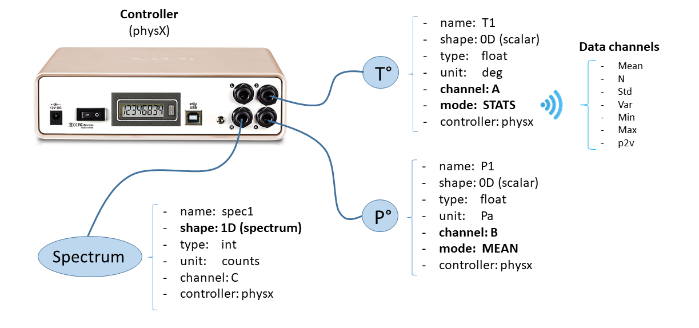
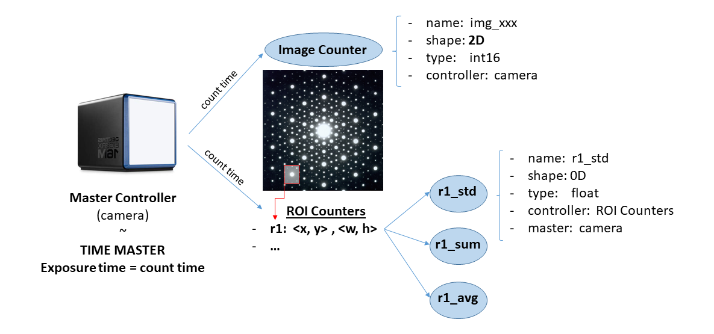
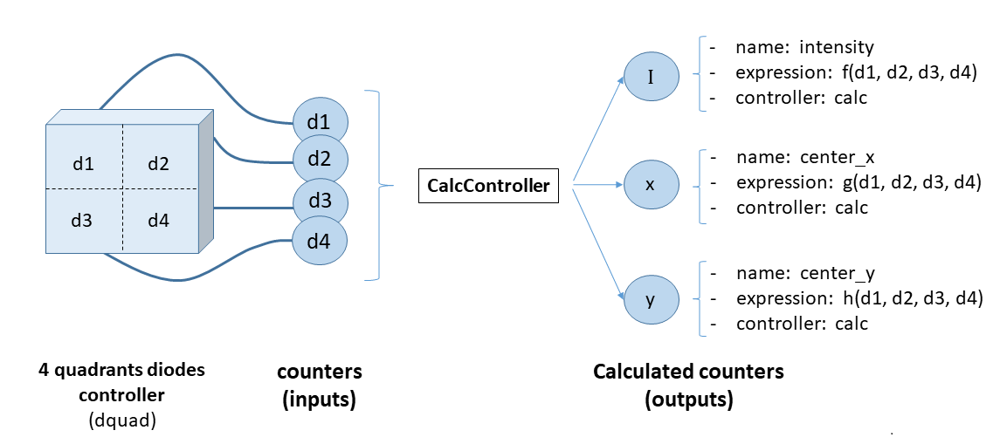
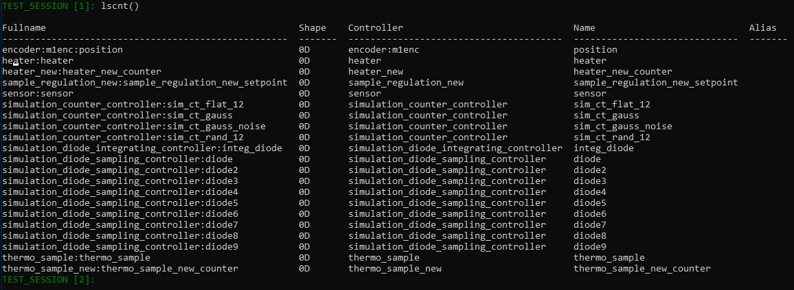

# Counters

In Bliss a counter is a python object that wraps the concept of an experimental
parameter which can be measured during a scan.

Counters are passed to the Scan object in order to select the experimental
parameters that will be measured or in other words the data that will be
produced.



* The counter is identified by a name
* The counter stores information about the shape of the associated data (0D, 1D, 2D).
* The counter stores information about the type of the associated data (float, int, ...).
* A counter is always attached to a controller which knows where and how to read
  the counter data: `data = controller.read( counter )`
* A conversion function can be attached to the counter.
* A unit can be specified for the associated data.


For example a counter could be:

* a scalar parameter like a temperature (0D)
* a spectrum of a multi-channel analyzer (1D)
* the image produced by a camera (2D)
* the statistics of a ROI in a image (N x 0D)


## Sampling counters

Sampling counters are designed for the measurement of instantaneous values.
The measurement is sampled as fast as possible during a given counting time.




Different modes of acquisition are available:

* `SINGLE`: performs a single measurement at the beginning of the counting time.
* `LAST`: returns the last measurement at the end of the counting time.
* `MEAN`: performs as many samples as possible and computes the averaged value.
* `STATS`: in addition to MEAN, produces the usual statistics (mean, N, std, var, min, max, p2v)
* `SAMPLES`: in addition to MEAN, produces individual samples as 1D array.
* `INTEGRATE`: produces the MEAN multiplied by the counting time.

```python
In   [9]: diode
Out  [9]: 'diode` counter info:
            counter type = sampling
            sampling mode = MEAN
            fullname = simulation_diode_sampling_controller:diode
            unit = None

In  [10]: diode.mode
Out [10]: <SamplingMode.SINGLE: 4>

In  [11]: diode.mode='MEAN'
In  [12]: diode.mode
Out [12]: <SamplingMode.MEAN: 1>

In  [13]: ct(1.0, diode)
diode =   12.75 (       12.75/s)

In  [14]: diode.statistics
Out [14]: Statistics(mean=12.75, N=92, std=55.95, var=3130.40, min=-99.0, max=100.0)
```


## Integrating counters

Integrating counters are designed for time integrated measurements and do not
offer any special counting modes.  They are bound to a "Time Master" controller
which propagates its `counting time` to the integrating counters that depend on
it.



```python
IN  [49]: lima1
Out [49]: Simulator - Generator (Simulator) - Lima Simulator

        Image:
        bin = [1 1]
        flip = [False False]
        height = 1024
        roi = <0,0> <1024 x 1024>
        rotation = rotation_enum.NONE
        sizes = [   0    4 1024 1024]
        type = Bpp32
        width = 1024

        Acquisition:
        expo_time = 0.1
        mode = mode_enum.SINGLE
        nb_frames = 1
        status = Ready
        status_fault_error = No error
        trigger_mode = trigger_mode_enum.INTERNAL_TRIGGER_MULTI

        ROI Counters: default
        Name  ROI (<X, Y> <W x H>)
        ----  ------------------
        r1    <0, 0> <100 x 200>

        BPM Counters:
        acq_time, intensity, x, y, fwhm_x, fwhm_y

```


## Calculation counters

A `CalcCounterController` takes multiple counters as inputs and produces
multiple calculated counters as outputs.

One calculated counter is defined by a name and a function that computes a new
value from the values of the input counters.

The calculation counters can be used in a scan as standard counters and the
dependencies on the input counters will be automatically managed.



```python

- plugin: bliss
  module: expression_based_calc
  class: ExpressionCalcCounterController
  name: calc_diodes

  inputs:
      - counter: $diode1
        tags: d1

      - counter: $diode2
        tags: d2

      - counter: $diode3
        tags: d3

      - counter: $diode4
        tags: d4

  constants:
       m : 0.5
       n : 0.8

  outputs:
      - name: intensity
        expression:  (d1 + d2 + d3 + d4 )

      - name: cen_x
        expression:  m*(d2-d1) + m*(d4-d3)

      - name: cen_y
        expression:  m*(d3-d1) + m*(d4-d2)


```


## Conversion function

In order to transform the value of a single counter, a ligther procedure than
calculation counters can be used. A **conversion function** can be dynamicaly
added to a counter.

Example usable in a session or in its setup:
```python

# Invert sign of a keithley counter:
kdiag.conversion_function = lambda x : -x

# Multiply cc12 counter by 3:
cc12.conversion_function = lambda x : 3*x
```


## Display the list of counters available in the session: `lscnt`



The `lscnt()` command displays all the counters that are currently available in
the Bliss session.

It shows the counters names, their associated controllers and the shape of the
associated data.

The `fullname` attribute of a counter is the concatenation of the counter name
and its controller name.


## Measurement groups

As it is not convenient to count on all counters of the session during a scan,
Bliss provides the `MeasurementGroup` object.

A measurement group is a sub-set of counters which can be defined through the
configuration files.

Several measurement groups can be defined and one can be chosen as the default.

Counters can be added/removed or enabled/disabled on the fly while in a Bliss
session.

```python

IN  [52]: MG1
OUT [52]: MeasurementGroup: MG1 (state='default')
            - Existing states : 'default'

            Enabled                                      Disabled
            -------------------------------------------  -------------------------------------------
            simulation_diode_sampling_controller:diode   heater_new:heater_new_counter
            simulation_diode_sampling_controller:diode2  sample_regulation_new:sample_regulation_new_setpoint
            simulation_diode_sampling_controller:diode3  thermo_sample_new:thermo_sample_new_counter

IN [53]: ct(1.0)

Tue Feb 18 17:04:36 2020

 diode =       1.6125 (      1.6125/s)
diode2 =       7.5125 (      7.5125/s)
diode3 =          8.5 (         8.5/s)

Out [53]: Scan(number=6, name=ct, path=)

```
