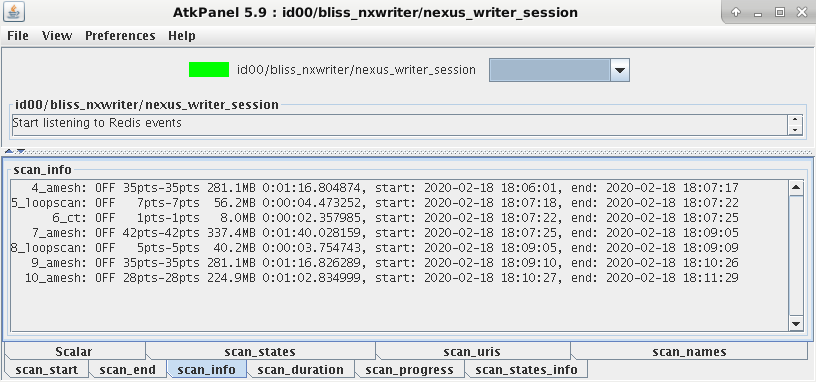
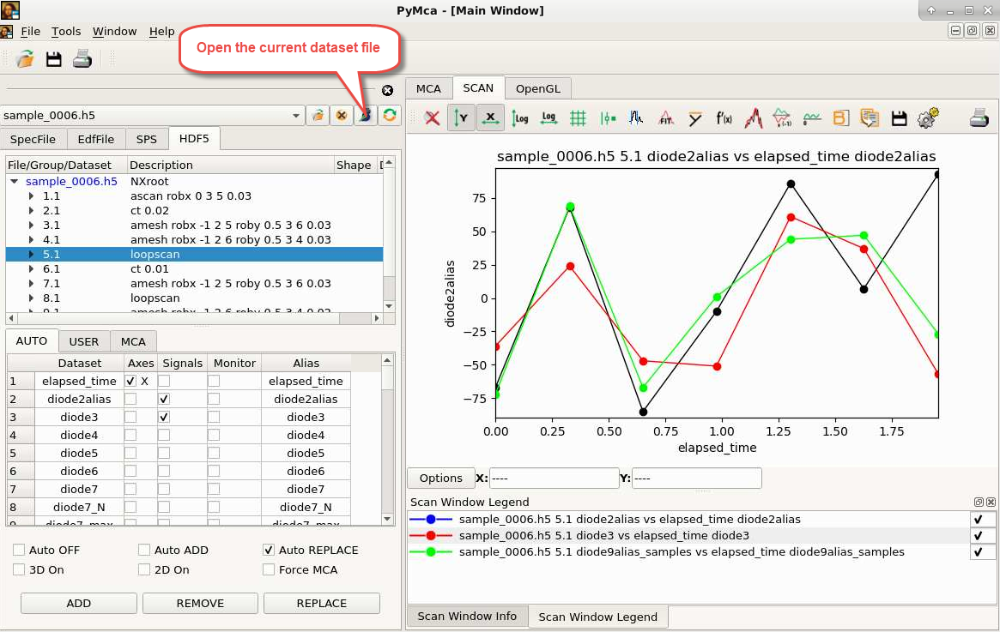
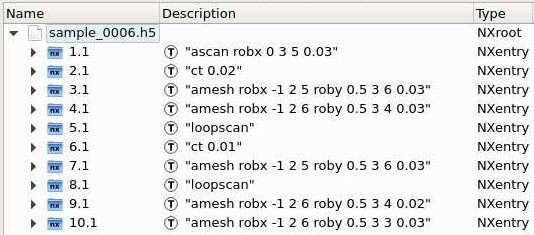
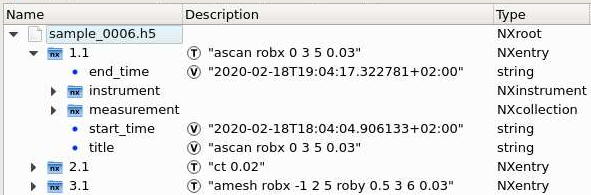
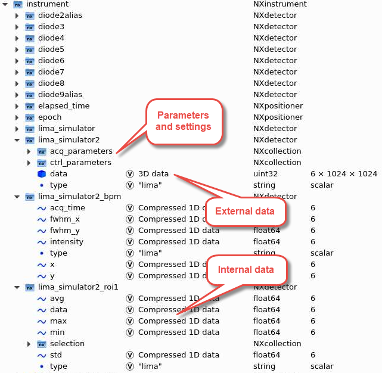
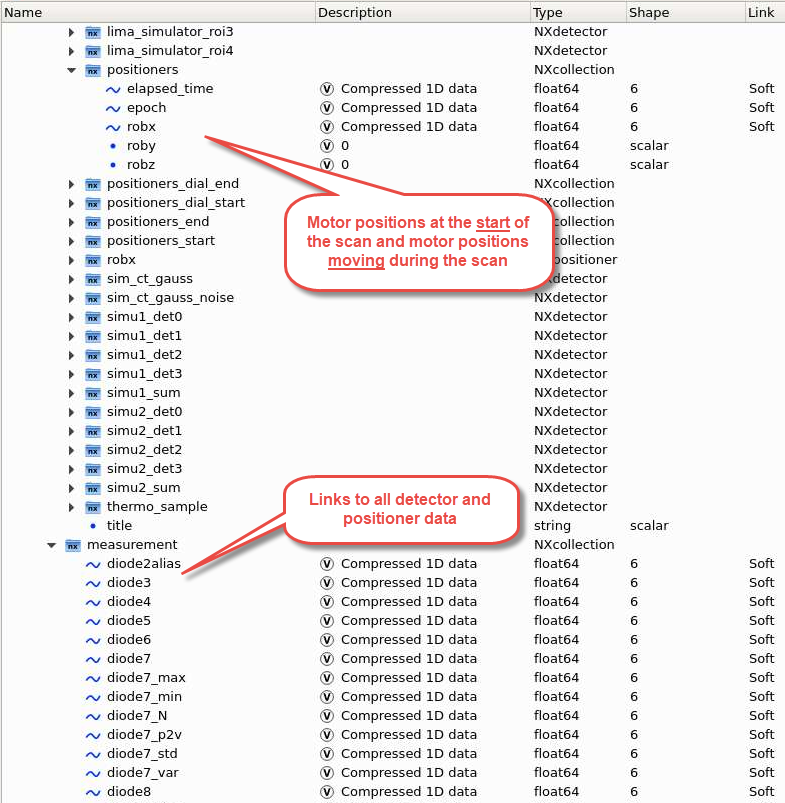

The [ESRF data policy](#esrf-data-policy) allows users to access their data and
electronic logbook at https://data.esrf.fr. The data is written in [Nexus
compliant](https://www.nexusformat.org/) HDF5 files in a specific directory
structure.

## Directory structure

Under the ESRF data policy the data directory is determined from: <span
style="color:red">proposal</span> name, <span style="color:green">sample</span>
name and <span style="color:blue">dataset</span> name. The data directory for a
user experiment is

<span style="color:red">/data/visitor/proposal</span>/beamline/<span
style="color:green">sample</span>/<span style="color:green">sample</span>\_<span
style="color:blue">dataset</span>/

### Proposal

Change *proposal* name with the command `newproposal()`

```python
DEMO  [1]: newproposal("blc123")
Proposal set to 'blc123'
Data path: /data/idxy/inhouse/blc123/idxy/sample/sample_0001

DEMO  [2]: newproposal("hg123")
Proposal set to 'hg123'
Data path: /data/visitor/hg123/idxy/sample/sample_0001
```

The root directory is determined from the *proposal* name (can be configured)

 * user experiment: <span style="color:red">/data/visitor/proposal</span>
 * inhouse (starts with *blc* or *ih*): <span style="color:red">/data/idxy/inhouse/proposal</span>/
 * test (starts with *test*, *temp* or *tmp*): <span style="color:red">/data/idxy/tmp/proposal</span>

When no *proposal* name is specified you get the default beamline proposal name
of the month (in this example February 2020 at beamline *idxy*)

```python
DEMO  [3]: newproposal()
Proposal set to 'idxy2002'
Data path: /data/idxy/inhouse/idxy2002/idxy/sample/sample_0001
```

The default beamline proposal is also accessible through https://data.esrf.fr
and comes with an electronic logbook. This is not the case for test proposals.

### Sample

Change *sample* name with the command `newsample()`

```python
DEMO  [4]: newsample("treated_cells_1_4")
Sample set to 'treated_cells_1_4'
Data path: /data/visitor/hg123/idxy/treated_cells_1_4/treated_cells_1_4_0001
```

### Dataset

Change *dataset* name with the command `newdataset()`

```python
DEMO  [5]: newdataset("area1")
Dataset set to 'area1'
Data path: /data/visitor/hg123/idxy/treated_cells_1_4/treated_cells_1_4_area1
```

When no *dataset* name is specified, datasets are numbered (unique within a
sample)

```python
DEMO  [6]: newdataset()
Dataset set to '0005'
Data path: /data/visitor/hg123/idxy/treated_cells_1_4/treated_cells_1_4_0005
```

## Data structure

Within the directory of a *dataset* you can find the main [Nexus
compliant](https://www.nexusformat.org/) HDF5 file

<span style="color:red">/data/visitor/proposal</span>/beamline/<span
style="color:green">sample</span>/<span style="color:green">sample</span>\_<span
style="color:blue">dataset</span>/<span style="color:green">sample</span>\_<span
style="color:blue">dataset</span>.h5

All scan data that belongs to the *dataset* is accessible through this one file,
although some detectors (for example all 2D detectors) actually save their data
in separate files.

### Data writing

A TANGO device referred to as the *[Nexus writer](dev_data_nexus_server.md)*
saves all data produced by BLISS. Data saving can be monitored through this
device:



### Accessing data

The ESRF Data Analysis Unit provided two main tools to visualize generic Nexus
data:

* silx view
* pymca


#### Silx view
```bash
silx view sample_dataset.h5
```

Silx view can be called directly from a BLISS shell via `silx_view()`
function. It points then on the last scan's data file.

!!! warning
    Do not use a silx versions older than 0.12.0

BLISS locks the *dataset* file *<span style="color:green">sample</span>\_<span
style="color:blue">dataset</span>.h5* during scans. If other applications have
locked the file (which is the default behaviour when opening HDF5 files) BLISS
cannot write to it and scans will be prevented from starting. Tools like *silx*
and *pymca* do not lock the file and are able to visualize its content without
disturbing ongoing scans.

#### PyMca

```bash
pymca sample_dataset.h5
```

Provides easy access to positioner and detector data for plotting.

PyMca can be launched directly from a BLISS shell via `pymca` function. It
points then on the last scan's data file.




### Nexus format

The *dataset* file *<span style="color:green">sample</span>\_<span
style="color:blue">dataset</span>.h5* contains one entry for each scan. Using
the *Silx* viewer it looks like this:



A scan entry has two subsections by default: *instrument* (for positioner and
detector data/metadata) and *measurement* (links to all data under
*instrument*). Additional subsections can appear when defining plots, scan
notes, sample description and application definitions.



The *instrument* section contains groups of data and metadata for detectors and
positioners:



The *measurement* group together with the *positioner* group under *instrument*
has all links to all data and motor positions at the start of a scan:




## Custom metadata

BLISS provides metadata for detectors but if something is missing, there are two
mechanisms to add custom metadata. The first is through user notes:

```python
DEMO [1]: s = loopscan(10,0.1,run=False)
DEMO [2]: s.add_comment("This is a comment")
DEMO [3]: s.add_comment("This is another comment")
DEMO [4]: s.add_comment("And another one")
DEMO [5]: s.run()
```

The second is for more complicated metadata:

```python
DEMO [1]: from bliss.scanning.scan_meta import get_user_scan_meta
DEMO [2]: h = get_user_scan_meta()
DEMO [3]: h.sample.set("name", {"name": "Hematite", "chemical_formula": "Fe2O3"})
```

When adding functions, metadata will be generated at the start of each scan:

```python
DEMO [1]: from bliss.scanning.scan_meta import get_user_scan_meta
DEMO [2]: h = get_user_scan_meta()
DEMO [3]: def generate_sample_description(scan):
            ...
            return description

DEMO [4]: h.sample.set("name", generate_sample_description)
```
