## What is Flint

* Flint is not silx-view
* Flint is not PyMca
* Flint have to replace Spec GUI and Oxidis

Flint is a GUI to display raw data generated by BLISS, mostly to help beamline
alignment.

It also provides graphic interaction for user scripts.

## Demo session

The BLISS demo session can be used as a show case for Flint.

This script launches simulation devices together with beacon and Redis.

```shell
./demo/start_demo_servers.py
```

## Starting Flint

If the session is configured for (which is the case for the demo session),
Flint will be started by the invocation of any standard scan command.

It can be enabled this way:
```python
SCAN_DISPLAY.auto = True
```

## Overview

The demo session provides simulated slits coupled with a camera already setup
with a ROI.

We can open the slits and scan the beam this way:

```python
mv(slit_vertical_gap, 1)
ascan(slit_vertical_offset, -5.0, 5.0, 20, 0.1, beamviewer.roi_counters)
```

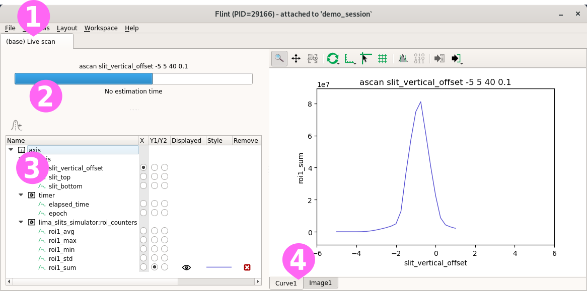

Flint provides a ➊ *Live screen* containing various widgets.

A widget ➋ provides the current scan progress, a ➌ *property widget* to
customize the content of the plots, and ➍ many others are provided to display
scan data.

## Curve

The previous scan displays the following result.

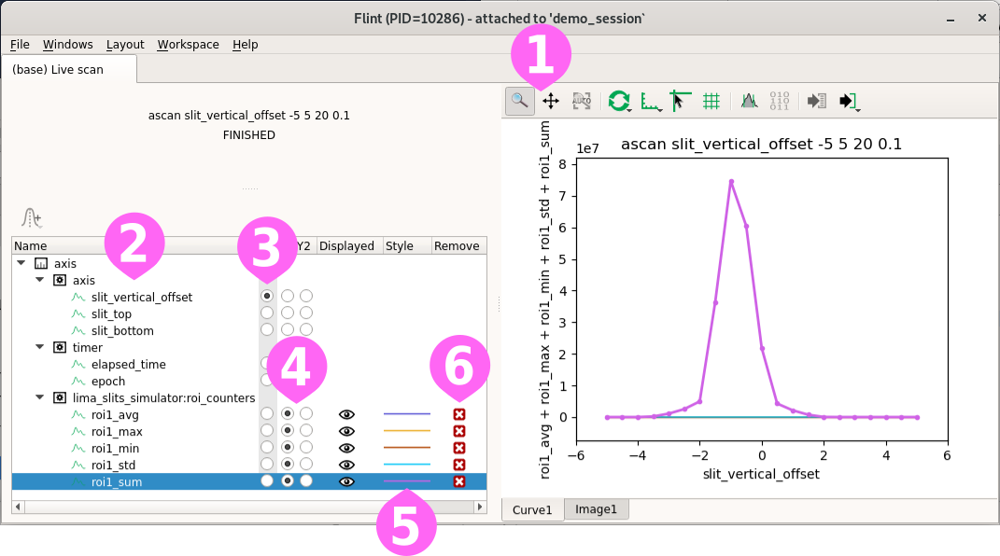

The curve widget provides a ➊ toolbar to interact with the plot. It contains
tools to:

* zoom and pan the view
* customize the refresh rate of the data
* change the axes configuration
* plus other specific actions

The property view provides tools to custom items displayed by the plot. Items
are identified by there ➋ names (usually the name of the counter), the ➌ x-axis
can be selected, the data can be ➍ displayed using the left or right y-axis.

The ➎ style for each curves is automatically picked depending on the content of
the scan. For curves, this can not be customed.

This items can be ➏ removed from the plot. A removed item is still available
and can be displayed back. But no style is allocated for it.

### Manual selection

The curve widget can be configured to display or hide data acquired by the scan.

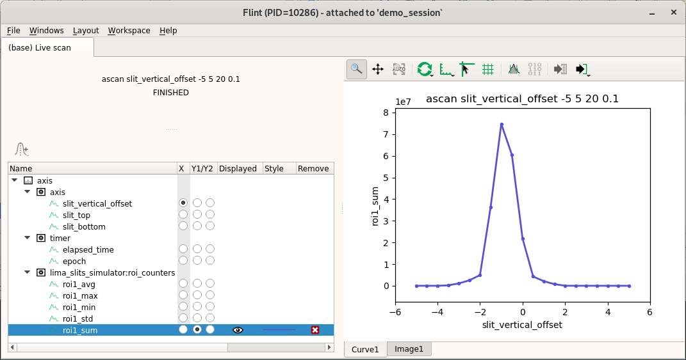

This setup will be reused and be unchanged while the same devices are scanned
(technically while the scanned acquisition chain is the same as the previous
displayed scan).

### Refinment of the scan

So values of the scan can be tuned, like the motor range or the number of points,
without losing the customed selection.

```python
ascan(slit_vertical_offset, -4.0, 2.0, 40, 0.1, beamviewer.roi_counters)
```

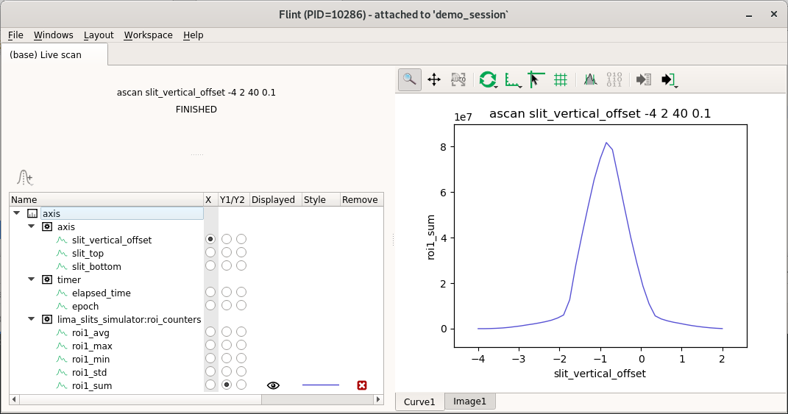

### Gaussian, derivative, and markers

Flint provides few helpers to annotate the displayed curves.

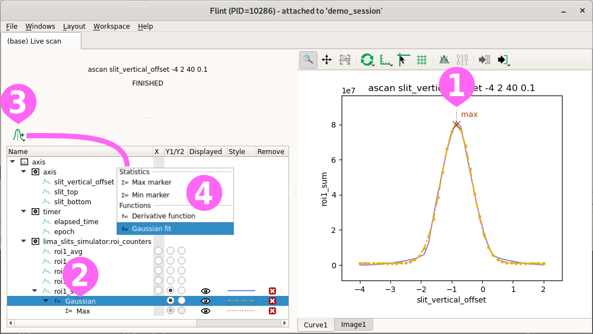

Computed items ➊➋ can be created, and a data processed will be applyed and
displayed based on a selected curve.

A tool ➌ is provided to create computed markers or functions to the actual
selected item.
It provides ➍ few features like markers for the location of the maximum or minimum,
a gaussian fit, or a derivative function.

As for curve selection, this information will persist only while the same devices
are scanned.

### Command-line selection

From BLISS, two mechanisms are also provided to select a specific curve.

Using `SCAN_DISPLAY` before a scan. It describes that the scan has to display
a specific data. Others will still be acquired, but only the ones named here
will be displayed by default. This information became part of the scan.

```python
SCAN_DISPLAY.init_next_scan_meta(["beamviewer:roi_counters:roi1_avg"])
ascan(slit_vertical_offset, -4.0, 2.0, 40, 0.1, beamviewer.roi_counters)
```

Using `plotselect` after the start and the first display of the scan. It interacts
with an existing plot using the same behaviour as what you could do with the
mouse.

```python
ascan(slit_vertical_offset, -4.0, 2.0, 40, 0.1, beamviewer.roi_counters)

...

plotselect("beamviewer:roi_counters:roi1_avg")
```

## Scatters

The demo session provides a simulation diode connected to `sy` and `sz` motors.
This can be used to do meshes.

```python
amesh(sy, -.75, .75, 30, sz, -.75, .75, 30, .001, fluo_diode)
```

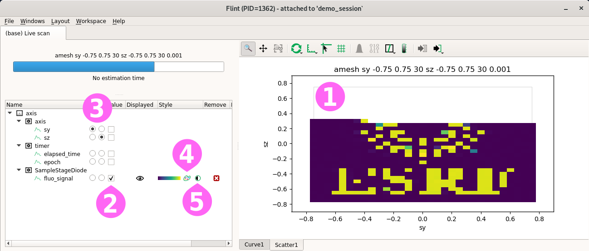

The default plot for meshes uses a ➊ scatter plot, with an image based rendering.

The property widget allows to ➋ select the main diode to display and the data to
use as ➌ axes. It also provide dialog to ➍ custom the rendering and to ➎ edit
the colormap level.

Few other ➍ rendering are provided, like point based, or solid interpolation.
Flint also supports fix rendering, to display for example points on top of a
solid rendering.

### Scatters with motor displacement

The demo session provides motor encoders configured to follow `sy` and `sz` but
including noice. THis can be used to simulate displacements in the scans.

```python
amesh(sy, -.1, .1, 20, sz, -.3, .3, 30, .001, fluo_diode,
                                              sy.encoder,
                                              sz.encoder)
```

Instead of the motors, the encoders can be selected as axes.

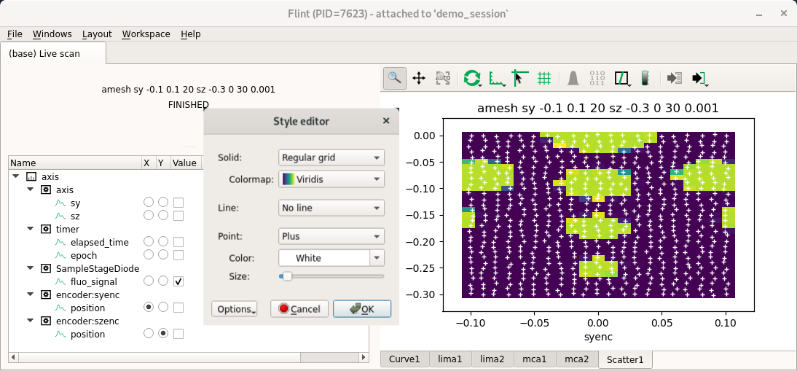

The *regular grid mode* is based on an image, and is then very fast to render.
An overlay with the location of the points can be added to check the
displacements.

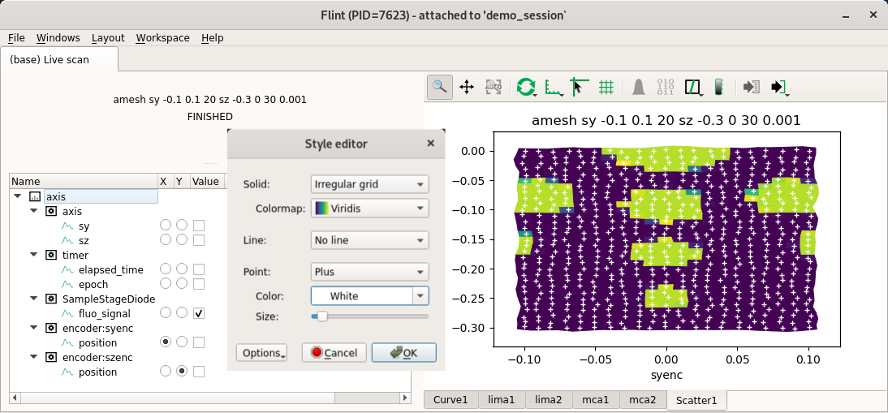

The *irregular grid mode* is based on mesh computed around the mesured points.
This rendering is much slower without OpenGL, but can help to notice bigger
displacements. The overlay can also be added.


### Curves from scatter data

The curve widget can also be used to display meshes.

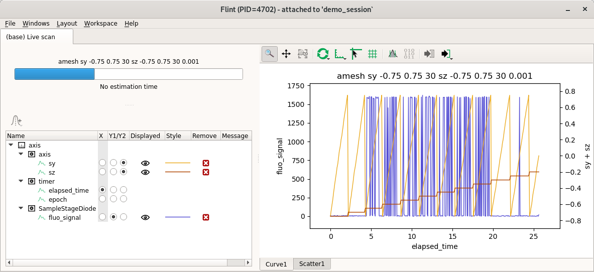

It presents the values of data acquisition according to the time.


## MCAs

Flint provides a basic view of the MCAs.

A single scan can involve many widgets for MCAs.
The policy is to use a single and always the same widget per detector.

```python
timescan(1, lima_tomo_simulator)
```

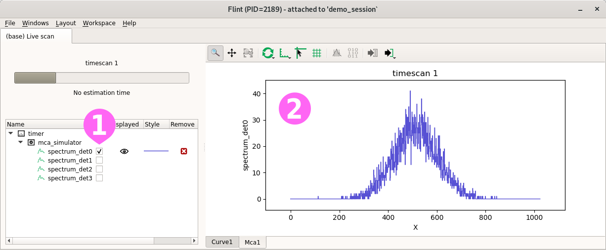

The configuration dialog allow to ➊ select one or many MCAs to display.

For now, only the ➋ raw data of the MCAs (count per channels) is displayed.

Few things could also be provided like plots in energy, but Flint is not
targetted to replace PyMca.

## Images

Images are the last supported kind of data.

A single scan can involve many widgets for MCAs.
The policy is to use a single and always the same widget per detector.

The demo session provides a tomography projection example.

```python
timescan(1, lima_tomo_simulator)
```

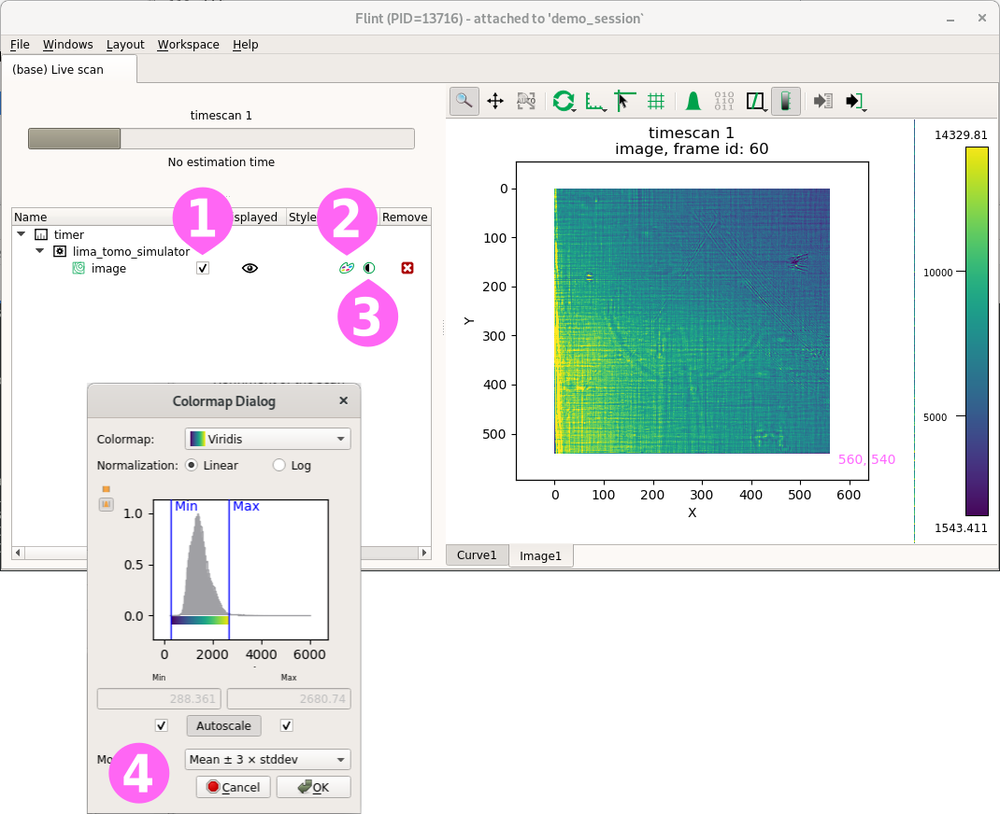

We can distinguish a diatom on a top of a needle.

The property widget allow to ➊ select the displayed image if there is many.
It also provides dialog to ➋ custom the default used colormap and to ➌ edit
the colormap level.

### Editing Lima ROIs

Lima ROIs can be edited with `edit_roi_counters` command. This BLISS command is
based on a Flint programming interface which also can be used for user scripts.

```python
edit_roi_counters(lima_tomo_simulator, 0.1)
```

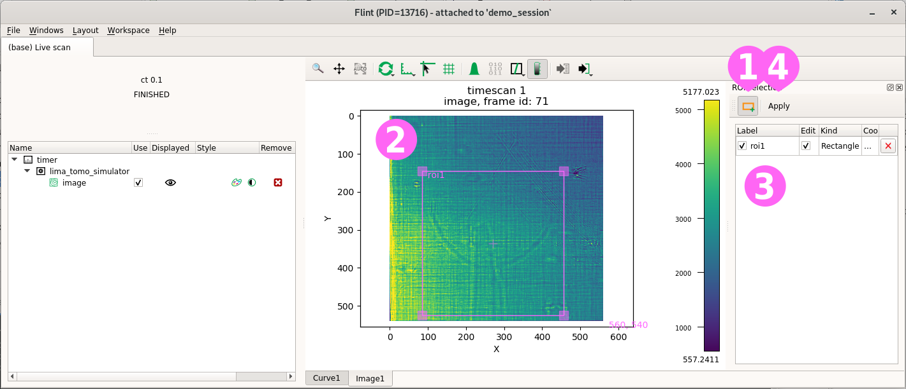

A tool ➊ have to be selected to switch the interaction to 'ROI mode'. This allows to
create ➋ new rectangle ROIs into the image. A list of available ROIs is displayed
and can be used to edit or remove ROIs. Finally a ➍ button have to be
validated to apply the new ROIs.

The selection can be cancelled using `Ctrl-c` in the BLISS shell.

This ROIs can now be scanned.

```python
loopscan(20, 1, lima_tomo_simulator.counters.roi2_avg)
```

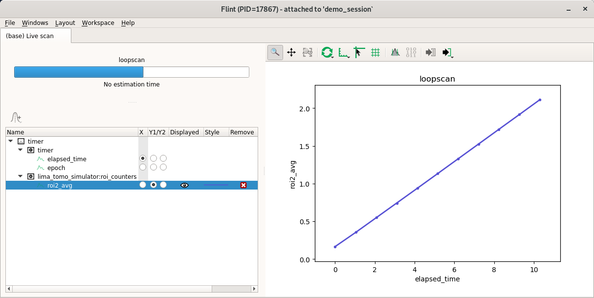
