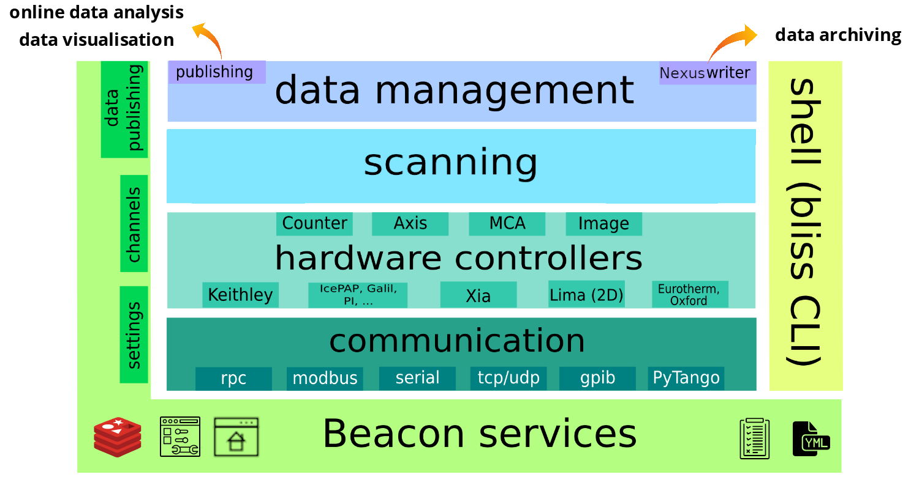

# BLISS architecture overview



The system has 6 big components:

* **Beacon**, the server that brings services for the whole system
* **communication objects** to deal with various protocols
* **hardware controllers** with ad hoc frameworks that can handle different kinds of equipment
* **scanning engine**
    - continuous scans as first-class citizens
    - acquisition chain
* **data management**
    - publishing, for online data analysis and data visualization (**Flint** tool)
    - **Nexus Writer**, tool from Data Analysis Unit that archives data in Nexus HDF5 format
* **BLISS shell**
    - powerful command line interface for users


## Beacon

BLISS is built on top of [Beacon](beacon.md), which provides essential services for
the whole system:

* beamline homepage
* configuration files hosting & housekeeping
* configuration editor
* log viewer
* data management, through the use of [Redis](http://redis.io)
    - publishing of data produced during scans, for online data analysis, visualization or saving
    - settings, i.e. runtime configuration properties
    - channels, to exchange data between different BLISS objects in different processes

### Beamline homepage

Beacon offers a homepage to get access to the beamline web applications. On ESRF
beamlines, a web server is configured to display the homepage when pointing a
web browser to the main beamline computer.


### Configuration

Beacon serves configuration files in [YAML format](http://yaml.org).

YAML has been chosen because the standard native types (list, dictionary, numbers, unicode strings...) can be easily mapped to Python equivalents, it handles comments (contrary to JSON), and also because it is human-readable (contrary to XML).

The set of YAML files provide a simple, yet flexible mechanism to describe devices within a BLISS system.

#### YAML files


Objects are identified in the system by an unique **name**. BLISS reserves the YAML key *name* as the entry point for an object configuration.
When loading static configuration data, Beacon goes all over the configuration database directories, and builds an internal representation of the objects that are defined in YAML mapping nodes from the files. Ultimately this structure is flattened and exposed as a Python dictionary with key-value pairs, keys being object names and values being the corresponding configuration information.

The following YAML lines show an example of the configuration of a movable axis (motor) called `rotY`:

```yaml
# motion.yml    
class: IcePAP
host: iceid311
plugin: emotion
axes:
- name: rotY
  address: 3
  steps_per_unit: 100
  acceleration: 16.0
  velocity: 2.0
```

The information contained in the YAML files is interpreted when the corresponding object is loaded. This interpretation depends on the type of object, in order to create the expected Python object. BLISS has **configuration plugins**, which can be used to extend supported object types. In the example above, the `emotion` (ESRF Motion) plugin is used to interpret the contents of the YAML file, in order to instantiate an `Axis` object.

#### Configuration editor

The configuration editor allows to browse through YAML files, and to edit them.


### Log viewer

Beacon centralizes log messages from BLISS applications. A simple web application allows to
look at the log messages.


## Sessions

A BLISS session represents an experimental setup associated with experiment control sequences.

A session has:

* a list of objects from configuration
* a setup file

Sessions can be nested, by specifying *include-session* in the session YAML configuration file.

Sessions are loaded by the [BLISS shell](bliss_shell.md), giving access to experimental setup and associated procedures within an integrated command line interface.


