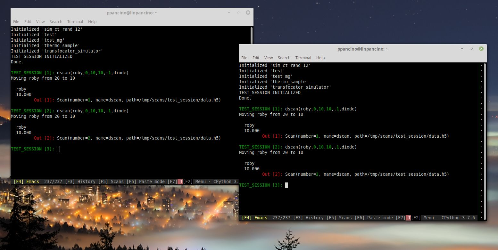

## Sessions

!!! note

    On an ESRF beamline computer, the ESRF BLISS environment has to be activated prior to start BLISS shell:
    
    - `. blissenv` to enter conda bliss stable
    - `. blissenv -d` to enter conda bliss unstable version for developers
    
From a terminal, after launching a BLISS environment, type:

 - `bliss -h` or `bliss --help` to display all command line options

 - `bliss -S` to display sessions
 - `bliss -s sessionname` to launch a specific session

```shell
(bliss) user@beamline:~/$ bliss --help
Usage: bliss [-l | --log-level=<log_level>] [-s <name> | --session=<name>] [--no-tmux] [--debug]
       bliss [-v | --version]
       bliss [-c <name> | --create=<name>]
       bliss [-D <name> | --delete=<name>]
       bliss [-h | --help]
       bliss [-S | --show-sessions]
       bliss --show-sessions-only

Options:
    -l, --log-level=<log_level>   Log level [default: WARN] (CRITICAL ERROR INFO DEBUG NOTSET)
    -s, --session=<session_name>  Start with the specified session
    -v, --version                 Show version and exit
    -c, --create=<session_name>   Create a new session with the given name
    -D, --delete=<session_name>   Delete the given session
    -h, --help                    Show help screen and exit
    --no-tmux                     Deactivate Tmux usage
    --debug                       Allow debugging with full exceptions and keeping tmux alive after Bliss shell exits
    -S, --show-sessions           Display available sessions and tree of sub-sessions
    --show-sessions-only          Display available sessions names only
```

### What is a session?

To make it easy using a session we have some object automatically created
and imported and some startup code that is executed. This can be customized.

## Bliss Shell Usage

- it is a python shell, with all capabilities. 

```python
BLISS [2]: 3+2
  Out [2]: 5

BLISS [3]: a=3+2
BLISS [4]: def double(num):
      ...:     return num * 2
BLISS [5]: double(3)
  Out [5]: 6
BLISS [6]: b=_5
BLISS [7]: b
  Out [7]: 6
```

### First steps on Bliss Shell

- use arrows to select previous commands
- use `_n` underscore line number to access the output of the shell
- `Ctrl-c` to clear the content of a line
- `Ctrl-r` and start typing to perform a search on previous commands
- `Ctrl-o` to execute multiline commands (or simply go to the end and press enter)
- History with F3 (move with arrows, select with space, confirm with Enter)
- Get informations about an object or function:
    - writing the name of the object, (E.G. type `SCAN_SAVING`)
    - for functions use `help`, (E.G. `help(ct)`)
- more info on [command line usage](shell_cmdline.md)

### Command Completion
  - proposes the end of the command while you are typing, `Ctrl+space` when it does not show
  - gives informations on functions while typing (E.G. ascan(roby, 0, 10, 1, .1, diode))

### Typing Helper
  - helps the transition from spec syntax to python adding parentesis and commas
  - I don't want the help? F7 to disable it

### How to exit Bliss Shell?
  - `Ctrl-d` or `exit()`
  - `Ctrl-b + d` to detach from a session (will be still running)

## Tmux


- It is a Terminal Multiplexer that allows multiple terminals
  in the same Window
- Allows multiple people to connect to the same Bliss session
- Access scan data page with F5

### Copy and Paste

- Copy mode: Scroll the mouse, select in yellow, exit with `Enter`, `q`, `right-click` or
  scroll down with mouse to the beginning.
- Multiline Copy: Start from the bottom and go up with the mouse wheel, or use `Page-Up`
- Copy a single word with double click
- Copy a line with triple click
- Properly format multiline code pressing `Shift` while pasting or using paste mode (F6)
