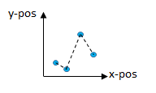

# Standard scans

Bliss provides a wide choice of standard scans for step by step scanning procedures.


| scan name | number of steps  |    motor axes  | specifications | representation |
| --------- | ---------------- | -------------- | -------------- | -------------- |
|    **ct**     |       1          |        0       | time           |  |
|  **loopscan** |       N          |        0       | time           |  |
|  **timescan** |      INF         |        0       | time           | |
|  **ascan**    |       N          |        1       | position, absolute, fixed step size |  |
|  **a2scan**   |       N          |        2       | position, absolute, fixed step size |  |
|  **anscan**   |       N          |        n       | position, absolute, fixed step size | |
|  **dscan**    |       N          |        1       | position, relative, fixed step size | |
|  **d2scan**   |       N          |        2       | position, relative, fixed step size | |
|  **dnscan**   |       N          |        n       | position, relative, fixed step size | |
|  **amesh**    |      N*M         |        2       | position, absolute, fixed step size | |
|  **dmesh**    |      N*M         |        2       | position, relative, fixed step size | |
| **pointscan** |       N          |        1       | position, absolute, list of coordinates | |
| **lookupscan**|       N          |        n       | position, absolute, list of coordinates | |


### Running a scan

#### Create and start simultaneously (with data saving):
```python

ascan( axis, start, stop, steps, count_time, *counters)

```

#### Create then start (with data saving):
```python
s = ascan( axis, start, stop, steps, count_time, *counters,  run=False)
s.run()
```

#### Scan without data saving
```python
ascan( axis, start, stop, steps, count_time, *counters, save=False)
```


Note: By default, for all standard scans `run=True` and `save=True` except for the `ct()` scan which uses `save=False`.
If `save=True` the data is generated but not saved to file.


#### About the "*counters" arguments:

`*counters` is a python expression for a 'list of arguments' (not a python list of objects).    
It could be a mix of `MeasurementGroups`, `Controllers` and `Counters`.
If not provided, the default measurement group is used.


#### Examples

* Scan with one axis and the default measurement (with data saving)
```python
ascan( roby, 0, 10, 10, 0.1)
```

* Scan with a given measurement group (without data saving)
```python
ascan( roby, 0, 10, 10, 0.1, MG2, save=False)
```

* Scan with all counters of a counter controller
```python
ascan( roby, 0, 10, 10, 0.1, lima1)
```

* Scan with a measurement group + all counters of a counter controller + 2 other counters
```python
ascan( roby, 0, 10, 10, 0.1, MG1, lima1, diode4, diode5)
```


#### Scanning and monitoring data

The data produced by a scan are printed in a separated window which can be display by pressing `F5`.

```python
Scan 28 Wed Feb 19 14:29:51 2020  test_session user = pguillou
ascan roby 0 10 10 0.1

           #         dt[s]          roby         diode        diode2        diode3        diode5
           0             0             0        -18.25        -1.625            -6             5
           1      0.233016             1        -10.25          8.25        -8.125             5
           2      0.475228             2          19.5        -4.125       -10.875             5
           3      0.705884             3      0.571429       14.1429      -4.42857             5
           4        0.9408             4            10           -21         0.625             5
           5        1.1806             5            16          6.75         1.125             5
           6       1.42225             6         15.75        24.125             3             5
           7       1.66196             7         -1.75        -10.75        37.125             5
           8       1.90008             8       -36.625          12.5       -13.375             5
           9       2.13927             9          13.5        -19.25        -7.375             5
          10       2.36863            10        17.625          2.25       -32.875             5

Took 0:00:03.030388
```


#### Scanning, acquisition chain and data production

During the scan creation, all the counters that are passed are introspected in order to build the acquisition chain.
The acquisition chain is a kind of tree that reflects the hierarchy between the different involved objects.
The root of the tree is the top master. The top master will produce the triggers and propagate them along the branches of the tree.  
Each node of tree which has associated counters will start acquiring the data in parallel of the others while receiving the trigger from its parent node. 

```python
IN  [65]: ascan(roby,0,10,10,0.1,MG1,diode5, save=False)
Out [65]: Scan(number=28, name=ascan, path=)
IN  [66]: print(s.acq_chain._tree)
acquisition chain
└── axis
    └── timer
        ├── simulation_diode_sampling_controller
        ├── simulation_diode_sampling_controller
        └── simulation_diode_sampling_controller
```

