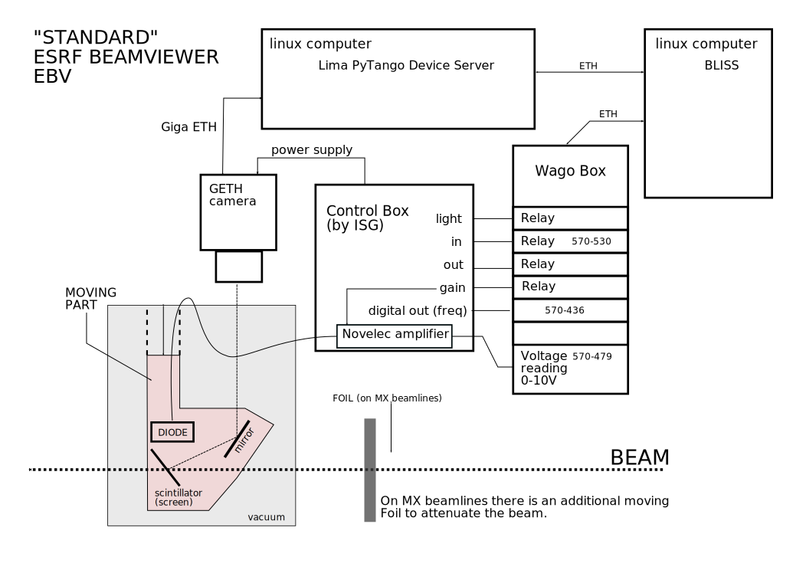

# Standard beamviewer (EBV: ESRF Beam Viewer)



see also: http://wikiserv.esrf.fr/bliss/index.php/Bvb

These beamviewers visualise the various types of x-ray beam (white, pink and
monochromatic) into the visible spectrum, using a scintillator, a camera and associated
software to provide the beam shape and relative power intensities. The maximum
accommodated beam size (or potential beam movement) is 10mm x 10mm for the standard
beamviewers.

ESRF "Standards" beamviewers (EBV) are composed by:

* a Control Box (ISG made)
* a fixed giga-ethernet basler camera+ lens
    * powered by the Control box
* an extractable head that can be moved in or out of the beam
    * pneumatic-mounted mirror+scintillator
    * scintillator
        * diamond for white beam
        * YAG for monochromatic beam
        * Energy dependent for pink beam
* a diode read by novelec module providing an output in frequency.
* a LED that can be swiched ON and OFF.
* on MX beamlines: a foil to attenuate beam

## Usage
Usage of an EBV is described here: [Beamviewer Usage](using_beamviewer.md).


## Control
Control is implemented through the Beamviewer Tango device server.

* EBV is controlled in BLISS via `tango_bpm` class from: `bliss/controllers/tango_bpm.py`
* This control is implemented throughthe *Beamviewer Tango
device server* (see: http://wikiserv.esrf.fr/bliss/index.php/Basler)


## Wagobox modules:

"standard" for 1 BVB:

* 750-436: 8-channel digital input; 24VDC, 3.0ms 1-conductor connection; low-side switching
* 750-530: 8-channel digital output; 24 VDC; 0.5 A
* 750-479: 2-channel analog input module (ADC)


## Configuration

BVB is controled via a Standard Lima Basler device server with the Beamviewer
plugin: http://wikiserv.esrf.fr/bliss/index.php/Basler

beamviewer plugin is installed with bpm-server package:
```
  Control
    Tango
      Server
        bpm-server
```

Wago Tango DS configuration:
```
Modbus/iphost: 160.103.XX.YY
       Protocol: TCP
       TCPTimeout: 1000
Wago/config: 750-436,bv1scr_in,bv1scr_out,bv1sled_on,bv1sgain_enab
             750-530,bv1out,bv1in,bv1ledon,bv1ledoff,bv1gain1,bv1gain2,bv1gain3,bv1gain4
             750-479,bv1curr
```

Wago Tango DS configuration for 2 BVB:
```
Wago/config:  750-436,bv2scr_in,bv2scr_out,bv2sled_on,bv2sgain_enab,bv3scr_in,bv3scr_out,bv3sled_on,bv3sgain_enab
              750-530,bv2out,bv2in,bv2ledon,bv2ledoff,bv2gain1,bv2gain2,bv2gain3,bv2gain4
              750-530,bv3out,bv3in,bv3ledon,bv3ledoff,bv3gain1,bv3gain2,bv3gain3,bv3gain4
              750-479,bv2curr,bv3curr
```


Beamviewer Tango DS properties:

* wago_ip: 160.103.XX.YY
* wago_index: position of wago controller
    * 0: only 1 BPM
    * 1: 1st BPM out of two controlled on the same wagobox
    * 2: 2nd BPM out of two controlled on the same wagobox
* has_foils: controls the intensity accessory (NB: note the '''s''')
    * 0: no foil (default)
    * 1: can insert/extract a foil
* acquisition_rate: 
* port: 
* beam_x:
* beam_y: 
* ccd_ip: 

