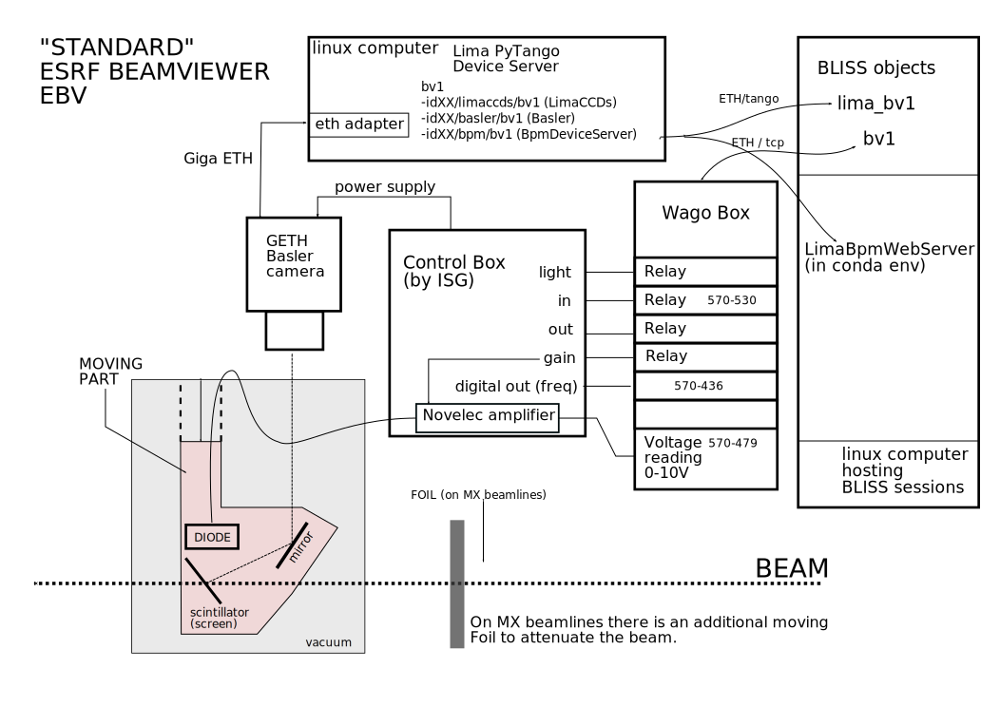

# Standard beamviewer (EBV: ESRF Beam Viewer)



see also: http://wikiserv.esrf.fr/bliss/index.php/Bvb

These beamviewers visualise the various types of x-ray beam (white, pink and
monochromatic) into the visible spectrum, using a scintillator, a camera and
associated software to provide the beam shape and relative power
intensities. The maximum accommodated beam size (or potential beam movement) is
10mm x 10mm for the standard beamviewers.

ESRF "Standards" beamviewers (EBV) are composed by:

* a Control Box (ISG made)
* a fixed giga-ethernet basler camera+lens
    * powered by the Control box
* an extractable head that can be moved in or out of the beam (called *screen*)
    * pneumatic-mounted mirror+scintillator
    * scintillator
        * diamond for white beam
        * YAG for monochromatic beam
        * Energy dependent for pink beam
* a diode read by novelec module providing an output in frequency.
* a LED that can be swiched ON and OFF.
* optionnaly a foil to attenuate beam (on MX beamlines)

## Usage
Usage of an EBV is described here: [Beamviewer Usage](using_beamviewer.md).


## Control

The **EBV** bliss object controls the wago box (screen, led, foil, diode), the basler camera and the associated BPM counters computed on images. 

## Wagobox modules

Two type of wago box exist:

* 1-EBV wagobox able to control only one EBV :
    - *750-436* : 8-channel digital input; 24VDC
    - *750-530* : 8-channel digital output; 24 VDC; 0.5 A
    - *750-479* : 2-channel analog input module (ADC)

* 2-EBV wagobox able to control up to 2 EBV:
    - *750-436* : 8-channel digital input; 24VDC
    - *750-530* : 8-channel digital output; 24 VDC; 0.5 A
    - *750-530* : 8-channel digital output; 24 VDC; 0.5 A
    - *750-479* : 2-channel analog input module (ADC)

If the EBV has a foil to attenuate beam (MX case), two additionnal wago modules
are added:

- *750-436* : 8-channel digital input; 24VDC
- *750-504* : 4 Channel Digital Output


## Configuration

#### Configuration example
```
plugin: bliss                 (mandatory)
name: myebv                   (mandatory)
class: EBV                    (mandatory)
modbustcp:                    (mandatory)
    url: wcidxxa              (mandatory)

single_model: False
has_foil: False
channel: 0
counter_name: mydiode      

tango_url: idxx/limaccds/bv1

```

`modbustcp / url` defines the wago control box host as in standard wago
controller.

`tango_url` defines the `limaccds` Tango device server of associated Basler camera.

#### Configuration optionnal parameters

* `single_model`
    - default value : `False`
    - define which model of wago is used : if `single_model` is `True`, the wago
      box is a 1-EBV model otherwise it is 2-EBV model. Note that some 2-EVB
      models can be installed even if it controls only one BVB.

* `has_foil`
    - default value : `False`
    - define if a foil attenuator can be controlled or not

* `channel`
    - default value : `0`
    - in case of a 2-EBV wago box model, defines which EBV is used : 1st one or
      2nd one.

* `counter_name`
    - default value : `diode`
    - counter name of diode current reading when EBV is used in counts/scans

* `tango_url`
    - default value : `None`
    - if provided, the EBV will be extended with the BPM powers (Bpm measurements and BeamViewer Live display)


## EBV and BPM counters

The BPM counter controller is accessible via the EBV object in Bliss.

```python
BLISS [51]: myebv.bpm 
  Out [51]: Bpm [id00/limaccds/simulator2]

                exposure : 1.0 s
                size     : [1024, 1024]
                binning  : [1, 1]
                roi      : [0, 0, 1024, 1024]
                flip     : [False, False]
                rotation : NONE

```

The EBV owns all BPM counters and the diode counter.
```
BLISS [51]: ct(1, myebv)                                                                                          
Tue Mar 31 16:43:52 2020

 acq_time = 1.038032054901123 ( 1.038032054901123/s)
   fwhm_x = 99.04761904761904 ( 99.04761904761904/s)
   fwhm_y = 99.04761904761904 ( 99.04761904761904/s)
intensity =         99.2 (        99.2/s)
        x =        512.0 (       512.0/s)
        y =        512.0 (       512.0/s)
ebv_diode = -0.15674306466872268 (-0.15674306466872268/s)


```


At the BPM level some camera parameters can be modified:

* `myebv.bpm.exposure`
* `myebv.bpm.bin`    
* `myebv.bpm.roi`    
* `myebv.bpm.flip`   
* `myebv.bpm.rotation`

more here: [Beamviewer Usage](using_beamviewer.md)