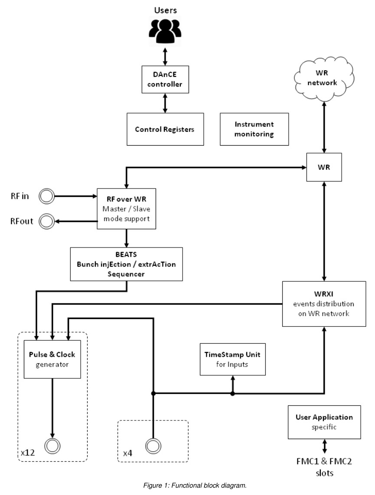

# CITY synchronisation device

The CITY is an ESRF device that aims at providing synchronization features with
White Rabbit and RF clock reference.

* WR: White Rabbit
* RF: Radio Frequency
* CITY: CarrIer for applicaTion based on RF over WR sYnchronization
* PTP: Precision Time Protocol
* RFoWR: RF over White Rabbit

The goal is to allow very accurate synchronisation of experiments with beam
pulses.

It will replace BCDU8 / N354 / Whist modules.


## Design

The CITY is a 1U module that provides 16 generic digital stages. There are 12
outputs and 4 Inputs.

These 12 generic digital IO are dedicated to timing and synchronization:

* Outputs: Pulses and Clocks related to RF clock and Bunch Injection /
  Extraction sequence or network events.
* Inputs: timestamps, events distribution, gating on generic outputs, or
  user-defined application.

I/Os can be extended by 2 commercial or custom LPC FMC mezzanines.

FMC slots are dedicated to user application extension which design is fully
user-defined (empty by default).


### Control
Interface to the instrument within a control system. The interface is a TCP/IP
socket implementing the DEEP protocol specific to DAnCE platform. The controller
implements commands and queries which access the control registers.

### White Rabbit

White Rabbit (WR) is an extension of Ethernet. It provides reliable
deterministic data transfer and sub nanosecond accuracy time
synchronization. More details can be found in the dedicated Open Hardware page:
https://www.ohwr.org/projects/white-rabbit/wiki

The instrument is connected to the WR network through a SFP connector and an
optical fiber. It is connected on a WR switch (WRS) which is a main component of
the WR network.

The goal of this mode is to have a common notion of time and frequency with
sub-nanosecond accuracy. Receiving / broadcasting control messages all over the
network.

### Radio Frequence over White Rabbit

This functionality allows reconstructing a RF reference signal in phase on every
node connected to the WR network. It is based on a Distributed Direct Digital
Synthesis (D3S). More details can be found on the dedicated Open Hardware page:
https://www.ohwr.org/projects/wr-d3s/wiki.

The CITY instrument shall be configurable and runnable as:

* Master mode,
* Slave mode.

RF frequency synthesis & reconstruction parameters:

* Frequency: up to 500MHz,
* Phase noise: < 10ps (ideal target < 1.8ps)


## Architecture


Functional block diagram of the CITY



A brief diagram explaining how the CITY is used:


TODO

## Configuration

Minimal configuration example:

```yaml
plugin: 
name: 
class: 
type: 
address: tcp://lid421:8909   # RPC server address
card_address:
```


## Usage


TODO

