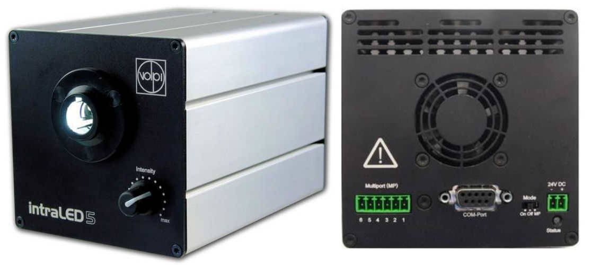

# FiberOptic Intraled

Intraled 5 is a Cold Light Source device from FiberOptic compagny (previously
Volpi).

It is controlled via a RS232 serial line.




## Configuration

```yaml
- name: il5
  plugin: bliss
  class: Intraled
  serial:
    url: /dev/ttyS0
    eol: b"\r\n"
    baudrate: 9600
    parity: "N"
```


## Usage

```python
DEMO [3]: il5
 Out [3]: INTRALED il5:
             Intensity: 0.0 %
             Temperature: 27.0 °C
             Source: COM PORT
             Mode: On

          SERIAL type=LOCAL url=/dev/ttyS0
                 timeout(s)=1 eol=b"\r\n"


DEMO [4]: il5.on()
DEMO [5]: il5.intensity
  Out [5]: 1.1

DEMO [6]: il5.intensity = 35
DEMO [7]: il5
 Out [7]: INTRALED il5:
             Intensity: 35.0 %
             Temperature: 27.5 °C
             Source: COM PORT
             Mode: On

          SERIAL type=LOCAL url=/dev/ttyS0
                 timeout(s)=1 eol=b"\r\n"
```

