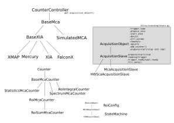

# MCA





## ROIs counters

To see which ROIs are defined:

```python
DEMO [1]: simul_mca.rois
 Out [1]: Name    start  end
          ------  -----  -----
          my_roi  200    800
```

### Raw manual method to add a ROI

Use: `add_roi(<name>, <start>, <stop>)` command to add a ROI.

 * `<name>` (*str*): name of the ROI (must be unique)
 * `<start>` (*int*): start channel index
 * `<end>` (*int*): end channel index

Example:
```python
DEMO [6]: simul_mca.rois
 Out [6]: Name    start  end
          ------  -----  -----
          my_roi  200    800

DEMO [7]: simul_mca.rois.add_roi("Aula", 350, 450)

DEMO [8]: simul_mca.rois
 Out [8]: Name    start  end
          ------  -----  -----
          my_roi  200    800
          Aula    350    450

```

This method to define ROIs is will be completed by higer level methods... TO BE
CONTINUED...

