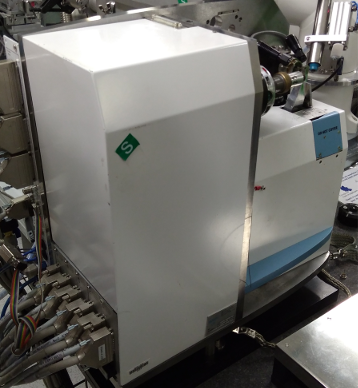

# MD2 Difractometer 



MD2 is a Micro Difractometer designed by EMBL and produced by MAATEL.

This devices is used for crystallography experiments and allows automatic sample alligment during operations.

Some information about the device:
https://www.embl.fr/instrumentation/cipriani/downloads/md2_pdf.pdf

Some troubleshooting on usage:
https://www.esrf.eu/UsersAndScience/Experiments/MX/How_to_use_our_beamlines/Trouble_Shooting/id29-microdiffractometer-troubleshooting

## Underlining Control ##

MD2 uses the Exporter protocol.
The Exporter protocols communicates through TCP/IP sockets using ASCII text request and replies.

## Configuration ##

The configuration yml file should provide those parameters:

`class` always MD2

`exporter_address` should contain hostname:port of the MD2 Difractometer.

`axes` should map names of devices inside bliss with root_names used by the Exporter protocol of the MD2 Device.
Both bliss names and MD2 names are usually as the following example.


### Example YAML configuration file ###

```yaml
controller:
  class: MD2
  exporter_address: "microdiff29new:9001"
  axes:
      -
        name: sampx
        root_name: "CentringX"
      -
        name: sampy
        root_name: "CentringY"
      -
        name: phix
        root_name: "AlignmentX"
      -
        name: phiy
        root_name: "AlignmentY"
      -
        name: phiz
        root_name: "AlignmentZ"
```

Usually the only parameter that should be changed is the `exporter_address`.