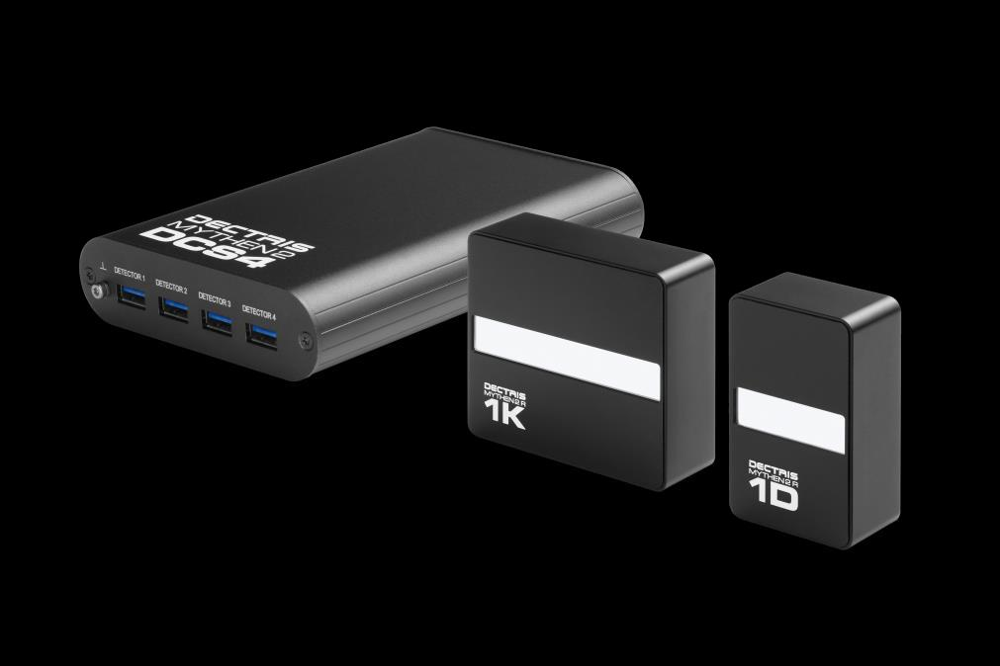

# Dectris Mythen strip (1D) detector controller

The Mythen is a 1D,strip , detector based on hybrid pixel technology made by Dectric company.
It can operate at 1000Hz, 24-bit, with a readout time of 89us. Its energy range is from 4 to 40 keV (down to 4keV only for 320um x 4 mm sensors). Threshold and energy in keV can be selected.

The Mythen strip detector is commonly used as *MCA-like detector* in the field of spectroscopy application.

There are actually two versions of Mythen hardware, so-called Mythen and Mythen2, the BLISS controller supports both systems.

The Mythen is a networked device which can be configured for a fix IP address. An embedded web client is running in the Detector Control System4 (DCS4) box. The DCS4 is delivered from factory with  IP address 192.168.0.90.

The Mythen web client can be used to test the detector, it provides a full access to the detector configuration and the acquisition.

## Configuration example from ID10 EH1
```YAML
- name: mythen1
  module: mca.mythen
  class: Mythen
  plugin: bliss
  hostname: mythenid101 
  apply_defaults: True    # Reset all the settings to their default value, it applies a reset command, see dectris manual for reset values
  energy: 10              # keV
  threshold: 5            # kev

- name: mythen2
  module: mca.mythen
  class: Mythen
  plugin: bliss
  hostname: mythenid102 
  apply_defaults: True
  energy: 12
```
Above example works in case there is a \_\_init__.yml in the same directory containing

    plugin: bliss 

## Full list of configuration with default values

| Setting                   | Possible values  | Default | Unit |
|-------------------------- |----------------- |-------- |----- |
| nmodules                  | 1-4              | 1       | int. |
| delay_after_frame         | 0-N              | 0.0     | sec. |
| nframes                   | 1-N              | 1       | int. |
| nbits                     | 4,8,16,24        | 24      | bit  |
| exposure_time             | 1e-7-N           | 1.0     | sec. |
| energy                    | Emin-Emax (1)    | 8.05    | keV  |
| threshold                 | Thrmin-Thrmax (1)| 1       | keV  |
| bad_channel_interpolation | True,False       | True    | bool.|
| flat_field_correction     | True,False       | True    | bool.|
| rate_correction           | True,False       | False   | bool.|
| rate_correction_deadtime  | 0-N              | N/A     | sec. |
| continuous_trigger_mode   | True,False       | False   | bool.|
| single_trigger_mode       | True,False       | False   | bool.|
| delay_before_frame        | 1e-7-N           | 0.0     | sec. |
| gate_mode                 | True,False       | False   | bool.|
| ngates                    | 1-N              | 1       | int. |
| input_polarity            | 0,1 (2)          | 0       | int. |
| output_polarity           | 0,1 (2)          | 0       | int. |
| selected_module           | 0-N              | 0       | int. |
| element_settings          | Cu,Mo,Cr,Ag      | Cu      | N/A  |


(1) : The supported energy and threshold ranges depend on the module type, see the detector manual
for the ranges.

(2) : in/out polarity change is deprecated from mythen controller model DCS4.

## Sample Tricks
The mythen has low level commands for `energy/threshold/correction/deadtime` settings and a high level command `element_settings` with predefined settings for cupper, molybdenum, Chromium or Iron tube . Changing the `element_settings` will apply new values for the low levet settings.

From the Mythen controller object you can display the settings in one shot:
```PYTHON
TEST_MYTHEN [1]: mythen2 = config.get('mythenid102')
TEST_MYTHEN [3]: mythen2                                                                        
        Out [3]: Mythen on mythenid102:
                   nmodules                  = 2
                   delay_after_frame         = 0.0
                   nframes                   = 1
                   nbits                     = 24
                   exposure_time             = 1.0
                   energy                    = (22.16, 22.16)
                   threshold                 = (11.08, 11.08)
                   bad_channel_interpolation = True
                   flat_field_correction     = True
                   rate_correction           = False
                   rate_correction_deadtime  = (1.3882828e-07, 1.3525846e-07)
                   continuous_trigger_mode   = False
                   single_trigger_mode       = False
                   delay_before_frame        = 0.0
                   gate_mode                 = False
                   ngates                    = 1
                   selected_module           = 0
                   element_settings          = ('Ag', 'Ag')
```


Some Mythen commands (energy, threshold, element_settings ...) apply on the **selected module**. The DCS4 can control up to 4 modules and you can choose to select all (default) on only one. The attribute `selected_module` give you access to this:

```PYTHON
TEST_MYTHEN [4]: mythen2.selected_module                                                        
        Out [4]: 0  # means all selected
TEST_MYTHEN [5]: mythen2.selected_module=2 #select module number 2
TEST_MYTHEN [6]: mythen2.element_settings='Cu' # change settings of module #2 to Cu

TEST_MYTHEN [8]: mythen2                                                                        
        Out [8]: Mythen on mythenid102:
                   nmodules                  = 2
                   delay_after_frame         = 0.0
                   nframes                   = 1
                   nbits                     = 24
                   exposure_time             = 1.0
                   energy                    = (22.16, 8.05)
                   threshold                 = (11.08, 6.4)
                   bad_channel_interpolation = True
                   flat_field_correction     = True
                   rate_correction           = False
                   rate_correction_deadtime  = (1.3882828e-07, 2.3231377e-07)
                   continuous_trigger_mode   = False
                   single_trigger_mode       = False
                   delay_before_frame        = 0.0
                   gate_mode                 = False
                   ngates                    = 1
                   selected_module           = 2
                   element_settings          = ('Ag', 'Cu')

```

## Further reading from Dectris

* [MYTHEN2 Detector Manual](https://www.dectris.com/support/manuals-docs/mythen2-x-for-synchrotron/mythen2-x-1k?file=files/content/docs/support/manuals_and_documentation/MYTHEN/MYTHEN2/User_Manual-MYTHEN2_V4.pdf)
* [Socket Interface V4.1.0](https://www.dectris.com/support/manuals-docs/mythen2-x-for-synchrotron/mythen2-x-1k?file=files/content/docs/support/manuals_and_documentation/MYTHEN/MYTHEN2/Socket_Interface_Spec-MYTHEN2_V4p1p0_V1.pdf)

