# Configuring the P201 counter card

This chapter assumes you have have a running a bliss configuration
server (beacon) available on your system.

The CT2 card has two models:

-   *P201*: the `PCI` version of the card
    -   8 input channels
    -   2 input/output channels
-   *C208*: the `cPCI` version of the card
    -   10 input channels
    -   2 input/output channels

The *C208* has been discontinued and is not supported by bliss.

!!! warning
    BLISS is tested with the 3.3 version of the P201 kernel driver.
    Any other version may cause troubles.

## Architecture

A brief diagram explaining how the P201 is used by bliss:

{% dot p201_arch.svg
  digraph G {
     rankdir="LR";

     driver [label="driver", shape="box"];
     card [label="Card", shape="component"];

     subgraph cluster_blissrpc {
       label = "CT2 Bliss RPC server";
       color = black;
       node [shape=rectangle];

       CT2_Device [label="bliss.\ndevice.\nCT2"];

     }

     subgraph cluster_client {
       label = "bliss shell";
       node [shape=rectangle];

       CT2_Client [label="bliss.\nclient.\nCT2"];
     }

     driver -> card [dir="both", label="PCI bus"];
     CT2_Device -> driver[dir=both];
     CT2_Client -> CT2_Device [dir="both", label="Bliss RPC\nreq/rep &\nstream"];
   }
%}


## Driver installation

The driver is available as an external project.

see: [CT2 driver project on gitlab](https://gitlab.esrf.fr/Hardware/P201)

!!! note
    If you are at ESRF you can install it with:
    * `blissinstaller`
    * `bliss_drivers config`
    * (need root password, see: https://passdoggo.esrf.fr)

BLISS has to be installed to get `bliss-ct2-server` script.

The *CT2 Bliss RPC server* has to run on the PC where the card is installed by
typing:

```bash

$ bliss-ct2-server
INFO 2017-10-30 15:14:57,680 CardInterface(/dev/ct2_0): connecting to /dev/ct2_0
INFO 2017-10-30 15:14:57,684 CT2Server: Serving CT2 on tcp://0.0.0.0:8909...
```

!!! note
    If you are at ESRF, use supervisor to start it.
    example of startup script:
    ```
    [group:EH1]
    programs=P201_zerorpc
    priority=100
    
    [program:P201_zerorpc]
    command=bash -c ". /users/blissadm/bin/blissenv && exec bliss-ct2-server --address /dev/ct2_0"
    priority=800
    environment=HOME="/users/blissadm"
    user=blissadm
    startsecs=2
    autostart=true
    redirect_stderr=true
    stdout_logfile=/var/log/%(program_name)s.log
    stdout_logfile_maxbytes=1MB
    stdout_logfile_backups=10
    stdout_capture_maxbytes=1MB
    ```

By default it runs on port **8909**. To run with different options type: `bliss-ct2-server --help`.

## Configuration

Minimal configuration example:

```yaml
plugin: ct2                   # (1)
name: p201_eh1                # (2)
class: CT2                    # (3)
type: P201 ???
address: tcp://lid421:8909    # (4)
```

(replace the address with the one that makes sense to you)

Since the full YAML configuration can be quite complex, we suggest using the
the web configuration tool which provides a more user friendly interface:

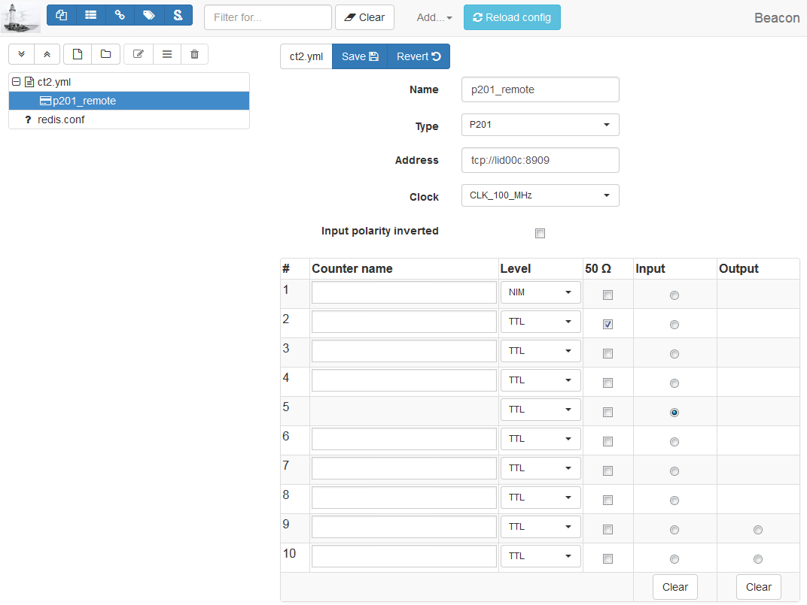


To use counters in a BLISS session, the P201 object (`p201_eh1`) has to be added
to the `config-objects` list.

!!! attention
    The counters corresponding to the channels are not exported.


Here is a more complete example including channel configuration and external
trigger/gate:

```yaml
plugin: ct2                    # (1)
name: p201_eh1                 # (2)
class: CT2                     # (3)
address: tcp://lid312:8909     # (4)
type: P201                     # (5)
clock: CLK_100_MHz             # (6)
external sync:                 # (7)
  input:                       # (8)
    channel: 9                 # (9)
    polarity inverted: False   # (10)
  output:                      # (11)
    channel: 10                # (12)
    mode: gate                 # (13)
channels:                      # (14)
- address: 1                   # (15)
  counter name: pC1            # (16)
  50 ohm: true                 # (17)
  level: TTL                   # (18)
- address: 10
  level: NIM                   # (19)
```

1.  plugin name (mandatory: `ct2`)
2.  controller name (mandatory)
3.  plugin class (mandatory)
4.  card address (mandatory). `tcp://<host>:<port>` to connect to a
    remote bliss rpc CT2 server or `/dev/ct_<card_nb>` for a local card.
5.  card type (optional, default: `P201`). Valid values are: `P201`
    (historical: before the C208 was forseen to be supported as well)
6.  card clock (optional, default: `CLK_100_MHz`)
    - There is a bug on P201 card at 100 MHz -> 12.5 MHz forced
7.  External synchronization signal configuration
8.  Input signal: used for external trigger/gate (optional, default: no
    input)
9.  Input signal channel (mandatory if input keyword is given). Valid:
    \[1, 10\]
10. Interpret input signal polarity inverted (optional, default: False)
11. Output signal: used for output gate signal
12. Output signal channel (mandatory if ouput keyword is given). Valid:
    \[9, 10\]
13. Output signal mode (optional, default: gate). Only possible value
    today is gate
14. Channel configuration
15. channel address (mandatory). Valid: \[1, 10\]
16. counter name (optional). Needed if want to count on this channel.
17. true to enable 50 ohm.
18. channel input level (optional, default: TTL)
19. channel input/output level (optional, default: TTL)

!!! note
    If external sync input/output channel is given, the channel counter name
    is ignored as this channel cannot be used to count

!!! note
    If a bliss rpc *address* is set, the `type` is ignored. In this case it is
    specified at the bliss rpc server command line.


### Configuring 2 or more *independent* cards

Sometimes, the 10 channels provided by a single CT2 card are not enough.
You may need two or more cards in order to fulfill your needs.

If the acquisition of the CT2 cards is triggered by an external signal,
we say that all the CT2 cards are *slaves* since the control of the
acquisition is done by another hardware. This is a simplest case since
it is sufficient to configure each card individually.

Here is an example how to configure and run two P201 cards:

-   syncronized by an external trigger on input channel 8
-   both cards in *external trigger multi*
    acquisition mode
-   10 acquisition points
-   with an exposure time of 0.1s.
-   Card A with channels 1, 2 and 3 (counter names: C01, C02 and C03)
-   Card B with channels 1 and 2 (counter names: C04 and C05)

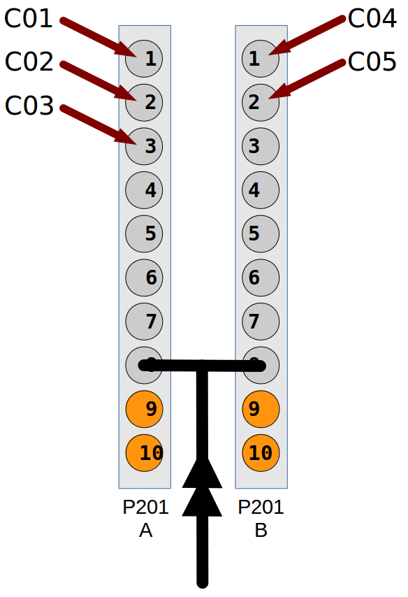

First, start two CT2 bliss rpc servers:

```bash
$ bliss-ct2-server --port=8909 --address=/dev/ct2_0
INFO 2017-10-30 15:14:57,680 CardInterface(/dev/ct2_0): connecting to /dev/ct2_0
INFO 2017-10-30 15:14:57,684 CT2Server: Serving CT2 on tcp://0.0.0.0:8909...

$ bliss-ct2-server --port=8910 --address=/dev/ct2_1
INFO 2017-10-30 15:16:32,456 CardInterface(/dev/ct2_1): connecting to /dev/ct2_1
INFO 2017-10-30 15:16:32,458 CT2Server: Serving CT2 on tcp://0.0.0.0:8910...
```

The YAML configuration should look something like this:

```yaml
plugin: ct2
cards:
- name: p201_A
  class: CT2
  address: tcp://lid312:8909
  external sync:
    input:
      channel: 8
      polarity inverted: false
  counters:
  - address: 1
    counter name: C01
  - address: 2
    counter name: C02
  - address: 3
    counter name: C03

- name: p201_B
  class: CT2
  address: tcp://lid312:8910
  external sync:
    input:
      channel: 8
      polarity inverted: false
  counters:
  - address: 1
    counter name: C04
  - address: 2
    counter name: C05
```

\...a simple demonstration program:

    from gevent import sleep, spawn, wait
    from gevent.event import Event

    from bliss.common.event import dispatcher
    from bliss.config.static import get_config
    from bliss.controllers.ct2.device import AcqMode, AcqStatus, StatusSignal

    config = get_config()

    p201_A = config.get('p201_A')
    p201_B = config.get('p201_B')

    for card in (p201_A, p201_B):
        card.acq_mode = AcqMode.ExtTrigMulti
        card.acq_expo_time = 0.1
        card.acq_point_period = None
        card.acq_nb_points = 10

    p201_A.acq_channels = 1, 2, 3
    p201_B.acq_channels = 1, 2

    finish_A, finish_B = Event(), Event()
    def on_state_changed(value, finish=None):
        if value == AcqStatus.Ready:
            finish.set()

    dispatcher.connect(functools(on_state_changed, finish=finish_A),
                       sender=p201_A, signal=StatusSignal)
    dispatcher.connect(functools(on_state_changed, finish=finish_B),
                       sender=p201_B, signal=StatusSignal)

    p201_A.prepare_acq()
    p201_B.prepare_acq()
    p201_A.start_acq()
    p201_B.start_acq()

    wait([finish_A, finish_B])
    print('Done!')

### *Master* and *slave* configuration

If the acquisition is triggered by one of the CT2 cards, this card is
named the *master* card and the other card(s) is(are) slave(s). The
*master* card will syncronize all other hardware (other CT2 cards,
detectors, multiplexers, etc) via an output gate signal. The *slave*
card(s) will follow this signal by configuring its acquisition mode to
*external gate*.

Here is an example how to configure and run two P201 cards:

-   Card A is master, with output gate signal channel 10
-   Card B is slave, syncronized by an external trigger on input channel
    8
-   Card A in *internal trigger single*
    acquisition mode
-   10 acquisition points
-   with an exposure time of 0.1s.
-   with a point period of 0.15s
-   Card A with channels 1, 2 and 3 (counter names: C01, C02 and C03)
-   Card B with channels 1 and 2 (counter names: C04 and C05)

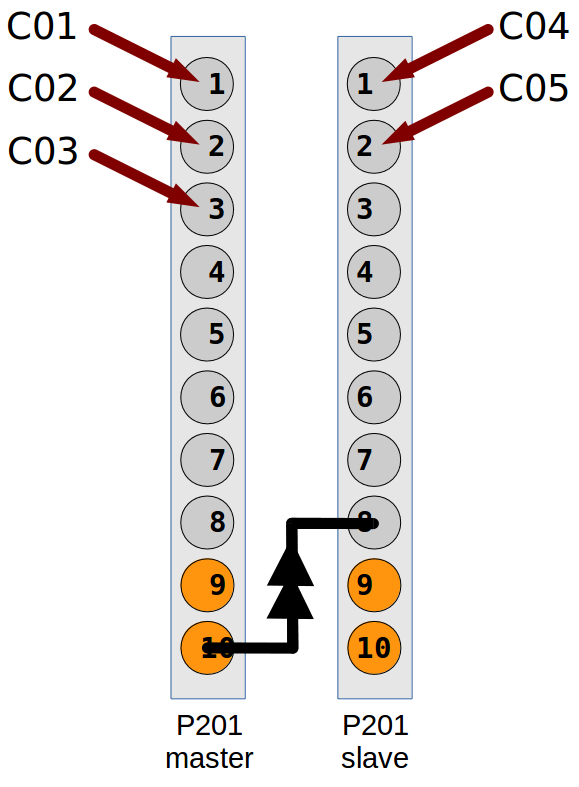

First, start two CT2 bliss rpc servers:

```bash
$ bliss-ct2-server --port=8909 --address=/dev/ct2_0
INFO 2017-10-30 15:14:57,680 CardInterface(/dev/ct2_0): connecting to /dev/ct2_0
INFO 2017-10-30 15:14:57,684 CT2Server: Serving CT2 on tcp://0.0.0.0:8909...

$ bliss-ct2-server --port=8910 --address=/dev/ct2_1
INFO 2017-10-30 15:16:32,456 CardInterface(/dev/ct2_1): connecting to /dev/ct2_1
INFO 2017-10-30 15:16:32,458 CT2Server: Serving CT2 on tcp://0.0.0.0:8910...
```

The YAML configuration should look something like this:

```yaml
plugin: ct2
cards:
- name: p201_A
  class: CT2
  address: tcp://lid312:8909
  external sync:
    output:
      channel: 10
  counters:
  - address: 1
    counter name: C01
  - address: 2
    counter name: C02
  - address: 3
    counter name: C03

- name: p201_B
  class: CT2
  address: tcp://lid312:8910
  external sync:
    input:
      channel: 8
      polarity inverted: false
  counters:
  - address: 1
    counter name: C04
  - address: 2
    counter name: C05
```

\...a simple demonstration program:

    from gevent import sleep, spawn, wait
    from gevent.event import Event

    from bliss.common.event import dispatcher
    from bliss.config.static import get_config
    from bliss.controllers.ct2.client import CT2
    from bliss.controllers.ct2.device import AcqMode, AcqStatus, StatusSignal

    config = get_config()

    master = config.get('p201_A')
    slave = config.get('p201_B')

    master.acq_mode = AcqMode.IntTrigSingle
    master.acq_expo_time = 0.1
    master.acq_point_period = 0.15
    master.acq_nb_points = 10
    master.acq_channels = 1, 2, 3

    slave.acq_mode = AcqMode.ExtGate
    slave.acq_expo_time = None
    slave.acq_point_period = None
    slave.acq_nb_points = 10
    slave.acq_channels = 1, 2

    finish_master, finish_slave = Event(), Event()
    def on_state_changed(value, finish=None):
        if value == AcqStatus.Ready:
            finish.set()

    dispatcher.connect(functools(on_state_changed, finish=finish_master),
                       sender=master, signal=StatusSignal)
    dispatcher.connect(functools(on_state_changed, finish=finish_slave),
                       sender=slave, signal=StatusSignal)

    master.prepare_acq()
    slave.prepare_acq()
    master.start_acq()
    slave.start_acq()

    wait([finish_master, finish_slave])
    print('Done!')

!!! note
    you can change the input and output channels at any time in a program by
    means of `<dev>.input_channel = <channel number>` and
    `<dev>.output_channel = <channel number>`, respectively.

## Spec & TANGO configuration

Bliss provides a TANGO_ server and a set of spec macros in case you need to
control the card through Spec:



First you need to have a running `bliss-ct2-server`. Check the beginning of
this chapter to find out out to do it.

### TANGO configuration

After, you need to configure a CT2 TANGO_ server. In Jive just go to the menu
bar, select `Edit --> Create server` and type in the following:

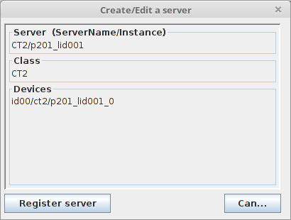

(replace *p201_lid001_0* with a name at your choosing)

The final step in configuring the server is to add a property called
*card_name*. Its value should be the name of the object you gave in the YAML_
configuration:

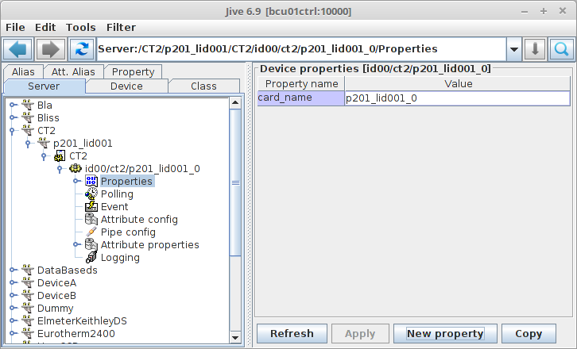

### Spec configuration

bliss also provides a *ct2.mac* macro counter/timer so it can be used from spec. It
communicates with the CT2 TANGO device.

Don't forget to add in setup `need bliss/ct2`.

Enter **config** and in the *Motor and Counter Device Configuration (Not CAMAC)*
screen, in the SCALERS list add a new item so it looks like this:

    SCALERS        DEVICE                    ADDR  <>MODE  NUM                 <>TYPE
        YES           ct2  id00/ct2/p201_lid001_0           11    Macro Counter/Timer

After, in the *Scaler (Counter) Configuration* screen, add the counters and/or
timer (don't forget that the *Unit* is the nth-1 device in the list of Macro
Counter or Macro Counter/Timer on the previous screen).

If you add a CT2 timer, the *Chan* must be **0**. The CT2 timer is capable of
working in 6 different frequencies: 1.25 KHz, 10 KHz, 125 KHz, 1 MHz, 12.5 MHz
and 100 MHz. The spec *Scale Factor* selects this frequency. The standard
working frequency is 1 MHz which correspondes to a *Scale Factor* of 1E6.
Example:

    Scaler (Counter) Configuration

    Number        Name  Mnemonic  <>Device  Unit  Chan   <>Use As  Scale Factor
         0     Seconds       sec   MAC_CNT     0     0   timebase       1000000
         1      p201_3    p201_3   MAC_CNT     0     3    counter             1


## Supported acquisition types

Here is a brief summary of the current acquisition types supported by
the CT2.

**Point period**:
    The time which corresponds to acquisition of one single point. This
    period is sub-divided in exposure time and a dead time.

**Exposure time**:
    The time during which the input channels are enabled to count


```python
SESSION_SXM [5]: from bliss.controllers.ct2.device import AcqMode as CT2AcqMode
SESSION_SXM [6]: for ii in list(CT2AcqMode):
            ...:     print(ii.value, ii)

0 AcqMode.IntTrigReadout
1 AcqMode.SoftTrigReadout
2 AcqMode.IntTrigSingle
3 AcqMode.IntTrigMulti
4 AcqMode.ExtTrigSingle
5 AcqMode.ExtTrigMulti
6 AcqMode.ExtGate
7 AcqMode.ExtTrigReadout
```


### Internal Trigger Single (2)

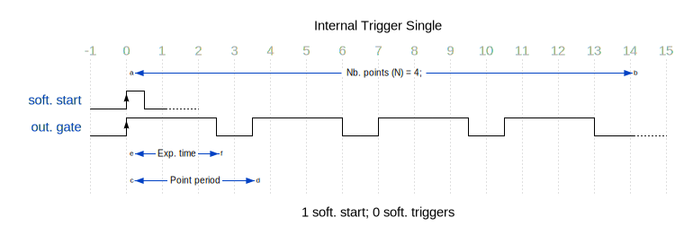

Start by software. Trigger by internal clock. Internal clock determines
exposure time (constant) and point period (constant).

Note that in this mode, the acquisition finishes after the last
*point period*, where in non *single* modes it ends right after *exposure
time* ends.

### Internal Trigger Multi (3)

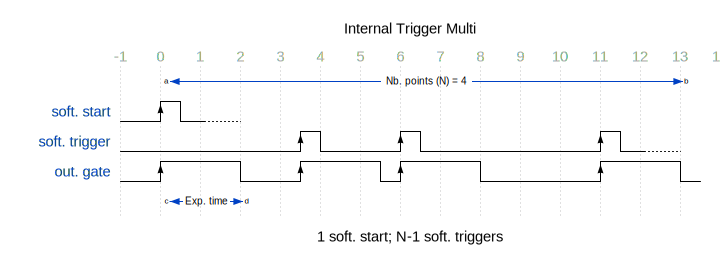

Start by software. Hardware takes one single point. Each point is
triggered by software. Internal clock determines exposure time (constant).

### Internal Trigger Readout (0)

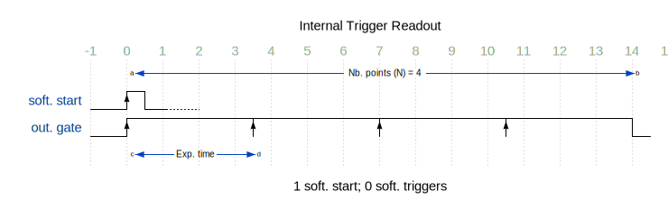

Start by software. Trigger by internal clock which determines exposure time.
Trigger ends previous acquisition and starts the next with no dead time.

This mode is similar to *Internal Trigger Single* when *point period*
equals *exposure time* (ie, no dead time).

### Software Trigger Readout (1)

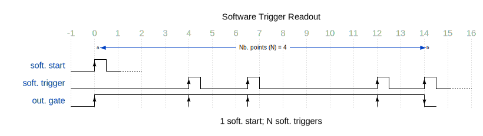

Start by software; trigger by software. Trigger ends previous acquisition
and starts next with no dead time. Exposure time determined by trigger.

### External Trigger Single (4)

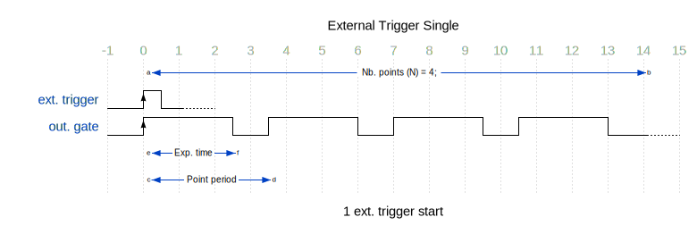

Start by external trigger. Trigger by internal clock. Internal clock
determines exposure time (constant) and point period (constant).

Note that in this mode, the acquisition finishes after the last
*point period*, where in non *single* modes it ends right after *exposure
time* ends.

This mode is similar to *Internal Trigger Single* except that the start
is done by an external trigger instead of software.

### External Trigger Multi (5)

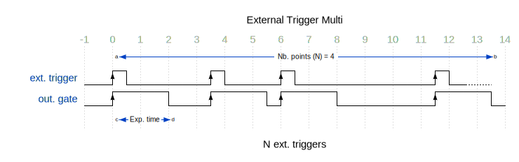

Start by external trigger. Trigger by external trigger. Internal clock
determines exposure time (constant).

This mode is similar to *Internal Trigger Multi* except that the start and
the triggers are by an external trigger instead of software start and
software trigger.

### External gate (6)

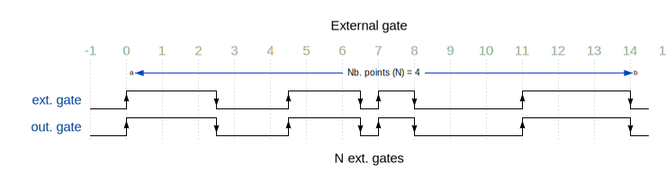

Start by external trigger. Exposure time determined by input gate signal.

### External Trigger Readout (7)

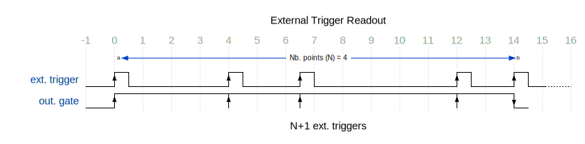

Start by external trigger. Trigger by external trigger.
Trigger ends previous acquisition and starts next with no dead time.
Exposure time determined by trigger.

This mode is similar to *Internal Trigger Readout* except that the start and
the triggers are by an external trigger instead of software start and
software trigger.

