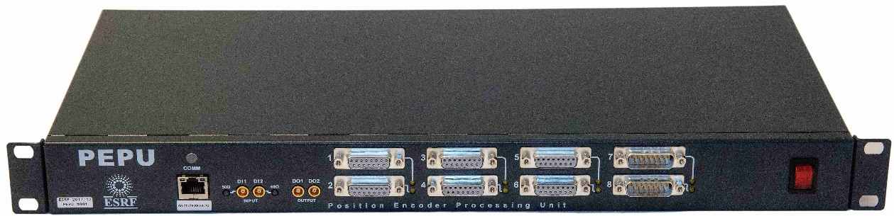

# PEPU board

<!-- This doc comes from pepu manual made by ISG. -->

PEPU is a device designed at ESRF to deal with encoder sources. The main
use cases of PEPU are, among others: encoder read-out, encoder protocol
conversion, data acquisition for metrology purposes, and multi-encoder and
compensation for environmental conditions for high-accuracy positioning systems.

PEPU stands for: Positioning Encoder Processing Unit.





PEPU receives data from position encoders and emulates encoders on its outputs
to external devices. The instrument has eight configurable channels to receive
(input) or transmit (output) data. PEPU channels can handle RS422 and LVDS
electrical levels and they are able to read or emulate quadrature incremental
encoders or SSI, BiSS-C, EnDat, or HSSL absolute encoders.

PEPU can process the incoming data by applying configurable mathematical
functions to them.

The result is then available through an output channel or stored in the internal
buffer. The buffer is part of the PEPU data acquisition features designed to
store data that can be retrieved by the host computer.

PEPU communicates with the host computer through an Ethernet conection for
configuration and data transfer.


## Configuration example
```yaml
class: PEPU
name: pepu
tcp:
  url: pepueu3
template: renishaw    # optional
```


## Usage


```python
# Read device parameters
pepudcm2.sys_info
  'DANCE version: 00.01 , build: 2016/11/28 13:02:35, versions: none'

pepudcm2.version
  '00.01'

# Get the input channel 1 and read the current value:
in1 = pepudcm2.in_channels[1]
print(in1.value)

# enable / disable the channel
in1.enabled = True

# read/change the channel mode
in1.mode
   <ChannelMode.BISS: 'BISS'>
in1.mode = ChannelMode.QUAD

# Define a calculation
calc1 = pepudcm2.calc_channels[1]
calc1.formula = '0.25 * IN1 + 3'

# Create a global inactive and unitialized stream and then initialize
s0 = pepudcm2.create_stream('S0')
s0.trigger = Trigger(start=Signal.SOFT, clock=Signal.SOFT)
s0.frequency = 1
s0.nb_points = 10
s0.sources = ['CALC1']

# Create a fully initialized stream in one go
s1 = pepudcm2.create_stream(name='S1',
        trigger=Trigger(Signal.SOFT, Signal.SOFT),
        frequency=10, nb_points=4,
        sources=('CALC1', 'CALC2'))

# Do an acquisition:
s1.start()
pepudcm2.software_trigger()
s1.nb_points_ready
   1
p1.read(1)
   array([ 2.75, -3.])
pepudcm2.software_trigger()
pepudcm2.software_trigger()
pepudcm2.software_trigger()
s1.nb_points_ready
   3
p1.read(3)
   array([ 2.75, -3.  ,  2.75, -3.  ,  2.75, -3.  ])
```


## PEPU scan support


The PEPU can be integrated in step-by-step scans using the counters
provided by the controller itself:

```python
# IN channel counters
pepu.counters.IN1 # to ...
pepu.counters.IN6

# CALC channel counters
pepu.counters.CALC1  # to ...
pepu.counters.CALC8

# All channel counters
list(pepu.counters)
```

Here's an working example:
```python
from bliss.config.static import get_config
from bliss.common.scans import timescan
from bliss.data.scan import get_data

config = get_config()
pepu = config.get('pepudcm2')

scan = timescan(1., *pepu.counters, npoints=3)
 [...] # Run the scan for 3 seconds
data = get_data(scan)
data['CALC1']
  array([1., 2., 3.])
```

Note that the values are acquired at the software trigger, not the end of the
integration time.

The PEPU is integrated in continuous scans by instanciating the
`PepuAcquisitionSlave` class. It takes the following arguments:

* `pepu`: the pepu controller
* `npoints`: the number of points to acquire
* `start`: the start trigger, default is `Signal.SOFT`
* `trigger`: the point trigger, default is `Signal.SOFT`
* `frequency`: only used in `Signal.FREQ` trigger mode
* `counters`: the PEPU counters to broadcast


Here's an example of a continuous scan using a PEPU:

```python
from bliss.scanning.scan import Scan
from bliss.controllers.pepu import Signal
from bliss.config.static import get_config
from bliss.scanning.chain import AcquisitionChain
from bliss.scanning.acquisition.motor import MotorMaster
from bliss.scanning.acquisition.pepu import PepuAcquisitionSlave

# Get controllers from config
config = get_config()
m0 = config.get("roby")
pepu = config.get("pepudcm2")

# Instanciate the acquisition device
device = PepuAcquisitionSlave(pepu, 10, trigger=Signal.DI1)

# Counters can be added after instanciation
device.add_counters(pepu.counters)

# Create chain
chain = AcquisitionChain()
chain.add(MotorMaster(m0, 0, 1, time=1.0, npoints=10), device)

# Run scan
scan = Scan(chain)
scan.run()

# Get the data
data = scans.get_data(scan)
print(data['CALC2'])
```
