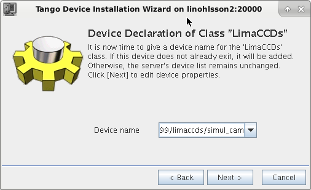
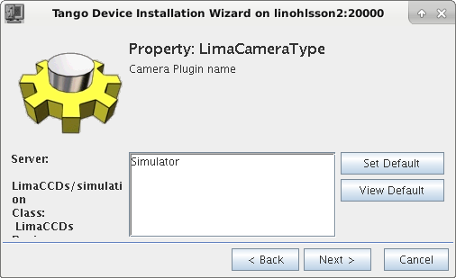
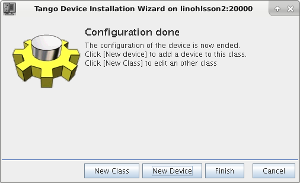
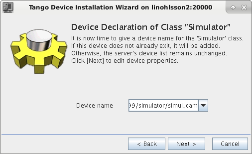

# BLISS simulation devices configuration

This chapter explains how to configure simulation BLISS devices:

* motor
* counter
* MCA
* Lima Camera

Such simulated devices can be used to: train users, test procedures or
to perform unit tests


## Motor

To create a simulation motor, you have to use the `mockup` class:

    controller:
      class: mockup
      axes:
         - velocity: 1
           name: simot1
           acceleration: 10
           steps_per_unit: 100

Do not forget to declare the plugin to use in a ` __init__.yml ` file:

     plugin: emotion

This simulation axis can now be used by BLISS:

    BLISS [5]: sm = config.get("simot1")
    BLISS [6]: sm.position()
      Out [6]: 2.0
    BLISS [7]: sm.move(4)
    BLISS [8]: sm.position()
      Out [8]: 4.0


## Calculational motor


```yaml
controller:
    class: calc_motor_mockup
    module: mockup
    axes:
        -
          name: $m1
          tags: real real_mot
        -
          name: calc_mot
          tags: calc_mot
          s_param: 3.1415
```


## Counter


### Fake counter

Two examples are given in ``tests/test_configuration/sessions/test_setup.py``


#### TestScanGaussianCounter

This counter returns at each scan step a value from a table filled
with gaussian noise.


#### AutoScanGaussianCounter

This counter uses `'scan_new'` event to get scan parameters in order
to generates a gaussian curve with random noise when it is used in a
scan.

NB: This counter must take into acount the type of procedure in which
it is used (ascan, timescan, ct, pointscan, etc.) to make `read()`
function able to return an appropriate result.

## MCA

To create a simulation MCA, just use `SimulatedMCA` class:

    name: simul_mca
    module: mca
    class: SimulatedMCA
    plugin: bliss

## Lima Device

### Use an existing TANGO_HOST

#### Install Lima-Simulator with dependecies

!!! note
    At ESRF, open blissinstaller and install:
    **Control:Tango:Server:LimaCCDs-simulator**

#### Open jive and create a simulator

**Tools** -> **Server Wizard** and fill it up


* Start **LimaCCDs simulation** on the command line
* Click **Next >** on the Wizard
* Select **LimaCCDs** and do **Edit Class** and fill it up with
**id99/limaccds/simul_cam**



* Click on **Next >** on the Wizard until you get to **LimaCameraType**
where you fill it with **Simulator**



* Click on **Next >** on the Wizard until you get to **Configuration done**



* Select **New Class** and select **Simulator** and do **Edit Class**
and fill it with **id99/simulator/simul_cam**



* Click on **Next >** on the Wizard until you get to **Configuration done**
* Click on **Finish** and say OK to restart and your new nice simulator is ready to be started

### Make sure this Tango server starts as **LimaCCDs simulator**

!!! note
    At ESRF you can use the servers.conf in *config/supervisor.d/templates*
    and create an entry like:
    ```
    [group:linohlsson2]
    programs=LimaCCDs_simulator
    
    [program:LimaCCDs_lima_sim]
    command=bash -c ". [...]/bin/blissrc && exec [...]/server/src/LimaCCDs simulator"
    environment=TANGO_HOST="linohlsson2:20000",HOME="/users/blissadm"
    user=blissadm
    startsecs=2
    autostart=true
    redirect_stderr=true
    stdout_logfile=/var/log/%(program_name)s.log
    stdout_logfile_maxbytes=1MB
    stdout_logfile_backups=10
    stdout_capture_maxbytes=1MB
    ```

### Put this in your YML file
Create a Lima class

```YAML
name: simul_cam
class: Lima
tango_url: id99/limaccd/simul_cam
```
