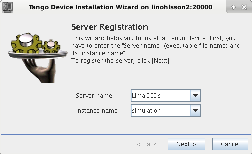

# BLISS simulation devices configuration

This chapter explains how to configure simulation BLISS devices:

* motor
* counter
* MCA
* Lima Camera

Such simulated devices can be used to: train users, test procedures or
to perform unit tests


## Motor

To create a simulation motor, you have to use the `mockup` class:

    controller:
      class: mockup
      axes:
         - velocity: 1
           name: simot1
           acceleration: 10
           steps_per_unit: 100

Do not forget to declare the plugin to use in a ` __init__.yml ` file:

     plugin: emotion

This simulation axis can now be used by BLISS:

    BLISS [5]: sm = config.get("simot1")
    BLISS [6]: sm.position()
      Out [6]: 2.0
    BLISS [7]: sm.move(4)
    BLISS [8]: sm.position()
      Out [8]: 4.0


## Calculational motor


```yaml
controller:
    class: calc_motor_mockup
    module: mockup
    axes:
        -
          name: $m1
          tags: real real_mot
        -
          name: calc_mot
          tags: calc_mot
          s_param: 3.1415
```


## Counter


### Fake counter

Two examples are given in ``tests/test_configuration/sessions/test_setup.py``


#### TestScanGaussianCounter

This counter returns at each scan step a value from a table filled
with gaussian noise.


#### AutoScanGaussianCounter

This counter uses `'scan_new'` event to get scan parameters in order
to generates a gaussian curve with random noise when it is used in a
scan.

NB: This counter must take into acount the type of procedure in which
it is used (ascan, timescan, ct, pointscan, etc.) to make `read()`
function able to return an appropriate result.

## MCA

To create a simulation MCA, just use `SimulatedMCA` class:

    name: simul_mca
    module: mca
    class: SimulatedMCA
    plugin: bliss

## Lima Device

Any Tango lima device (for example: **id99/limaccd/simul_cam**) server
can be used in a BLISS session.

Make sure the server is well running. If you don't have a camera
installed, use the Lima Simulator.

!!! note

    At ESRF, see:
    http://wikiserv.esrf.fr/bliss/index.php/Lima_ds_installation#Device_Servers



The corresponding YAML configuration file looks like:

```yaml
name: simul_cam
class: Lima
tango_url: id99/limaccd/simul_cam
```

