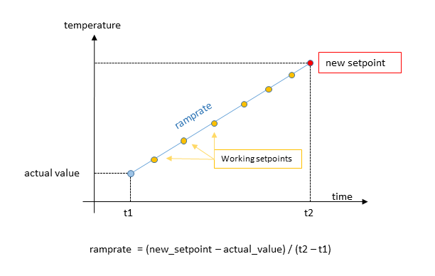

# BLISS Regulation and Temperature controllers

A generic python library has been developed inside the BLISS framework to manage regulation controllers in a uniform manner.
Actually, at the moment, two plugins are cohabiting:

* old plugin `Temperature` (until all controllers have been migrated under the Regulation plugin)
* new plugin `Regulation`  (replace the older Temperature plugin)


The Regulation (or Temperature) framework provides 3 kind of objects:

* The `Input`  to evaluate the actual state of the system (like the room temperature).
* The `Output` to perform an action on the system via its output device (like an heater).
* The `Loop`   to manage the regulation of the system via the *PID* parameters and a given setpoint (like the wanted temperature for the room).


The regulation process can be described by the following steps:

1. The **Input** reads the actual value of the processed variable (i.e. the physical parameter that is monitored by the regulation).
2. The **Loop** computes an output value that depends on the actual value of the Input, the "distance" to the setpoint and the *PID* parameters.
3. The output value is sent to the **Output**. The output device has an effect on the system and modifies the value of the processed variable.
4. back to step 1) and loop forever so that the processed value reaches the setpoint value and stays stable around that value.  


The **Input**, **Output** and **Loop** objects will access the **Controller** class written for the equipment (inheriting from the Temperature or Regulation Controller class).

* For the `Regulation` plugin: `from bliss.controllers.regulator import Controller`
* For the `Temperature` plugin: `from bliss.controllers.temp import Controller`

The `Controller` class has pre-defined methods that must be filled. Other methods or attributes (custom methods or attributes) can be freely defined by the developer.
Furthermore, a Tango access can be generated automatically to these objects.

```python
class Controller:
    ...

    @property
    def name(self):

    @property
    def config(self):

    @property
    def inputs(self):

    @property
    def outputs(self):

    @property
    def loops(self):
        }

    # ------ init methods ------------------------

    def initialize_controller(self):

    def initialize_input(self, tinput):

    def initialize_output(self, toutput):

    def initialize_loop(self, tloop):

    # ------ get methods ------------------------

    def read_input(self, tinput):

    def read_output(self, toutput):

    def state_input(self, tinput):

    def state_output(self, toutput):

    # ------ PID methods ------------------------

    def set_kp(self, tloop, kp):

    def get_kp(self, tloop):

    def set_ki(self, tloop, ki):

    def get_ki(self, tloop):

    def set_kd(self, tloop, kd):

    def get_kd(self, tloop):

    def start_regulation(self, tloop):

    def stop_regulation(self, tloop):

    # ------ setpoint methods ------------------------

    def set_setpoint(self, tloop, sp, **kwargs):

    def get_setpoint(self, tloop):

    # ------ setpoint ramping methods (optional) ------------------------

    def start_ramp(self, tloop, sp, **kwargs):

    def stop_ramp(self, tloop):

    def is_ramping(self, tloop):

    def set_ramprate(self, tloop, rate):

    def get_ramprate(self, tloop):

```


## New regulation plugin


```python

TEST_SESSION [3]: loop                                                                                                                             
Out [3]:
                  === Loop: sample_regulation_new ===
                  controller: Mockup
                  Input: thermo_sample_new @ 0.000 deg
                  output: heater_new @ 0.000 Volt
                  setpoint: 0.0 deg
                  ramp rate: 1.0 deg/s
                  ramping: False
                  kp: 0.5
                  ki: 0.2
                  kd: 0.0
```

### Start and monitor the regulation loop

The regulation is automatically started by setting a new setpoint: `loop.setpoint = value`.


The regulation can be monitored through a plot in Flint using the command `plt = loop.plot()`.
The plot can be closed by pressing the little cross on the top right corner of the plot tab in Flint.
The plot can be stopped and restarted using the commands `plt.stop()` and `plot.start()`.
The refresh time of the plot can be modified with `plt.sleep_time = 0.1`

```python

TEST_SESSION [4]: loop.plot()
TEST_SESSION [5]: loop.setpoint=10

```


### Ramping

The Loop object has a ramping feature allowing a safer progression toward the new setpoint value.

If the ramprate is not zero (`loop.ramprate != 0`), the loop will compute intermediate setpoints (`workingsetpoints`) that match the ramping rate.
The ramprate unit is [input unit]/[sec].



The Output object also has a ramping feature. If `loop.output.ramprate != 0` then any new value sent to the output
will use a ramp to reach that value. The output ramping is useful when the output device must be protected against too brutal variations (like a high voltage controller).


### Configure an hardware regulation

The `hardware regulation` case corresponds to the situation where a regulation hardware exists and if the input and output devices are connected to that hardware.
In that case, a regulation Controller object must be implemented by inheriting from the Controller base class (`bliss.controllers.regulator`).
The inputs and outputs attached to that controller are defined through the YML configuration file.

!!! example "YML file example"

```yaml
- class: LakeShore336
  module: temperature.lakeshore.lakeshore336
  plugin: regulation
  name: lakeshore336
  timeout: 3
  tcp:
     url: lakeshore336se2:7777
     eol: "\r\n"
  inputs:
    - name: ls336_A
      channel: A
      unit: Kelvin
    - name: ls336_A_c     # input temperature in Celsius
      channel: A
      unit: Celsius
    - name: ls336_A_su    # in sensor unit (Ohm or Volt)
      channel: A
      unit: Sensor_unit

    - name: ls336_B
      channel: B
      unit: Kelvin
    - name: ls336_B_c     # input temperature in Celsius
      channel: B
      unit: Celsius
    - name: ls336_B_su    # in sensor unit (Ohm or Volt)
      channel: B
      unit: Sensor_unit

  outputs:
    - name: ls336o_1
      channel: 1
      unit: Kelvin
    - name: ls336o_2
      channel: 2
      unit: Kelvin

  ctrl_loops:
    - name: ls336l_1
      input: $ls336_B
      output: $ls336o_1
      channel: 1
    - name: ls336l_2
      input: $ls336_B
      output: $ls336o_2
      channel: 2

```

### Configure a software regulation

The `software regulation` case corresponds to the situation where there is no existing hardware for the regulation.
For example, it may be necessary to regulate a temperature by moving a cryostream on a stage (axis).
Any `SamplingCounter` can be interfaced as an input (`ExternalInput`) and any `Axis` as an input or output (`ExternalOutput`).
Devices which are not standard Bliss objects can be interfaced by implementing a custom input/output class inheriting
from the `ExternalInput` or the `ExternalOutput` classes.

To perform the regulation with this kind of inputs/outputs not attached to an hardware regulation controller, users must define a SoftLoop.
The SoftLoop object inherits from the Loop class and implements its own PID algorithm (using the 'simple_pid' Python module).

!!! example "YML file example"

```yaml
-   
    class: Chi2DiodeInput     # A custom object implemented by the user and inheriting from the ExternalInput base class
    package: id26.controllers.chi2_diode_device  # where to find the object class definition
    plugin: bliss             # Use the standard bliss plugin to load that object
    name: chi2_diode_pos  
    device: $moco_chi2        # a dependency object that exists in the configuration (used by this class as self.device)
    unit: log(finm/foutm)
    signal_beam_limit: 1e-07     # custom attribute
    offset_finm: 1.70147994e-11  # custom attribute
    offset_foutm: 1.5094417e-11  # custom attribute
    
-
    class: ExternalOutput   # A predifined class that allow the usage of an axis as a regulation Output
    plugin: regulation      # Use the regulation plugin for regulation objects
    name: chi2_motor_pos
    device: $CHI2           # an axis already existing in the configuration
    unit: CHI2_position
    low_limit: -0.06   # minimum/maximum axis steps for the regulation, too large makes feedback too coarse, too small makes feedback slow
    high_limit: 0.06
    ramprate: 0.0     # usually no ramping for axis as output
    mode: relative    # doing relative moves on the axis instead of an absolute positioning

- 
    class: SoftLoop    # The predefined software Loop class
    plugin: regulation
    name: chi2_regul
    input: $chi2_diode_pos    # the Input object to be used
    output: $chi2_motor_pos   # the Output object to be used
    P: -25   # is multiplied by the difference setpoint - real_point (0.01 CHI2 ~ 0.001 signal and again amplified by factor 10)
    I: 0.0
    D: 0.0
    low_limit: -1.0            # <-- low limit of the PID output value. Usaually equal to 0 or -1.
    high_limit: 1.0            # <-- high limit of the PID output value. Usaually equal to 1.
    frequency: 10.0            # frequency of the regulation loop evaluation
    deadband: 0.00025          # deadband width (like a tolerance for the setpoint)
    deadband_time: 3.0         # minimum time (sec) to consider that the setpoint has been reached
    ramprate: 1                # ramprate is used as a speed to go to setpoint (units = input_units/second) (ramprate=0 to apply setpoint immediately)
    wait_mode: deadband        # wait_move mode for the loop as pseudo axis


```


Somewhere else ('id26/controllers/chi2_diode_device.py') the user has defined the custom `Chi2DiodeInput` which inherits from the `ExternalInput` class.

```python
from bliss.common.regulation import ExternalInput

class Chi2DiodeInput(ExternalInput):

    def __init__(self, name, config): # (name, config) args to satisfy bliss plugin requierements
        super().__init__(config)
        
        self.offset_finm = config['offset_finm']
        self.offset_foutm = config['offset_foutm']
        self.signal_beam_limit = config['signal_beam_limit']
        self._last_value = 0

    def _get_chi2_counts(self):  # local custom method
        count_chi2 = self.device.comm('?fbeam') # self.device is known and was defined via the yml config (see 'device: $moco_chi2')
        count_finm = float(count_chi2.split()[0]) 
        count_foutm = float(count_chi2.split()[1])
        return count_finm, count_foutm
        
    def allow_regulation(self): # override base class implementation
        count_finm, count_foutm = self._get_chi2_counts()
        
        d1 = count_finm - self.offset_finm
        d2 = count_foutm - self.offset_foutm
        
        if d1 <= 0 or d2 <= 0:
            return False
            
        signal_beam = d1 + d2 
        if signal_beam >= self.signal_beam_limit:
            return True
        else:
            return False

    def read(self):    # MANDATORY: must be implemented (not implemented in the base class)
        """ """
        count_finm, count_foutm = self._get_chi2_counts()
        
        d1 = count_finm - self.offset_finm
        d2 = count_foutm - self.offset_foutm
        
        if d1 > 0 and d2 > 0:
            self._last_value = (d1 - d2)/(d1+d2)
        
        return self._last_value
        
        
    def state(self):   # override base class implementation
        """ returns the input device state """
        return "READY"


```