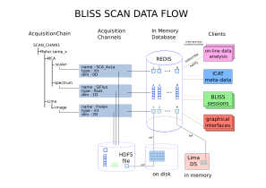

Data produced by BLISS is published into [Redis](https://redis.io/) (RAM
storage). In Redis, data is stored for a limited period of time (1 day by default) and for a limited amount (1GB by default).

Two primary [Redis](https://redis.io/) subscribers are provided by BLISS

1. The [Nexus writer](data_nexus_server.md) for writing [Nexus compliant](https://www.nexusformat.org/) HDF5 files.

2. [Flint](flint_scan_plotting.md) for online data visualization

[Custom subscribers](data_subscribing.md) can be created for other types of data processing.
