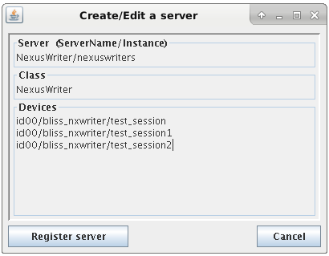
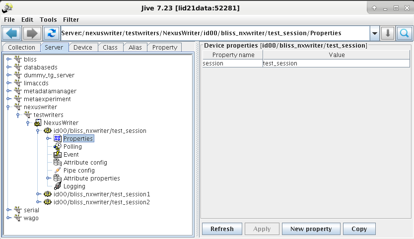

The ESRF data policy requires data to be saved in HDF5 files compliant with the [Nexus format](https://www.nexusformat.org/). The Nexus writer is a TANGO device maintained by the ESRF Data Analysis Unit (DAU) to ensure seamless integration with data analysis tools provided by the DAU.

## Summary

To install and use the Nexus writer

1. [Register](#installation) a Nexus writer for each BLISS session (*test_session* in this example) with the TANGO database:

    ```bash
    RegisterNexusWriter test_session --domain id00 --instance nexuswriters
    ```

2. [Run](#running) the Nexus writer server:

    ```bash
    NexusWriterService nexuswriters --log=info
    ```

3. [Enable](#enable-in-bliss) the Nexus writer in the BLISS session:

    ```python
    TEST_SESSION [1]: SCAN_SCAVING.writer = "nexus"
    ```

## Installation

The data writing of one BLISS session is handled by one Nexus writer TANGO device. The device has one MANDATORY property call *test_session* which must be equal to the BLISS session name. To register the device with the TANGO database you need to specify:

|                      | example        | comment                                                |
|----------------------|----------------|--------------------------------------------------------|
| server name          | NexusWriter    | you can choose but this is recommended                 |
| server instance name | nexuswriters   | you can choose                                         |
| server class         | NexusWriter    | MANDATORY!!!                                           |
| device domain name   | id00           | you can choose but typically this is the beamline name |
| device family name   | bliss_nxwriter | you can choose but this is recommended                 |
| device member name   | test_session   | you can choose but typically this is the session name  |

Here are three ways to register this TANGO device:

1. Installation script

    ```bash
    RegisterNexusWriter test_session --domain id00 --instance nexuswriters
    ```

2. Jive

    

    In this example we registered three Nexus writers with the same server. Specify the *session* property for each Nexus writer

    

3. Beacon configuration files

    ```yaml
    server: NexusWriter
    personal_name: nexuswriters
    device:
    - tango_name: id00/bliss_nxwriter/test_session
    class: NexusWriter
    properties:
        session: test_session
    ```

## Running

A Nexus writer TANGO server (which may serve different BLISS session) can be started inside the BLISS conda environment as follows

```bash
NexusWriterService nexuswriters --log=info
```

You need to specify the instance name of the TANGO server, so *nexuswriters* in the example.

## Enable in BLISS

Select the Nexus writer in the BLISS session

```python
TEST_SESSION [1]: SCAN_SCAVING.writer = "nexus"
```

BLISS will discover the Nexus writer automatically. The scan will stop when the writer throws an exception.

## Session writer state

The state of the TANGO device serving a BLISS session can be

 * INIT: initializing (not accepting scans)
 * ON: accepting scans (without active scan writers)
 * RUNNING: accepting scans (with active scan writers)
 * OFF: not accepting scans
 * FAULT: not accepting scans due to exception

When the server stays in the INIT state you can try calling the TANGO devices's "init" method. This can happen when the connection to beacon fails in the initialization stage. When in the OFF state, use the TANGO devices's "start" method. To stop accepting new scans, use the TANGO devices's "stop" method.

## Scan writer state

Each session writer launches a separate scan writer which saves the data of a particular scan (subscans are handled by the same scan writer). The scan writer state can be

 * INIT: initializing (not accepting data yet)
 * ON: accepting data
 * OFF: not accepting data (scan is done and all data has been saved)
 * FAULT: not accepting data due to exception

The final state will always be OFF (finished succesfully) or FAULT (finished unsuccesfully). The session purges the scan writers that are finished after 5 minutes. The state of those scans (which reflects whether the data has been written succesfully or not) is lost forever.

When the state is ON while the scan is finished, the writer did not received the "END_SCAN" event. You can stop the writer with the TANGO devices's "stop_scan" method. This gracefully finalizes the writing. As a last resort you can invoke the "kill_scan" method which might result in incomplete or even corrupt data (when it is executing a write operation while you kill it).

## Concurrent writing

Each scan writer holds the HDF5 file open in append mode for the duration of the scan. The HDF5 file is [locked](https://support.hdfgroup.org/HDF5/docNewFeatures/SWMR/Design-HDF5-FileLocking.pdf) which means that

 * The HDF5 file cannot be accessed during the scan unless you [bypass](#concurrent-reading) the file lock.

 * If the HDF5 file is opened and locked by other software, new data cannot be written to this file which will prevent scans from starting: you will get a "file locked" exception in BLISS.

Flushing is done regularly so [readers](#concurrent-reading) can see the latest changes. Data from scans running in parallel and multi-top-master scans will writting concurrently.

## Concurrent reading

To read the HDF5 file during a scan, open it in read-only mode while bypassing the file lock.

!!! warning
    A reader should never open the HDF5 file in append mode (which is the default in `h5py`). Even when only performing read operations, this will result in a corrupted file!

!!! warning
    A reader which locks the HDF5 file (this happens by default, even in read-only mode) will prevent the Nexus writer from accessing the file and scans in BLISS will be prevented from starting!

## File permissions

The HDF5 file and parent directories are created by the TANGO server and are therefore owned by the user under which the server process is running. Subdirectories are created by the BLISS session (e.g. directories for lima data) and are therefore owned by the user under which the BLISS session is running. Files in those subdirectories are created by the device servers and are therefore owned by their associated users.
