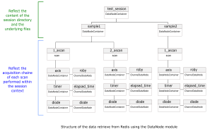

Data produced among sessions is published into [Redis]( https://redis.io/) (RAM
storage) and in the same time written to disk in a hdf5 file ([see data
saving](scan_saving.md)).

In Redis, data is stored for a limited period of time (1 day by default) and for
a limited amount (1GB by default).

## Experiment and data files structure

A complete experiment can be seen has a succession of *measurements* with
different *samples* in different conditions.

In a Bliss session, the experiment can be seen as a *tree*, where the trunk is
the session itself and where each measurement performed for a given sample and
experimental conditions is a branch.

As an example, let's consider:

* two samples: '**sample1**' and '**sample2**'
* a session named '**test_session**'
* several measurements with the two samples
* a measurement that consists in scanning one of the samples by moving a motor
'**roby**' and measuring the value of a counter '**diode**' along the scan.

The sample scan is performed with the following command (for details, see: [scan
commands](scan_default.md)):
```python
ascan(roby, 0, 9, 10, 0.1, diode)
```

* To start the session:

```shell
$ bliss -s test_session
```

* Format data saving path for the experiment:

While starting a session for the first time, a directory with the same name as
the session is created and the scan data is stored in this directory.


As two different samples will be scanned, one sub-directory per sample will be
created. To do that, the [SCAN_SAVING](scan_saving.md#scan_saving) object has to
be used. The data saving path is customized by adding a new parameter
'*s_name*' usable in the template of the PATH.

```py
SCAN_SAVING.add('s_name', '')                # add a new parameter named "s_name"
SCAN_SAVING.template = '{session}/{s_name}/' # modify the data saving path template
SCAN_SAVING.s_name = 'sample1'               # set value of the parameter "s_name"
```

* Perform a first measurement:

```py
ascan(roby, 0, 9, 10, 0.1, diode)
```

* Perform a second measurement:

```py
ascan(roby, 0, 9, 10, 0.1, diode)
```

* Change the data saving path for measurements on sample2:

```py
SCAN_SAVING.s_name = 'sample2'
```

* Perform a measurement:

```py
ascan(roby, 0, 9, 10, 0.1, diode)
```

For this experiment the files structure inside the session main folder is
described by the following tree:


The measurements data can be accessed by reading the content of the hdf5 files
(see [silx](http://silx.org), [pymca](http://pymca.sourceforge.net/)). One file
usually contains multiple scans data.


## Experiment and Redis data structure

In parallel of the in-file data storage describe above, Redis stores the data in
RAM memory as soon as it is produced. Therefore retrieving data from **Redis
allows a fast and live access to the data**.

Redis stores the data as a flatten list of (key:value) pairs but hopefully the
**bliss.data.node** module provides a simple interface to access the data in a
structured way that reflects the session structure.

```py
from bliss.data.node import get_node
n = get_node("test_session")
for node in n.iterator.walk(wait=False):
        print(node.name, node.db_name, node)

test_session    test_session                                                      <bliss.data.node.DataNodeContainer object at 0x7ff7064f36d8>
sample1         test_session:mnt:c:tmp:sample1                                    <bliss.data.node.DataNodeContainer object at 0x7ff7063d3b38>
1_ascan         test_session:mnt:c:tmp:sample1:1_ascan                            <bliss.data.scan.Scan object at 0x7ff7063e7e10>
axis            test_session:mnt:c:tmp:sample1:1_ascan:axis                       <bliss.data.node.DataNodeContainer object at 0x7ff7063e7f60>
roby            test_session:mnt:c:tmp:sample1:1_ascan:axis:roby                  <bliss.data.channel.ChannelDataNode object at 0x7ff7062a4668>
timer           test_session:mnt:c:tmp:sample1:1_ascan:axis:timer                 <bliss.data.node.DataNodeContainer object at 0x7ff7063f5978>
elapsed_time    test_session:mnt:c:tmp:sample1:1_ascan:axis:timer:elapsed_time    <bliss.data.channel.ChannelDataNode object at 0x7ff70633e748>
diode           test_session:mnt:c:tmp:sample1:1_ascan:axis:timer:diode           <bliss.data.node.DataNodeContainer object at 0x7ff70633ef98>
diode           test_session:mnt:c:tmp:sample1:1_ascan:axis:timer:diode:diode     <bliss.data.channel.ChannelDataNode object at 0x7ff7063670f0>
2_ascan         test_session:mnt:c:tmp:sample1:2_ascan                            <bliss.data.scan.Scan object at 0x7ff7063e7438>
axis            test_session:mnt:c:tmp:sample1:2_ascan:axis                       <bliss.data.node.DataNodeContainer object at 0x7ff70633ee10>
roby            test_session:mnt:c:tmp:sample1:2_ascan:axis:roby                  <bliss.data.channel.ChannelDataNode object at 0x7ff7062edd30>
timer           test_session:mnt:c:tmp:sample1:2_ascan:axis:timer                 <bliss.data.node.DataNodeContainer object at 0x7ff7062edd68>
elapsed_time    test_session:mnt:c:tmp:sample1:2_ascan:axis:timer:elapsed_time    <bliss.data.channel.ChannelDataNode object at 0x7ff70633e470>
diode           test_session:mnt:c:tmp:sample1:2_ascan:axis:timer:diode           <bliss.data.node.DataNodeContainer object at 0x7ff70633efd0>
diode           test_session:mnt:c:tmp:sample1:2_ascan:axis:timer:diode:diode     <bliss.data.channel.ChannelDataNode object at 0x7ff7063e7908>
sample2         test_session:mnt:c:tmp:sample2                                    <bliss.data.node.DataNodeContainer object at 0x7ff7063f59b0>
1_ascan         test_session:mnt:c:tmp:sample2:1_ascan                            <bliss.data.scan.Scan object at 0x7ff7063e74e0>
axis            test_session:mnt:c:tmp:sample2:1_ascan:axis                       <bliss.data.node.DataNodeContainer object at 0x7ff7062edb00>
roby            test_session:mnt:c:tmp:sample2:1_ascan:axis:roby                  <bliss.data.channel.ChannelDataNode object at 0x7ff7063f5240>
timer           test_session:mnt:c:tmp:sample2:1_ascan:axis:timer                 <bliss.data.node.DataNodeContainer object at 0x7ff7063f5710>
elapsed_time    test_session:mnt:c:tmp:sample2:1_ascan:axis:timer:elapsed_time    <bliss.data.channel.ChannelDataNode object at 0x7ff70633ea20>
diode           test_session:mnt:c:tmp:sample2:1_ascan:axis:timer:diode           <bliss.data.node.DataNodeContainer object at 0x7ff70633e358>
diode           test_session:mnt:c:tmp:sample2:1_ascan:axis:timer:diode:diode     <bliss.data.channel.ChannelDataNode object at 0x7ff70633ea90>

```

With the function `n = get_node("node_db_name")` *node_db_name* is your entry
point and *n* is the associated
[DataNodeContainer](scan_data_node.md#datanodecontainer).

With the function `n.iterator.walk(wait=False)` you can iterate over all the
child nodes of the node *n* ([see
DataNodeIterator](scan_data_node.md#datanodeiterator)).

Among the child nodes, two other types of nodes can be ditinguished:

* the [ChannelDataNode](scan_data_node.md#channeldatanode)
* and the [scan](scan_data_node.md#scan).

They both inherit from the `DataNodeContainer` class.

The experimental measures are associated to the *ChannelDataNodes*, and the scan
object to the *Scan* nodes.



You can access any node using its full name (`db_name`):

```py
cdn_roby = get_node("test_session:mnt:c:tmp:sample1:1_ascan:axis:roby")
```

### Online data analysis

The classes inheriting from the `DataNode` class provide the `iterator` method
which returns a `DataNodeIterator` object.

The DataNodeIterator provides the best methods to monitor the events happening
during the experiment and follow the data production.

The method `walk(filter=None, wait=True)` iterates over existing child nodes
that match the `filter` argument. If `wait` is True (default), the function
blocks until a new node appears. It returns the new node when it appears and
then waits again for a new node.

The method `walk_events(filter=None)` walks through child nodes, just like
`walk` function but waits for node events (like `EVENTS.NEW_CHILD` or
`EVENTS.NEW_DATA_IN_CHANNEL`). It returns the event type and the node then waits
again for next event.

```py
session = get_node("test_session")
def f(filter=None):
    """wait for any new node in the session"""
    for node in session.iterator.walk(filter=filter):
        print(node.name,node.type)

def g(filter='channel'):
    """wait for a new event happening in any node of the
    type 'channel' (ChannelDataNode)
    """
    for event_type, node in session.iterator.walk_events(filter=filter):
        print(event_type, node.name, node.get(-1))

# spawn greenlets to avoid blocking
g1 = gevent.spawn(f)
g2 = gevent.spawn(g)

# start a scan
ascan(roby,0,9,10,0.01,diode)

# the monitoring prints pop out during the scan
# (produced by f and g running in greenlets)
10_ascan scan
axis None
roby channel
event.NEW_CHILD roby None
timer None
elapsed_time channel
event.NEW_CHILD elapsed_time None
diode None
diode channel
event.NEW_CHILD diode None
event.NEW_DATA_IN_CHANNEL elapsed_time 0.0
event.NEW_DATA_IN_CHANNEL roby 0.0
event.NEW_DATA_IN_CHANNEL diode 70.0
event.NEW_DATA_IN_CHANNEL elapsed_time 0.157334566116333
event.NEW_DATA_IN_CHANNEL roby 1.0
event.NEW_DATA_IN_CHANNEL diode -57.0
event.NEW_DATA_IN_CHANNEL elapsed_time 0.33751416206359863
event.NEW_DATA_IN_CHANNEL roby 2.0
event.NEW_DATA_IN_CHANNEL diode -61.0
...

# do not forget to kill the greenlet at the end
g1.kill()
g2.kill()

```

!!! note
    In the example above `node.get(-1)` is used to retrieve the last data value
    produced on this node. For more details see method `get(from_index,
    to_index=None)` of the [ChannelDataNode](scan_data_node.md#channeldatanode).

#### Lima Data View

2D images from Lima servers have a special `lima` node type, which corresponds
to a `LimaImageChannelDataNode` class.  When executing `.get()` on those nodes,
the returned value is not directly the raw images, since it can be very
voluminous, but a "**view**" on the data. It represents **references to data**
already produced by the image channel at the moment the view object is
instantiated.

```py
g3 = gevent.spawn(g, "lima")

lima_simulator=config.get("lima_simulator")
ct(0.1, lima_simulator)
event.NEW_NODE image <bliss.data.lima.LimaImageChannelDataNode.LimaDataView object at 0x7f4d28931be0>
event.NEW_DATA_IN_CHANNEL image <bliss.data.lima.LimaImageChannelDataNode.LimaDataView object at 0x7f4d28931c18>
```

Function `g()` calls `.get(-1)` on the node object, thus returning the last
image view. This works the same as with other nodes. It is perfectly valid to
only get a view with partial data, for example: `.get(0, 10)` will return a view
object for images from 0 to 10 only.


#### Getting raw image data

The `.get_image()` method can be called on `LimaDataView` objects to retrieve
raw image data from references stored within a Lima data view object.

```py
ct(0.1, lima_simulator)
Scan(number=1, name=ct, path=<no saving>)

SCANS[-1].node
<bliss.data.scan.Scan object at 0x7efda1dd0898>

# there is only one Lima node for this 'ct'
lima_node = next(SCANS[-1].node.iterator.walk(filter="lima", wait=False))

lima_data_view = lima_node.get(-1)

raw_image_data = lima_data_view.get_image(-1)
```

!!! note
    `.get_image(-1)` means "get latest image from the view". In the example
    above, there is only one image so it would be equivalent to `.get_image(0)`.


### Scanning & experiment sequences

In the context of an experiment or a scan procedure it exist a more convenient
way to obtain the data produced by a scan.  At the shell level, it exist a
global variable `SCANS` that stores all the scan objects that have been launched
in this shell session.

For example `SCANS[-1]` returns the last scan object and `SCANS[-1].get_data()`
returns the data of that scan.

```py
SCANS
deque([Scan(number=1, name=ascan, path=/mnt/c/tmp/sample2/test_session/data.h5),
       Scan(number=2, name=ascan, path=/mnt/c/tmp/sample2/test_session/data.h5)],
maxlen=20)

SCANS[-1]
Scan(number=11, name=ascan, path=/mnt/c/tmp/sample2/test_session/data.h5)

SCANS[-1].get_data()
{
'roby':         array([0., 1., 2., 3., 4., 5., 6., 7., 8., 9.]),
'elapsed_time': array([0., 0.15733457, 0.33751416, 0.49564481, 0.6538229,
                       0.80611968, 0.94998145, 1.12727523, 1.28556204, 1.4369061 ]),
'diode':        array([ 70., -57., -61., -43.,  89.,  54.,  23., -89., -87., -98.])
}
```

#### Getting image data

Image data is not directly retrieved via the scan object `.get_data()` method,
since it can be very voluminous. In case of an acquisition with images, the
returned dictionary will contain a key with the image channel fullname, that
gives access to a *data view object*.

The view object is used to get the raw image data from references. Indeed, the
image data can be still available from the Lima server memory, if it is not the
case it may try other data sources -- at the last resort it tries to open the
file (if image saving is activated).

The Lima data view object has a `.get_image(image_index)` method that returns
the raw image data:

```py
BLISS [1]: lima_simulator=config.get("lima_simulator")
BLISS [2]: ct(0.1, lima_simulator)
  Out [2]: Scan(number=14, name=ct, path=<no saving>)
BLISS [3]: SCANS[-1].get_data()['lima_simulator:image'].get_image(-1)
  Out [3]: array([[0, 0, 0, ..., 0, 0, 0],
                  [0, 0, 0, ..., 0, 0, 0],
                  [0, 0, 0, ..., 0, 0, 0],
                   ...,
                  [0, 0, 0, ..., 0, 0, 0],
                  [0, 0, 0, ..., 0, 0, 0],
                  [0, 0, 0, ..., 0, 0, 0]], dtype=uint32)
```

