# Counters

Counters are BLISS objects intented to be read during a count or step
by step scan as well as during a continuous scan.

Such objects have then to follow a minimal API to be usable is
standard scans.


## Sampling or Integrating counter ?

A *sampling counter* is used to deal with devices to be read "on the
fly" with jsut a read command:

* `read()`

BLISS examples:

* tango BPM
* Wago
* Keller gauges

An *integrating counter* is used with devices that need to be processed
according to a defined sequence, typically:

* `prepare()`
* `start()`
* `stop()`

BLISS examples:

* Lima ROI and BPM


a custom Acquisition device can be created in case of:

* non-standard device interfacing
    * ex: flex.py
* mix of data types : spectrum and scalars


### Counters classes dependencies

This diagram presents the hierarchy of BLISS classes related to
counters with some example of usage.

{% dot counters_dep.svg
  digraph counter_dependencies {
   rankdir=BT

   bc   [shape=none label=
   <<table>
       <tr> <td> BaseCounter </td> </tr>
       <tr><td> <table border="0">
            <tr> <td>shape() </td> </tr>
            <tr> <td> dtype() </td> </tr>
           </table>
           </td>
       </tr>
    </table>>]
   c    [shape=none label=
   <<table>
       <tr> <td> Counter </td> </tr>
       <tr><td> <table border="0">
            <tr> <td>prepare() </td> </tr>
            <tr> <td> start() </td> </tr>
            <tr> <td> stop() </td> </tr>
           </table>
           </td>
       </tr>
    </table>>]

   sc   [shape=none label=
   <<table>
       <tr> <td> SamplingCounter </td> </tr>
       <tr><td> <table border="0">
            <tr> <td>read() </td> </tr>
            <tr> <td> ConvertValue() </td> </tr>
           </table>
           </td>
       </tr>
    </table>>]

    sftc   [shape=none label=
    <<table>
       <tr> <td> SoftCounter </td> </tr>
        <tr><td> <table border="0">
            <tr> <td>read() </td> </tr>
           </table>
           </td>
       </tr>
    </table>>]

    ic   [shape=none label=
    <<table>
        <tr> <td>IntegratingCounter </td> </tr>
        <tr> <td>
            <table border="0">
               <tr> <td>get_values() </td> </tr>
            </table>
        </td> </tr>
    </table>>]


    ic   [shape=none label=
    <<table>
        <tr> <td>IntegratingCounter </td> </tr>
        <tr> <td>
            <table border="0">
               <tr> <td>get_values() </td> </tr>
            </table>
        </td> </tr>
    </table>>]

   pc   [shape="oval" label="PepuCounter"]
   lrc  [shape="oval" label="LimaRoiCounter"]
   wc   [shape="oval" label="WagoCounter"]

   sc->c
   ic->c
   c->bc
   wc->sc
   sftc-> sc
   pc->bc
   lrc->ic
  }
%}


## Group read
Both IC and SC provide mechanism to perform *group read* in order to
read many counters at once if they belong to a common controller able
to read all channels at once.


## Sampling counter

Depending on the number and the way how channels of the controller are
managed, different designs can be used.

### example 1

A simple 1 channel-counter.

YML configuration:

    plugin: bliss
    class: EMH
    name: emeter2
    unit: volt
    tcp:
       url: em

In this example, BLISS controller has:

* to deal with connection (TCP)


### example 2 : EMH

A controller with multiple channels.

EMH is a 4chan electrometer.

YML configuration:

    plugin: bliss
    class: EMH
    name: emeter2
    unit: volt
    tcp:
       url: emeter2.esrf.fr
    counters:
    - counter_name: e1
      channel: 1
    - counter_name: e2
      channel: 2

!!! note
    In this example, keyword `counter_name` is used instead of
    `name` to avoid to load automaticaly the counters objects in
    BLISS sessions.


In this example, BLISS controller has:

* to deal with connection (TCP)
* to manage channels (returned by `counters()` property).
* to allow a groupped reading of all channels

NB: controller file name must be in lower case.

Example from `emh.py`:

    class EmhCounter(SamplingCounter):
        def __init__(self, name, controller, channel, unit=None):
    
            SamplingCounter.__init__(self, name, controller)
            #                                    ref to the controller
            # the reading of many counters depending on the same
            # controller will be performed using  controller.read_all() function
    
            self.channel = channel
            self.unit = unit
    class EMH(object):
        """
        ESRF - EM#meter controller
        """
        def __init__(self, name, config):
    
            self.name = name
            self.bliss_config = config
    
            self.comm = get_comm(config, TCP, eol='\r\n', port=5025)
            # port number is fixed for this device.

            self.counters_list = list()
            for counter_conf in config.get("counters", list()):
                unit = counter_conf.get_inherited("unit")
                counter = EmhCounter(counter_conf["counter_name"],
                                     self,
                                     counter_conf["channel"], unit)
                self.counters_list.append(counter)
    
        @property
        def counters(self):
            return counter_namespace(self.counters_list)
    
        def read_all(self, *counters):
            curr_list = self.get_currents()
            vlist = list()
    
            for counter in counters:
                vlist.append(curr_list[counter.channel - 1])
    
            return vlist

### Sampling counter modes

As sampling counters represent experimental values that can be read instantaneously the _mode_ is used to specify the behaviour of a sampling counter during the integration time. E.g.

    TEST_SESSION [1]: ct(1,diode)

will read the `diode` as often as possible during 1s and return the averaged value afterwards.

The available modes can be found in `bliss.common.measurement.SamplingMode`:

    TEST_SESSION [1]: from bliss.common.measurement import SamplingMode
    TEST_SESSION [2]: list(SamplingMode))
             Out [3]: [<SamplingMode.SIMPLE_AVERAGE: 0>,
                       <SamplingMode.INTEGRATE: 1>,
                       <SamplingMode.STATISTICS: 2>,
                       <SamplingMode.SINGLE_COUNT: 3>,
                       <SamplingMode.SAMPLES: 4>,
                       <SamplingMode.FIRST_READ: 5>]

#### SamplingMode.SIMPLE_AVERAGE
The default mode is `SIMPLE_AVERAGE` which returns a average value of all values read during the integration time.


<!-- svg rendered with https://www.planttext.com
@startuml

title SamplingMode.SIMPLE_AVERAGE
start

:sum=0;
repeat
  :read data from device;
  :add read value to sum;
repeat while (counting time over?)

:return sum / number of read cycles;

stop


@enduml
 -->
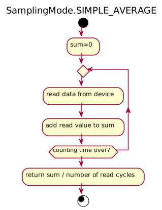

#### SamplingMode.INTEGRATE
compaired to `SamplingMode.SIMPLE_AVERAGE` it takes also into account the nominal counting time and mulitplies by it.

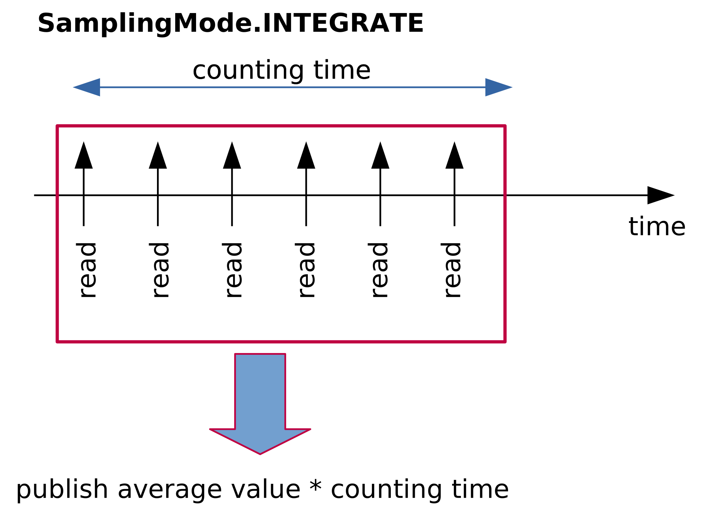

<!-- svg rendered with https://www.planttext.com
@startuml

title SamplingMode.INTEGRATE
start

:sum=0;
repeat
  :read data from device;
  :add read value to sum;
repeat while (counting time over?)

:return sum * counting time / number of read cycles;

stop


@enduml

-->

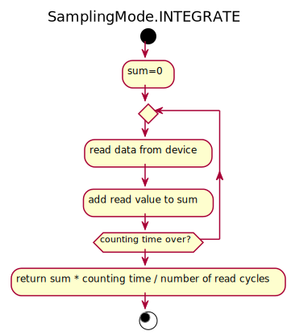

#### SamplingMode.STATISTICS
publishes `mean`, number values read and `std` in three channels that appear as 3 seperate entries in hdf5 and redis.

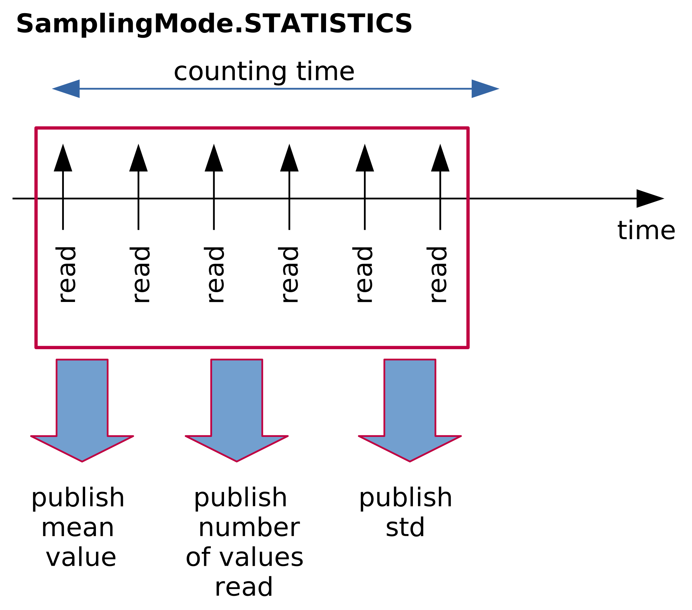

<!-- svg rendered with https://www.planttext.com
@startuml

title SamplingMode.STATISTICS
start

repeat
  :read data from device;
  :calculate whatis 
  needed for statistics;
repeat while (counting time over?)

:yields 3 channels:
mean of read values, 
number of read cycles,
standard deviation of read values;

stop


@enduml

 -->
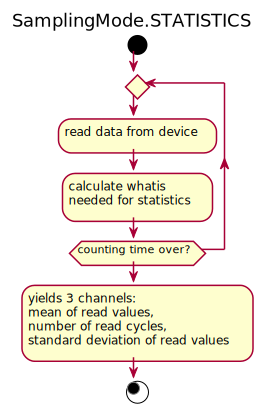

#### SamplingMode.SINGLE_COUNT

Counters in this mode will only be read once (only one call of `read()`). Counters in this mode can not be combined with conters in other modes in the same `AquistionDevice`.

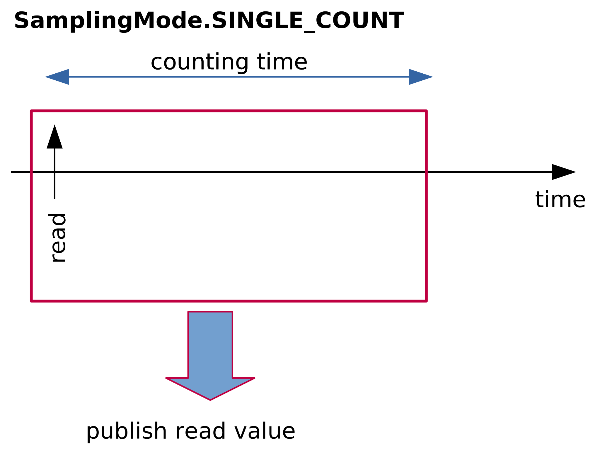

<!-- svg rendered with https://www.planttext.com
@startuml

title SamplingMode.SINGLE_COUNT
start

:read data from device;

:return read value;

stop


@enduml
-->


#### SamplingMode.SAMPLES

this mode is more complex than the other modes in a sense that it generates an additional 1d dataset per point and also publishes it.

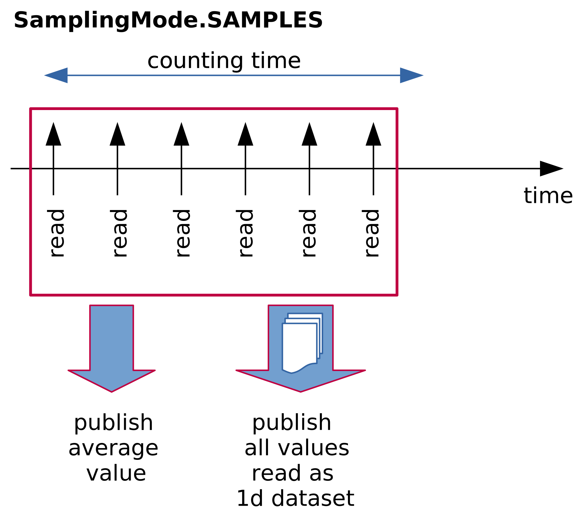

<!-- svg rendered with https://www.planttext.com
@startuml

title SamplingMode.SAMPLES
start

repeat
  :read data from device;
  :append read values to a list;
repeat while (counting time over?)

:return like SIMPLE_AVERAGE
and
publish all samples read as 1d data;

stop


@enduml

 -->
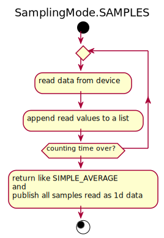

#### SamplingMode.FIRST_READ
The final result is simmilar to what is achivied with `SamplingMode.SINGLE_COUNT`, however here the sampling loop is used so counters in this mode can be comined with conters in other modes using the same AquisitionDevice.
No averaging will take place but the first read value will be propagated.

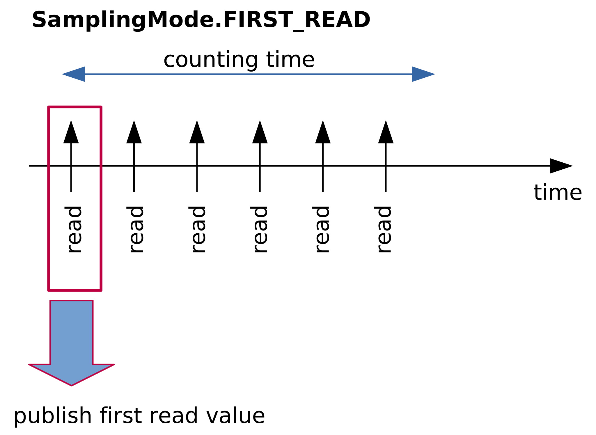

<!-- svg rendered with https://www.planttext.com
@startuml

title SamplingMode.FIRST_READ
start

repeat
  :read data from device;
  if (first loop itteration loop) then (yes)
    :keep read value for laster;
  else (no)
    :do nothing;
  endif

  
repeat while (counting time over?)

:return read value of first itteration;

stop

 -->
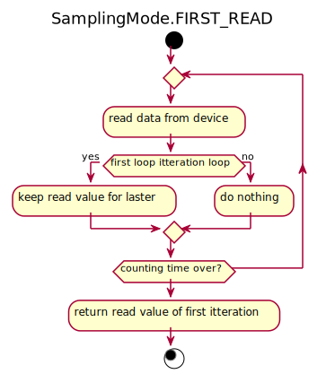


## Integrating counter

### example 1

A controller exporting N counters.


## NOTES
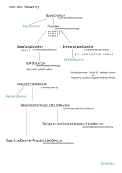

## Calculation counter

Calculation counters can be use to do some computation on raw values
of real counters.

### Simple example

In this example the calculation counter will return the mean of two
real counters.
Real counters are **diode** and **diode2**.

```python
from bliss.common.measurement import CalcCounter
from bliss.scanning.acquisition.calc import CalcHook

# Mean caclulaion
class Mean(CalcHook):
    def prepare(self):
        self.data = {}
    def compute(self,sender,data_dict):
    	# Gathering all needed data to calculate the mean
	# Datas of several counters are not emitted at the same time
        nb_point_to_emit = numpy.inf
        for cnt_name in ('diode','diode2'):
            cnt_data = data_dict.get(cnt_name,[])
            data = self.data.get(cnt_name,[])
            if len(cnt_data):
                data = numpy.append(data,cnt_data)
                self.data[cnt_name]=data
            nb_point_to_emit = min(nb_point_to_emit,len(data))
	# Maybe noting to do
        if not nb_point_to_emit:
            return

        # Calculation
        mean_data = (self.data['diode'][:nb_point_to_emit] +
                     self.data['diode2'][:nb_point_to_emit]) / 2.
        # Removing already computed raw datas
        self.data = {key:data[nb_point_to_emit:]
                     for key,data in self.data.items()}
        # Return name musst be the same as the counter name:
	# **mean** in that case
        return {"mean":mean_data}

mean = CalcCounter("mean",Mean(),diode,diode2)
```


