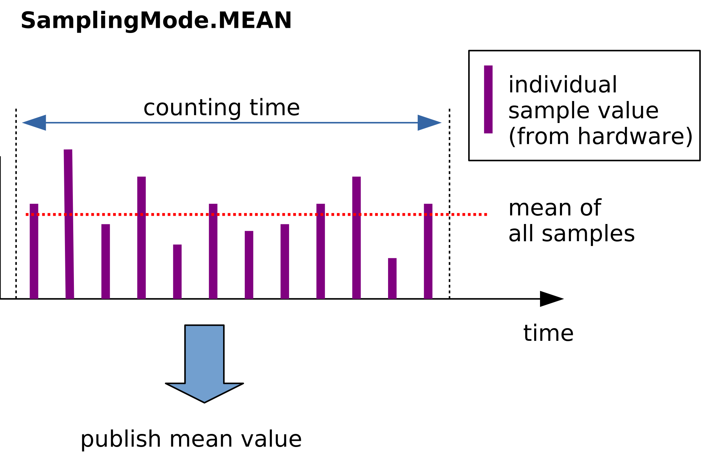
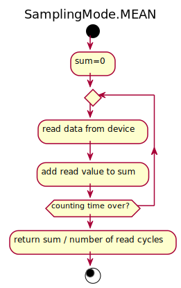
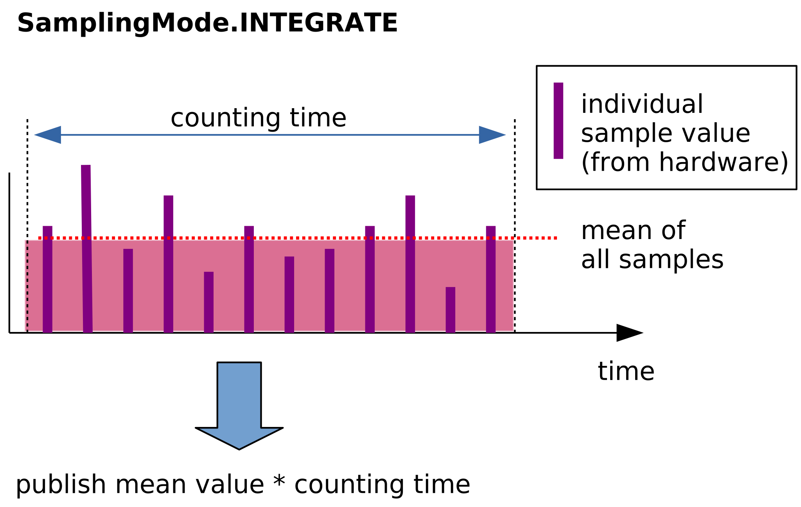
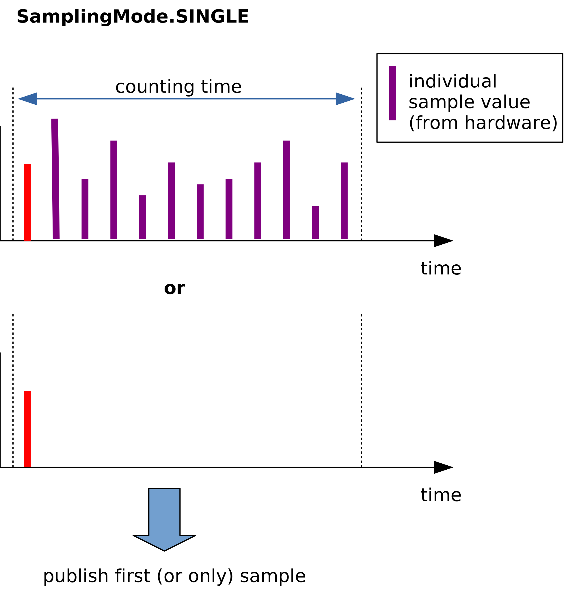
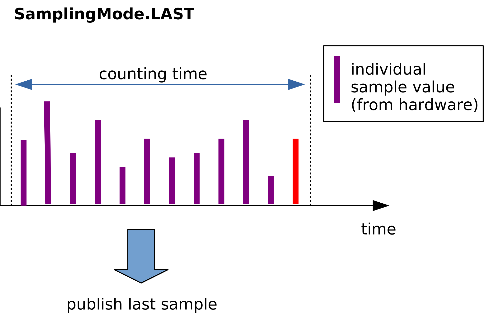

# Counters

Counters are BLISS objects intended to be read during a count or step
by step scan as well as during a continuous scan.

Such objects have then to follow a minimal API to be usable in
standard scans.


## Sampling or Integrating counter ?

A *sampling counter* obtains readout values "*on the
fly*" with just a read command:

* `read()`

BLISS examples:

* tango BPM
* Wago
* Keller gauges

An *integrating counter* processes readout values
according to a defined sequence, typically:

* `prepare()`
* `start()`
* `stop()`

BLISS examples:

* Lima ROI and BPM


a custom Acquisition device can be created in case of:

* non-standard device interfacing
    * ex: flex.py
* mix of data types : spectrum and scalars


### Counters classes dependencies

This diagram presents the hierarchy of BLISS classes related to
counters with some example of usage.

{% dot counters_dep.svg
  digraph counter_dependencies {
   rankdir=BT

   bc   [shape=none label=
   <<table>
       <tr> <td> BaseCounter </td> </tr>
       <tr><td> <table border="0">
            <tr> <td>shape() </td> </tr>
            <tr> <td> dtype() </td> </tr>
           </table>
           </td>
       </tr>
    </table>>]
   c    [shape=none label=
   <<table>
       <tr> <td> Counter </td> </tr>
       <tr><td> <table border="0">
            <tr> <td>prepare() </td> </tr>
            <tr> <td> start() </td> </tr>
            <tr> <td> stop() </td> </tr>
           </table>
           </td>
       </tr>
    </table>>]

   sc   [shape=none label=
   <<table>
       <tr> <td> SamplingCounter </td> </tr>
       <tr><td> <table border="0">
            <tr> <td>read() </td> </tr>
            <tr> <td> ConvertValue() </td> </tr>
           </table>
           </td>
       </tr>
    </table>>]

    sftc   [shape=none label=
    <<table>
       <tr> <td> SoftCounter </td> </tr>
        <tr><td> <table border="0">
            <tr> <td>read() </td> </tr>
           </table>
           </td>
       </tr>
    </table>>]

    ic   [shape=none label=
    <<table>
        <tr> <td>IntegratingCounter </td> </tr>
        <tr> <td>
            <table border="0">
               <tr> <td>get_values() </td> </tr>
            </table>
        </td> </tr>
    </table>>]


    ic   [shape=none label=
    <<table>
        <tr> <td>IntegratingCounter </td> </tr>
        <tr> <td>
            <table border="0">
               <tr> <td>get_values() </td> </tr>
            </table>
        </td> </tr>
    </table>>]

   pc   [shape="oval" label="PepuCounter"]
   lrc  [shape="oval" label="LimaRoiCounter"]
   wc   [shape="oval" label="WagoCounter"]

   sc->c
   ic->c
   c->bc
   wc->sc
   sftc-> sc
   pc->bc
   lrc->ic
  }
%}


## Group read
Both IC and SC provide mechanism to perform *group read*s in order to
read many counters at once, if they belong to a common controller, able
to read all channels at once.


## Sampling counter

Depending on the number and the way how channels of the controller are
managed, different designs can be used.

### example 1

A simple 1 channel-counter.

YML configuration:

    plugin: bliss
    class: EMH
    name: emeter2
    unit: volt
    tcp:
       url: em

In this example, BLISS controller has:

* to deal with connection (TCP)


### example 2 : EMH

A controller with multiple channels.

EMH is a 4chan electrometer.

YML configuration:

    plugin: bliss
    class: EMH
    name: emeter2
    unit: volt
    tcp:
       url: emeter2.esrf.fr
    counters:
    - counter_name: e1
      channel: 1
    - counter_name: e2
      channel: 2

!!! note
    In this example, keyword `counter_name` is used instead of
    `name` to avoid to load automatically the counters objects in
    BLISS sessions.


This example BLISS controller has:

* to deal with the connection (TCP)
* to manage channels (returned by `counters()` property)
* to allow a grouped reading of all channels.

NB: the controller file name must be in lower case.

Example from `emh.py`:

    class EmhCounter(SamplingCounter):
        def __init__(self, name, controller, channel, unit=None):
    
            SamplingCounter.__init__(self, name, controller)
            #                                    ref to the controller
            # the reading of many counters depending on the same
            # controller will be performed using controller.read_all() function
    
            self.channel = channel
            self.unit = unit
    class EMH(object):
        """
        ESRF - EM#meter controller
        """
        def __init__(self, name, config):
    
            self.name = name
            self.bliss_config = config
    
            self.comm = get_comm(config, TCP, eol='\r\n', port=5025)
            # port number is fixed for this device.

            self.counters_list = list()
            for counter_conf in config.get("counters", list()):
                unit = counter_conf.get_inherited("unit")
                counter = EmhCounter(counter_conf["counter_name"],
                                     self,
                                     counter_conf["channel"], unit)
                self.counters_list.append(counter)
    
        @property
        def counters(self):
            return counter_namespace(self.counters_list)
    
        def read_all(self, *counters):
            curr_list = self.get_currents()
            vlist = list()
    
            for counter in counters:
                vlist.append(curr_list[counter.channel - 1])
    
            return vlist

### Sampling counter statistics

Sampling counters read as many samples as possible from the connected hardware
in the specified counting time and return, amongst others, an average value
(default mode, see below for details). Additionally, some basic statistics of 
the sampling process are calculated on the fly, which are accessible after the 
count through the `.statistics` property.

```
    TEST_SESSION [1]: diode.mode     
             Out [1]: <SamplingMode.MEAN: 1>

    TEST_SESSION [2]: ct(1,diode)    
    
      diode = 8.03225806451613 ( 8.03225806451613/s)
        
    TEST_SESSION [3]: diode.statistics      
             Out [3]: SamplingCounterStatistics( mean=8.032, N=93,
                                                 std=55.96, var=3132.16, 
                                                 min=-98.0, max=100.0, 
                                                 p2v=198.0, count_time=1, 
                                                 timestamp='2019-07-26 10:13:25')
```
The values available in `SamplingCounterStatistics` are

 - `mean`: Mean value  $\bar x = \frac {\sum_{j=1}^n x_j}{n}$
 - `var`: Variance  $\sigma^2 = \displaystyle\frac {\sum_{i=1}^n (x_i - \bar x)^2}{n}$
 - `std`: Standard deviation $\sigma = \sqrt{\sigma^2}$
 - `min`: Minimum value $x_{min}$
 - `max`: Maxium value $x_{max}$
 - `p2v`: Peak to valley $x_{max}-x_{min}$

To avoid storing individual sample values temporarily, the statistics are calculated
in a rolling fashion using [Welford's online algorithm]
(https://en.wikipedia.org/wiki/Algorithms_for_calculating_variance#Welford's_online_algorithm). 
Internally, the sum of squares of differences from the current mean 
$M_{2,n} = \sum_{i=1}^n (x_i - \bar x_n)^2$, is calculated iteratively 
via $M_{2,n} = M_{2,n-1} + (x_n - \bar x_{n-1})(x_n - \bar x_n)$.
Based on $M_{2,n}$ the variance is derived as $\sigma^2_n = \frac{M_{2,n}}{n}$.

### Sampling counter modes

At the end of the counting process, the sampling counter modes are used to specify 
which value(s) should be published (to hdf5 file and database).

The available modes can be found in `bliss.common.measurement.SamplingMode`:

```
    TEST_SESSION [1]: from bliss.common.measurement import SamplingMode
    TEST_SESSION [2]: list(SamplingMode)
             Out [3]: [<SamplingMode.MEAN: 1>,
                       <SamplingMode.STATS: 2>,
                       <SamplingMode.SAMPLES: 3>,
                       <SamplingMode.SINGLE: 4>,
                       <SamplingMode.LAST: 5>,
                       <SamplingMode.INTEGRATE: 6>]
                       <SamplingMode.INTEGRATE_STATS: 7>]
```

#### SamplingMode.MEAN

The default mode is `MEAN` which returns the mean (average) value of all 
samples, which have been read during the counting time.



<!-- svg rendered with https://www.planttext.com
@startuml

title SamplingMode.MEAN
start

:sum=0;
repeat
  :read data from device;
  :add read value to sum;
repeat while (counting time over?)

:return sum / number of read cycles;

stop


@enduml
 -->


#### SamplingMode.INTEGRATE

in addition to `SamplingMode.MEAN` the nominal counting time is taken into
account. This way a counter in the mode `SamplingMode.INTEGRATE` returns the
equivalent of the sum of all samples normalized by the counting time. 
A use case for this mode is for example the reading of a diode, that should yield
a value approximately proportional to the number of photons that hit the diode
during the counting time.




#### SamplingMode.STATS

publishes all the values as calculated for the sampling counter statistics 
(see above) into the hdf5 file and the redis database.


#### SamplingMode.INTEGRATE_STATS

equivalent to `SamplingMode.STATS`, but for counters that should behave as 
described in `SamplingMode.INTEGRATE` yielding statistics in additional channels.

#### SamplingMode.SINGLE

A counter in this mode publishes only the first sample read from the device,
discarding any further samples. If possible (i.e. there is no counter in any 
other mode on the same `AquisitionDevice`) only one sample will be read.




#### SamplingMode.LAST

A counter in this mode publishes only the last sample discarding any further samples.



#### SamplingMode.SAMPLES

Is different from other modes in the sense, that in addition to `SamplingMode.MEAN`,
it generates an additional 1d dataset containing the individual samples in a
counting period and also publishes it. It can e.g. be used to do some more 
complex statistical analysis of the measured values or, as basis for
any `CalcCounter`, that can be used to extract derived quantities from the
original dataset. Following is an example for a CalcCounter, that returns the median:

 
```
TEST_SESSION [1]: from bliss.common.measurement import CalcCounter
             ...: from bliss.scanning.acquisition.calc import CalcHook
             ...: import numpy
             ...: class Median(CalcHook):
             ...:     def compute(self,sender,data_dict):
             ...:         if "_samples" in sender.name:
             ...:             return {"median":numpy.median(data_dict[sender.name])}
             ...: medi = CalcCounter('median',Median(),diode9)
             ...: diode9.mode = "SAMPLES"

TEST_SESSION [2]: ct(.1,medi)
         Out [2]: Scan(number=224, name=ct, path=<no saving>)
	
                  dt[s] =          0.0 (         0.0/s)
                  diode9 = 19.333333333333332 ( 193.33333333333331/s)
                  median =         -7.0 (       -70.0/s)
```

## Integrating counter

### example 1

A controller exporting N counters.


## NOTES


## Calculation counter

Calculation counters can be use to do some computation on raw values
of real counters.

### Simple example

In this example the calculation counter will return the mean of two
real counters.
Real counters are **diode** and **diode2**.

```python
from bliss.common.measurement import CalcCounter
from bliss.scanning.acquisition.calc import CalcHook

# Mean caclulaion
class Mean(CalcHook):
    def prepare(self):
        self.data = {}
    def compute(self,sender,data_dict):
    	# Gathering all needed data to calculate the mean
	# Datas of several counters are not emitted at the same time
        nb_point_to_emit = numpy.inf
        for cnt_name in ('diode','diode2'):
            cnt_data = data_dict.get(cnt_name,[])
            data = self.data.get(cnt_name,[])
            if len(cnt_data):
                data = numpy.append(data,cnt_data)
                self.data[cnt_name]=data
            nb_point_to_emit = min(nb_point_to_emit,len(data))
	# Maybe noting to do
        if not nb_point_to_emit:
            return

        # Calculation
        mean_data = (self.data['diode'][:nb_point_to_emit] +
                     self.data['diode2'][:nb_point_to_emit]) / 2.
        # Removing already computed raw datas
        self.data = {key:data[nb_point_to_emit:]
                     for key,data in self.data.items()}
        # Return name musst be the same as the counter name:
	# **mean** in that case
        return {"mean":mean_data}

mean = CalcCounter("mean",Mean(),diode,diode2)
```


