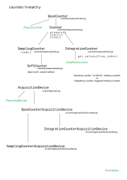

# Counters

Counters are BLISS objects intented to be read during a count or step
by step scan as well as during a continuous scan.

Such objects have then to follow a minimal API to be usable is
standard scans.


## Sampling or Integrating counter ?

A *sampling counter* is used to deal with devices to be read "on the
fly" with jsut a read command:

* `read()`

BLISS examples:

* tango BPM
* Wago
* Keller gauges

An *integrating counter* is used with devices that need to be processed
according to a defined sequence, typically:

* `prepare()`
* `start()`
* `stop()`

BLISS examples:

* Lima ROI and BPM


a custom Acquisition device can be created in case of:

* non-standard device interfacing
    * ex: flex.py
* mix of data types : spectrum and scalars


### Counters classes dependencies

This diagram presents the hierarchy of BLISS classes related to
counters with some example of usage.

{% dot counters_dep.svg
  digraph counter_dependencies {
   rankdir=BT

   bc   [shape=none label=
   <<table>
       <tr> <td> BaseCounter </td> </tr>
       <tr><td> <table border="0">
            <tr> <td>shape() </td> </tr>
            <tr> <td> dtype() </td> </tr>
           </table>
           </td>
       </tr>
    </table>>]
   c    [shape=none label=
   <<table>
       <tr> <td> Counter </td> </tr>
       <tr><td> <table border="0">
            <tr> <td>prepare() </td> </tr>
            <tr> <td> start() </td> </tr>
            <tr> <td> stop() </td> </tr>
           </table>
           </td>
       </tr>
    </table>>]

   sc   [shape=none label=
   <<table>
       <tr> <td> SamplingCounter </td> </tr>
       <tr><td> <table border="0">
            <tr> <td>read() </td> </tr>
            <tr> <td> ConvertValue() </td> </tr>
           </table>
           </td>
       </tr>
    </table>>]

    sftc   [shape=none label=
    <<table>
       <tr> <td> SoftCounter </td> </tr>
        <tr><td> <table border="0">
            <tr> <td>read() </td> </tr>
           </table>
           </td>
       </tr>
    </table>>]

    ic   [shape=none label=
    <<table>
        <tr> <td>IntegratingCounter </td> </tr>
        <tr> <td>
            <table border="0">
               <tr> <td>get_values() </td> </tr>
            </table>
        </td> </tr>
    </table>>]


    ic   [shape=none label=
    <<table>
        <tr> <td>IntegratingCounter </td> </tr>
        <tr> <td>
            <table border="0">
               <tr> <td>get_values() </td> </tr>
            </table>
        </td> </tr>
    </table>>]

   pc   [shape="oval" label="PepuCounter"]
   lrc  [shape="oval" label="LimaRoiCounter"]
   wc   [shape="oval" label="WagoCounter"]

   sc->c
   ic->c
   c->bc
   wc->sc
   sftc-> sc
   pc->bc
   lrc->ic
  }
%}


## Group read
Both IC and SC provide mechanism to perform *group read* in order to
read many counters at once if they belong to a common controller able
to read all channels at once.


## Sampling counter

Depending on the number and the way how channels of the controller are
managed, different designs can be used.

### example 1

A simple 1 channel-counter.

YML configuration:

    plugin: bliss
    class: EMH
    name: emeter2
    unit: volt
    tcp:
       url: em

In this example, BLISS controller has:

* to deal with connection (TCP)


### example 2 : EMH

A controller with multiple channels.

EMH is a 4chan electrometer.

YML configuration:

    plugin: bliss
    class: EMH
    name: emeter2
    unit: volt
    tcp:
       url: emeter2.esrf.fr
    counters:
    - counter_name: e1
      channel: 1
    - counter_name: e2
      channel: 2

!!! note
    In this example, keyword `counter_name` is used instead of
    `name` to avoid to load automaticaly the counters objects in
    BLISS sessions.


In this example, BLISS controller has:

* to deal with connection (TCP)
* to manage channels (returned by `counters()` property).
* to allow a groupped reading of all channels

NB: controller file name must be in lower case.

Example from `emh.py`:

    class EmhCounter(SamplingCounter):
        def __init__(self, name, controller, channel, unit=None):
    
            SamplingCounter.__init__(self, name, controller)
            #                                    ref to the controller
            # the reading of many counters depending on the same
            # controller will be performed using  controller.read_all() function
    
            self.channel = channel
            self.unit = unit
    class EMH(object):
        """
        ESRF - EM#meter controller
        """
        def __init__(self, name, config):
    
            self.name = name
            self.bliss_config = config
    
            self.comm = get_comm(config, TCP, eol='\r\n', port=5025)
            # port number is fixed for this device.

            self.counters_list = list()
            for counter_conf in config.get("counters", list()):
                unit = counter_conf.get_inherited("unit")
                counter = EmhCounter(counter_conf["counter_name"],
                                     self,
                                     counter_conf["channel"], unit)
                self.counters_list.append(counter)
    
        @property
        def counters(self):
            return counter_namespace(self.counters_list)
    
        def read_all(self, *counters):
            curr_list = self.get_currents()
            vlist = list()
    
            for counter in counters:
                vlist.append(curr_list[counter.channel - 1])
    
            return vlist

## Integrating counter

### example 1

A controller exporting N counters.


## NOTES


## Calculation counter

Calculation counters can be use to do some computation on raw values
of real counters.

### Simple example

In this example the calculation counter will return the mean of two
real counters.
Real counters are **diode** and **diode2**.

```python
from bliss.common.measurement import CalcCounter
from bliss.scanning.acquisition.calc import CalcHook

# Mean caclulaion
class Mean(CalcHook):
    def prepare(self):
        self.data = {}
    def compute(self,sender,data_dict):
    	# Gathering all needed data to calculate the mean
	# Datas of several counters are not emitted at the same time
        nb_point_to_emit = numpy.inf
        for cnt_name in ('diode','diode2'):
            cnt_data = data_dict.get(cnt_name,[])
            data = self.data.get(cnt_name,[])
            if len(cnt_data):
                data = numpy.append(data,cnt_data)
                self.data[cnt_name]=data
            nb_point_to_emit = min(nb_point_to_emit,len(data))
	# Maybe noting to do
        if not nb_point_to_emit:
            return

        # Calculation
        mean_data = (self.data['diode'][:nb_point_to_emit] +
                     self.data['diode2'][:nb_point_to_emit]) / 2.
        # Removing already computed raw datas
        self.data = {key:data[nb_point_to_emit:]
                     for key,data in self.data.items()}
        # Return name musst be the same as the counter name:
	# **mean** in that case
        return {"mean":mean_data}

mean = CalcCounter("mean",Mean(),diode,diode2)
```


