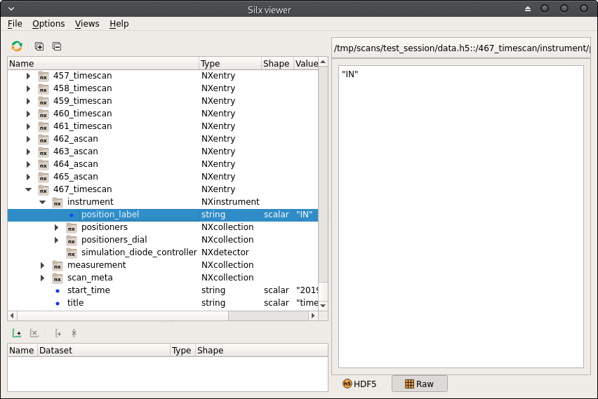

## User metadata

BLISS provides a global structure to associate names (string keys) to functions, which return values are
inserted in the `scan_info` dictionary that contains metadata information for scans.

Depending on which writer is used for scans, the metadata information is then written at the appropriate
place.

By default, BLISS is saving data in the HDF5 format, following Nexus convention.

Available categories are:

* instrument
* sample
* sample_description
* proposal
* technique

### Filling metadata

The `get_user_scan_meta()` function from `bliss.scanning.scan_meta` returns the scan metadata object.
Each metadata category is accessible via the corresponding property. Then, the `.set()` method allows to
associate a name or an object with a `.name` property to a function, that has to return a dictionary
to be stored as metadata for the object, for the category.

The following example adds the position label of a Multiple Position object under the 'Instrument'
category to each scan metadata:

```python
from bliss.scanning import scan_meta

scan_meta_obj = scan_meta.get_user_scan_meta()

# mp is a BLISS Multiple Position object
scan_meta_obj.instrument.set(mp, lambda _: { "position_label": mp.position })
```

The function receives the scan object as argument. In the example above, this argument is ignored.

Each subsequent scan will have an 'instrument' section filled with the metadata:




### Examples

Refer to the [Nexus standard](https://manual.nexusformat.org) when adding metadata.

#### Devices

Choose an appropriate [device definition](https://manual.nexusformat.org/classes/base_classes/NXinstrument.html#nxinstrument) from the Nexus standard. For example an attenuator can be added as follows

```python
scan_meta_obj.instrument.set("myattenuator", {"myattenuator":
    {"@NX_class":"NXattenuator",
     "status": "in",
     "type": "aluminium",
     "thickness":{"@data":20., "@units": "um"}}})
```
