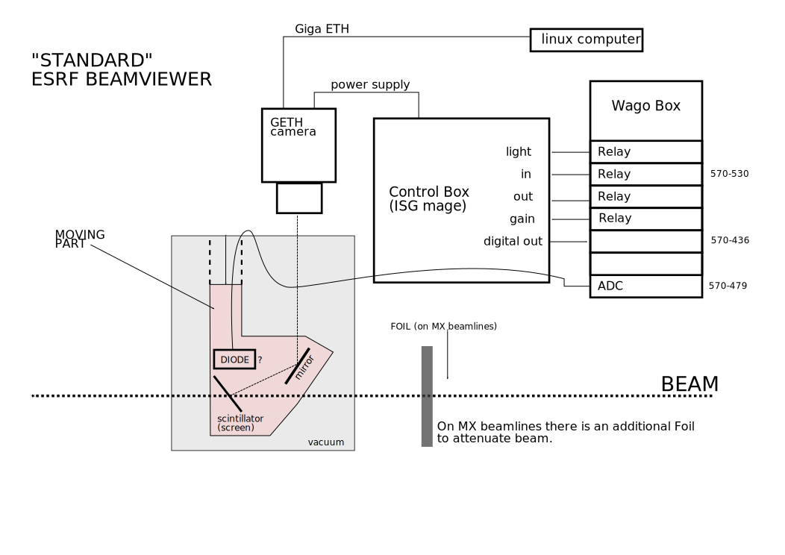

# BLISS Documentation

BLISS Documentation is furnished in various manners:

* main documentation using mkdocs https://www.mkdocs.org/
    * When adding a page, the main summary in `doc/mkdocs.yml` must be
      modified according to the new hierarchy.
    * As usual, merge requests are used to track and review modifications.
    * Common parts of documentation must be factorized as much as
      possible in order to keep a good coherency. When developing a
      new motor controller for example, the common documentation can
      be found [here](dev_write_motctrl.md) and only the specific part
      will be kept in source code.

* embeded in source code
    * inline comments to understand source code
    * *docstring* after all user functions to be accessible from BLISS
      shell with `help(<function>)`


## New controller documentation

What to include in code  / What to put in mkdoc ???


Example:
    
    """ESRF - PePU controller
    
    Example YAML_ configuration:
    
    .. code-block:: yaml
    
        plugin: bliss
        class: PEPU
        module: pepu
        name: pepudcm2
        tcp:
          url: pepudcm2
        template: renishaw    # optional
    
    Usage::
       >>> from bliss.config.static import get_config
       >>> from bliss.controllers.pepu import Stream, Trigger, Signal, ChannelMode

       >>> config = get_config()

       >>> pepudcm2 = config.get('pepudcm2')
       
    For the counter interface, see the
    `PePU scan support documentation <bliss.scanning.acquisition.pepu.html>`__.
    """


template:


    """ESRF - XXX controller
    
    Example YAML configuration:
    
    .. code-block:: yaml
    
        plugin: bliss
        class: XXX
        module: xxx
        name: xxx
        tcp:
          url: xxx.esrf.fr
    
    Usage::
        XXX
        
    For more information, see the XXX documentation: XXX.
    """

## Markdown examples

This page can be used as example of typical markdown usage.

Here is an online editor to test your markdown:
https://nhnent.github.io/tui.editor/api/latest/tutorial-example01-basic.html#

And a summary of markers: https://github.com/adam-p/markdown-here/wiki/Markdown-Cheatsheet

### Documentation creation

To easily view the result of your writing, using a local rendering:

* Create or use a conda environment with good packages installed:
    * sphinx / graphviz / pygments / mkdocs / mkdocs-material
    * pymdown-extensions==5.0 / markdown-inline-graphviz / Markdown < 3
* These packages are in `requirements-doc.txt` and `requirements-doc.txt`

        conda install --yes --file requirements-doc-conda.txt
        pip install -r requirements-doc.txt

* launch `mkdocs` in server mode:

        cd doc/
        mkdocs serve -a <computer_name>:8888

* and visit [http:\\\\computername:8888](http:\\computername:8888) to see the documentation


### Level 3 title
There are 6 levels of titles.

!!! note
     Titles of levels 2 to 6 are referenced in lateral right bar.

#### Level 4 title

!!! note
     A note of made with an empty line and 3 !!!

##### Level 5 title

###### Level 6 title

### Lists

To create a list, an empty line must be respected:

* and start 1st level lines with `* ` (star + space)
* etc.
    * Nested list are possible,
    * with 4 spaces to begin the 2nd level lines.
        * and 8 for 3rd level
        * etc.


### Links

* mkdocs inner links: [Beamviewer Configuration](config_beamviewer.md).
* mkdocs inner links fir section ref: [code formatting](dev_guidelines.md#code-formatting)
* outer links: [ESRF Gitlab](https://gitlab.esrf.fr/bliss/bliss)
* footnote reference: [silx](1)


### Raw text

Inline raw text is placed between 2 backquotes:

    `raw text in monospace font`
result: `raw text in monospace font`


A raw text block is defined using 4 spaces to begin a line and
respecting an empty line before block.

    % bliss -h
    Usage: bliss [-l | --log-level=<log_level>] [-s <name> | --session=<name>]
           bliss [-v | --version]
           bliss [-c <name> | --create=<name>]
           bliss [-d <name> | --delete=<name>]
           bliss [-h | --help]


### Formated text

#### Inline

There are many formating marker to write text in *italic* or `raw text
 in monospace font` or **bold** or ~~strikethrough~~


#### Python code

To specify a programing language, 3 back-quotes can be used:

```python
from bliss.common.axis import Axis
from bliss.controllers.motors import icepap
iceid2322 = icepap.Icepap("iceid2322", {"host": "iceid2322"},
    [("mbv4mot", Axis, { "address":1,"steps_per_unit":817,
    "velocity": 0.3, "acceleration": 3
        })], [], [], [])
```

!!! note
    With such formatin, python code is more easy to copy past in a shell.

#### YAML code

```YAML
- controller:
    class: icepap
    host: iceid2322
    axes:
        -   name: ts2f
            address: 4
            steps_per_unit: 1000
```

#### Mathematic formula

Nice formula can be integrated using Latex syntax:

Example of code for cubic crystal diffraction:

    $$
    d = \frac{a}{\sqrt{h^2+k^2+l^2}}
    $$

result:

$$
d = \frac{a}{\sqrt{h^2+k^2+l^2}}
$$


### images and drawings

#### SVG

Code to include an existing svg file:

    

result:


#### Bitmap

PNG, SVG or GIF files can be used


#### 2 examples of inline graphviz drawing

{% dot p201_arch.svg
  digraph G {
     rankdir="LR";

     driver [label="driver", shape="box"];
     card [label="Card", shape="component"];

     subgraph cluster_zerorpc {
       label = "CT2 0RPC server";
       color = black;
       node [shape=rectangle];

       CT2_Device [label="bliss.\ndevice.\nCT2"];

     }

     subgraph cluster_client {
       label = "bliss shell";
       node [shape=rectangle];

       CT2_Client [label="bliss.\nclient.\nCT2"];
     }

     driver -> card [dir="both", label="PCI bus"];
     CT2_Device -> driver[dir=both];
     CT2_Client -> CT2_Device [dir="both", label="0RPC\nreq/rep &\nstream"];
   }
%}


{% dot scan_dep.svg
   digraph scans_hierarchy {
   d2s [shape="box" label="d2scan"]
   a2s [shape="box" label="a2scan"]
   ls [shape="box" label="loopscan"]
   ct [shape="box" label="ct"]
   ts [shape="box" label="timescan"]
   lu [shape="box" label="lineup"]
   ds [shape="box" label="dscan"]
   as [shape="box" label="ascan"]
   ss [shape="box" label="step_scan"]
   ps [shape="box" label="pointscan"]
   dm [shape="box" label="dmesh"]
   am [shape="box" label="amesh"]

   d2s->a2s->ss
   ls->ts->ss
   lu->ds->as->ss
   ps->ss
   dm->am->ss
   ct->ts
   ss->"bliss.scanning.scan.Scan"
   }
%}


[1]: http://silx.org

