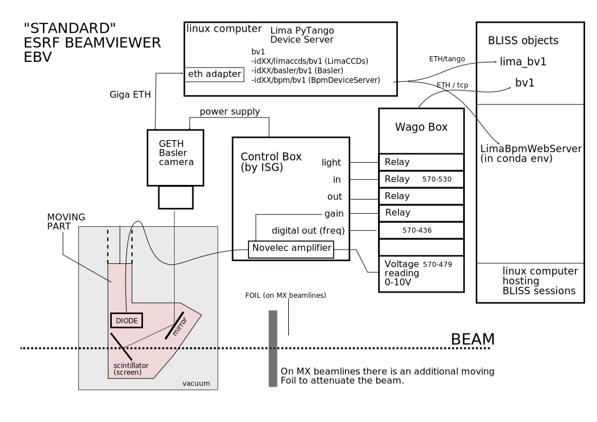
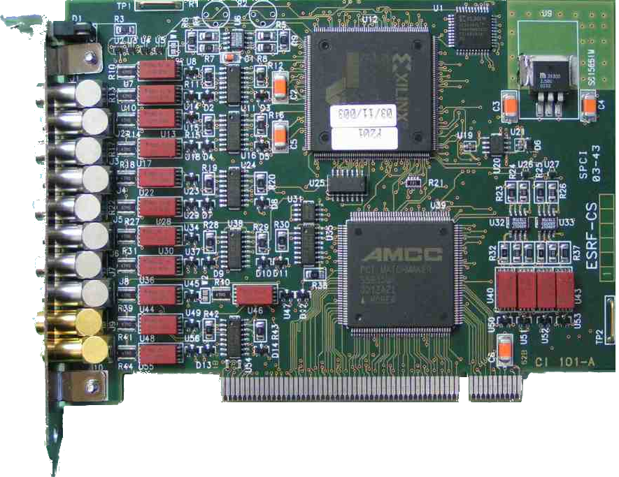

# BLISS Documentation

BLISS Documentation is furnished in various manners:

* main documentation using mkdocs https://www.mkdocs.org/
    * When adding a page, the main summary in `doc/mkdocs.yml` must be
      modified according to the new hierarchy.
    * As usual, merge requests are used to track and review modifications.
    * Common parts of documentation must be factorized as much as
      possible in order to keep a good coherency. When developing a
      new motor controller for example, the common documentation can
      be found [here](dev_write_motctrl.md) and only the specific part
      will be kept in source code.

* embeded in source code
    * inline comments to understand source code
    * *docstring* after all user functions to be accessible from BLISS
      shell with `help(<function>)`

## Installing documentation requirements

In order to be able to test documentation on a PC where BLISS is
installed, the documentation requirements need to be installed
in a conda environment.

!!! note "At ESRF"
    At ESRF, enter the BLISS development conda environment to install documentation requirements:
    ```bash
    . blissenv -d
    ```


```bash
cd <bliss.git directory>
conda install --file requirements-doc-conda.txt
pip install -r requirements-doc.txt
```

This installs `mkdocs` and all dependencies.

In order to serve a local version of the documentation, start
the mkdocs server with:
```bash
cd <bliss.git directory>/doc/
mkdocs serve
```
And visit http://localhost:8000


In order to update the codumentation
http://localhost:8000/dev_documentation.html
Please do the following

```bash
cd <bliss.git directory>/doc/docs
<your favorite editor> dev_documentation.md
```

Once you save **dev_documentation.md** you can see the new version
by reloading
http://localhost:8000/dev_documentation.html

## New controller documentation

What to include in code  / What to put in mkdoc ???


### Example:

**ESRF - PePU controller**

Example YAML_ configuration:

```yaml

	plugin: bliss
	class: PEPU
	module: pepu
	name: pepudcm2
	tcp:
	  url: pepudcm2
	template: renishaw    # optional
```

Usage:

```
>>> from bliss.config.static import get_config
>>> from bliss.controllers.pepu import Stream, Trigger, Signal, ChannelMode

>>> config = get_config()

>>> pepudcm2 = config.get('pepudcm2')
```

For the counter interface, see the
`PePU scan support documentation <bliss.scanning.acquisition.pepu.html>`


###template:


**ESRF - XXX controller**

Example YAML configuration:

```yaml

	plugin: bliss
	class: XXX
	module: xxx
	name: xxx
	tcp:
	  url: xxx.esrf.fr
```

Usage:
     XXX

For more information, see the XXX documentation: XXX.


## GUI doc

examples:

* Menu: `Help` ▶ `IPython`.

* some symbols: 🗹 ✅ ❌ ❓ 🔴 🔶 □ 🗹 𝚫t µ → ⟶ 🡆 ← ↑ → ↓


## Markdown examples

This page can be used as example of typical markdown usage.

Here is an online editor to test your markdown:
https://nhnent.github.io/tui.editor/api/latest/tutorial-example01-basic.html#

And a summary of markers: https://github.com/adam-p/markdown-here/wiki/Markdown-Cheatsheet

### Documentation creation

To easily view the result of your writing, using a local rendering:

* Create or use a conda environment with good packages installed:
    * sphinx / graphviz / pygments / mkdocs / mkdocs-material
    * pymdown-extensions==5.0 / markdown-inline-graphviz / Markdown < 3
* These packages are in `requirements-doc.txt` and `requirements-doc.txt`

!!! note  "At ESRF"
    At ESRF, enter the BLISS development conda environment to install documentation requirements:
    ```bash
    . blissenv -d
    ```

```bash
cd <bliss.git directory>
conda install --file requirements-doc-conda.txt
pip install -r requirements-doc.txt
```

* launch `mkdocs` in server mode in your conda environment:

```bash
hostname
myhost
cd <bliss.git directory>/doc/
mkdocs serve -a 0.0.0.0:8888
```

* and visit [http://myhost:8888](http://myhost:888) to see the documentation


### Level 3 title
There are 6 levels of titles.

!!! note  "Title of the note"
     Titles of levels 2 to 6 are referenced in lateral right bar.

#### Level 4 title

!!! note  "Title of the note"
    A note is made with an empty line, 3 !!!, `note` keyword and indented text.
    ```

    !!! note "Title of the note"
        A note of made with an empty line and 3 !!!
    ```


##### Level 5 title

###### Level 6 title

### emphasis blocks

There are some ways to outline information in blocks:

with admonition plugin:
https://squidfunk.github.io/mkdocs-material/extensions/admonition/

* `note`
* `info` / `todo`
* `example` / `snippet`
* `warning`
* `abstract` / `summary` / `tldr`
* `tip` / `hint` / `important`
* `success` / `check` / `done`
* `question` / `help` / `faq`
* `failure` / `fail` / `missing`
* `danger` / `error`
* `bug`
* `quote` / `cite`


!!! note "This is a note"

     « Au contraire, il est impossible de partager soit un cube en deux cubes, soit
     un bicarré en deux bicarrés, soit en général une puissance quelconque supérieure
     au carré en deux puissances de même degré : j'en ai découvert une démonstration
     véritablement merveilleuse que cette marge est trop étroite pour contenir. »
     *Pierre de Fermat*


!!! warning "ATTENTION !!!!"

    “Beware the ides of March.”
    ― *William Shakespeare*, Julius Caesar

!!! info

    bla bla

!!! abstract

    bla bla

!!! example

    just do like that

!!! tip

    Do you known you can do... ?

!!! success

    And voila !

!!! question "to be or not to be"

    That's the question.

!!! failure

    a marche pas...

!!! danger

    "Use that at your own risks"

!!! quote "Quote of the day"

    *People think that computer science is the art of geniuses but the actual reality
    is the opposite, just many people doing things that build on eachother, like a
    wall of mini stones.*

    Donald Knuth


### Lists

To create a list, an empty line must be respected:

* and start 1st level lines with `* ` (star + space)
* etc.
    * Nested list are possible,
    * with 4 spaces to begin the 2nd level lines.
        * and 8 for 3rd level
        * etc.


### Links and references
use:

```
* mkdocs inner links: [Beamviewer Configuration](config_beamviewer.md).
* inner links to section: [code formatting](dev_guidelines.md#code-formatting)
* outer links: [ESRF Gitlab](https://gitlab.esrf.fr/bliss/bliss)
```

to produce:

* mkdocs inner links: [Beamviewer Configuration](config_beamviewer.md).
* mkdocs inner links fir section ref: [code formatting](dev_guidelines.md#code-formatting)
* outer links: [ESRF Gitlab](https://gitlab.esrf.fr/bliss/bliss)


### Raw text

Inline raw text is placed between 2 backquotes:

    `raw text in monospace font`

result: `raw text in monospace font`


A raw text block is defined using 4 spaces to begin a line and
respecting an empty line before block.

    My text without any change,
    but it has to be text without symbols.

In case you want to have a line break
just insert two *spaces* at the end of the line, like this:
line1
line2
line3

A bash command line is defined with 3 \` (backquotes) followed by **bash**<br>
It looks like
```markdown
 ```bash
```
and you finish your script with 3  \` (backquotes)  like
```markdown
 ```
```

Here is an example with <,> and [ in the text

```bash
% bliss -h
Usage: bliss [-l | --log-level=<log_level>] [-s <name> | --session=<name>]
       bliss [-v | --version]
       bliss [-c <name> | --create=<name>]
       bliss [-d <name> | --delete=<name>]
       bliss [-h | --help]
```


### Formated text

#### Inline

There are many formating marker to write text in *italic* or `raw text
 in monospace font` or **bold** or ~~strikethrough~~


#### Python code

To specify a programing language, 3 backquotes can be used:

```python
from bliss.common.axis import Axis
from bliss.controllers.motors import icepap
iceid2322 = icepap.Icepap("iceid2322", {"host": "iceid2322"},
    [("mbv4mot", Axis, { "address":1,"steps_per_unit":817,
    "velocity": 0.3, "acceleration": 3
        })], [], [], [])
```

!!! info
    With such formatting, Python code is easier to copy/paste in a shell.

#### YAML code

```YAML
- controller:
    class: icepap
    host: iceid2322
    axes:
        -   name: ts2f
            address: 4
            steps_per_unit: 1000
```

#### Mathematic formula

Nice formula can be integrated using Latex syntax:

Example of code for cubic crystal diffraction:

    $$
    d = \frac{a}{\sqrt{h^2+k^2+l^2}}
    $$

result:

$$
d = \frac{a}{\sqrt{h^2+k^2+l^2}}
$$


### images and drawings

#### SVG

Code to include an existing svg file:

    

result:


!!! note
    To avoid fonts problems with svg files, texts can be converted to
    pathes. Select all and use Shift-Ctrl-C in Inkscape for example.

#### Bitmap

PNG, SVG or GIF files can be used


