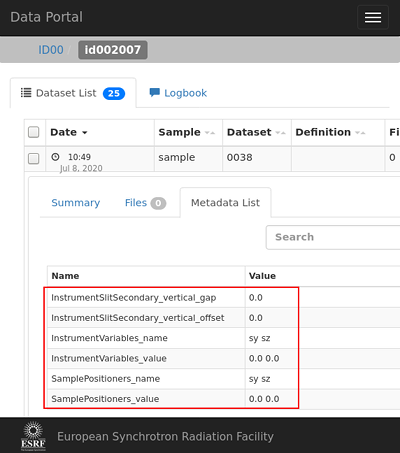
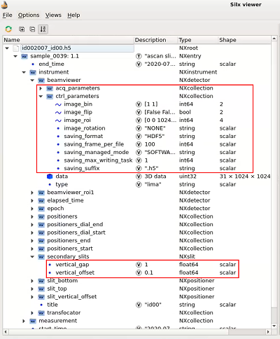

# ICAT metadata

## Difference between icat metadata and scan metadata
It is important to distinguish between two kind of meta-data that can be
handled in bliss.

### icat metadata


Roughly speaking icat metadata is what one can find as metadata of a
**dataset** in data.esrf.fr. There is a resticted set of available field names 
to unify metadata keys for the whole esrf. To have metadata published here
additional configuration is needed (see below)

### scan metadata
Not related to icat but to each **scan** in bliss there is a mechanism to 
collect metadata that ends up in the hdf5 files.



For bliss controller that publish metadata this works out of the box without 
additional configuration.

## icat: beamline snapshot and technique specific fields

From a bliss point of view there are two different types of metadata fields in 
icat itself. On the one hand there is a *beamline snapshot* that can be configured
follwoing the example below. On the other hand there there are technique related fields that
are discussed [here](dev_data_set.md).

## Configuration of icat metadata 

for the beamline snapshot a mapping has to be done between the icat field names and
bliss objects. To facilitate this mapping there is the `ICATmeta` controller. Its yaml configuration
looks like this:

```yaml
name: my_icat_obj
plugin: bliss
class: ICATmeta

# in the objects section a mapping between entire bliss
# objects that produce nexus/icat compliant metadata
# and icat objects can be done. The keys in the following
# mapping are the keys of bliss.icat.instrument.INSTRUMENTATION

objects:
  secondary_slit: $secondary_slits

# as icat defines its own sub groups of positioners there
# is a dedicated section here. Keys in there are icat 
positioners:
  sample: [$sy,$sz]

# in the mapping section individual keys can be mapped to 
# icat keys under mapping musst be valid icat field names
mapping:
  InstrumentVariables_name: [ $sy.name, $sz.name ]
  InstrumentVariables_value: [ $sy.position, $sz.position ]
  # by the way, this is just a demo ... this mapping
  # does probably not make sense...
```

all bliss controllers listed under `objects` in the config above must follow the `MetadataPublisher` 
protocol (have a method called `metadata` that returns a dict with nexus/icat compliant keys). 

This object has to be added to the session config like this:

```yaml

- class: Session
  name: demo_session
  setup-file: ./demo_session_setup.py
  icat-mapping: my_icat_obj     # <-- this is the important line
  config-objects: 
    - diode1
```


