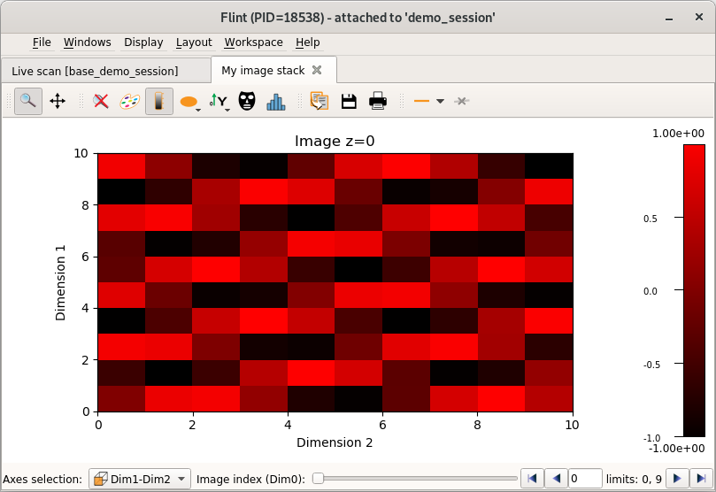

# Flint Data Plotting

During a BLISS session, users may create data (other than scan data) that needs
to be displayed graphically. Flint offers a collection of different type of
plots (curve, scatter, image...) so user can select the one that best fits
with the data to be displayed.

## Basic plot display

A generic display is provided through the BLISS `plot` command.

This the data dimensionality to select and display a plot.

This can be convenient for basic display.


```python
# Display a list (as a single curve using index as x-axis)
plot([1, 2, 3, 1, 2, 3])

import numpy

# Display a 1D data (as a single curve using index as x-axis)
array = numpy.array([1, 2, 3, 1, 2, 3])
plot(array)

# Display a 2D data (as an image)
image = numpy.array([[1, 2, 3], [1, 2, 3], [1, 2, 3]])
plot(image)

# Display a 3D data (as a stack of images)
cube = numpy.arange(1000)
cube.shape = 10, 10, 10
plot(cube)
```

## Create a plot

To use more features another way is provided.

First a plot have to be created from the Flint.

The first argument (here `curve`) is used to select the kind of expected plot.
See the following documentation for example for each kind.

```python
f = flint()
p = f.get_plot("curve")
```

Other arguments are available to edit some behavior of this plot.

A title can be specified, a unique name can be set to reuse plots instead of
creating a new one. The plot can be closeable (default is true) or selected
by default at the creation (default is false).

```python
p = f.get_plot("curve",
               name="My plot title",
               unique_name="myplot42",
               closeable=True,
               selected=True)
```

## 1D plot / curve plot

The main plot is a curve plot.

It can be used to display several 1D data as curves.

```python
import numpy

# Create the plot
f = flint()
p = f.get_plot("curve", name="My plot")

# Create data
t = numpy.linspace(0, 10 * numpy.pi, 100)
s = numpy.sin(t)
c = numpy.cos(t)

# Update the plot
p.add_curve(t, c, legend="aaa")  # the legend have to be unique
p.add_curve(t, s, legend="bbb")

# Clean up the plot
p.clean_data()
```

This also can be used to display parametric functions

```python
import numpy

t = numpy.linspace(-3, 3, 50)
x = 16 * numpy.sin(t)**3
y = 13 * numpy.cos(t) - 5 * numpy.cos(2*t) - 2 * numpy.cos(3*t) - numpy.cos(4*t)

f = flint()
p = f.get_plot("curve", name="My heart")
p.add_curve(x, y, legend="heart")
```

## Scatter plot

A 2D scatter plot is provided.

A scatter is a group of of three 1D data of the same length. Each of them
respectively contains x-locations, y-locations and values.

The widget provides different visualization mode to display the data as points,
or with a solid rendering, including 2D histogram rendering.

```python
import numpy

# Create the plot
f = flint()
p = f.get_plot("scatter", name="My plot")

# Create the data and setup the plot
y, x = numpy.ogrid[:10, :10]
x, y = numpy.zeros_like(y) + x, numpy.zeros_like(x) + y
x, y = x.flatten(), y.flatten()
v = numpy.sin(numpy.sqrt((x-5)**2 + (y-5)**2))
p.set_data(x, y, v)

# The colormap can be updated
p.set_colormap(lut="red")
```


## Image plot

A plot is provided to display a specific image.

It provides a dedicated view to display a single image, with tools
to provides vertical and horizontal histograms.

```python
import numpy

# Create the plot
f = flint()
p = f.get_plot("image", name="My plot")

# Create the data and setup the plot
y, x = numpy.ogrid[:10, :10]
image = numpy.sin(numpy.sqrt((x-5)**2 + (y-5)**2))
p.set_data(image)

# The colormap can be updated
p.set_colormap(lut="red")
```


## 2D plot

Another 2D plot is provided to allow to compose a view with many images.
It provides less tools than the dedicated image plot.

```python
import numpy

# Create the plot
f = flint()
p = f.get_plot("plot2d", name="My plot")

# Create the data and setup the plot
y, x = numpy.ogrid[:10, :10]
image1 = numpy.sin(numpy.sqrt((x-5)**2 + (y-5)**2))
image2 = numpy.cos(numpy.sqrt((x-5)**2 + (y-5)**2))
p.add_image(image1, origin=(0, 0), scale=(0.5, 0.5), legend="img1")  # legend have to be unique
p.add_image(image2, origin=(5, 0), scale=(0.5, 0.5), legend="img2")

# Clean up the plot
p.clean_data()
```


## Curve stack

This plot displays a single curve from a selectable list of curves.

The data have to be provided as a 2D array. The slow axis is used as the axis
of the curve.

The selection is done with a slider.

```python
import numpy

# Create the plot
f = flint()
p = f.get_plot(plot_class="curvestack", name="My curve stack")

# Create the data and setup the plot
curves = numpy.empty((10, 100))
for i in range(10):
    curves[i] = numpy.sin(numpy.arange(100) / 30 + i * 6)
x = numpy.arange(100) * 10
p.set_data(curves=curves, x=x)
```


## Image stack

This plot displays a single image from a stack of image.

The data have to be provided as a 3D array. The 2 first slow axis are used as
the image axes.

A slider is provided to browse the images.

```python
import numpy

# Create the plot
f = flint()
p = f.get_plot(plot_class="stackview", name="My image stack")

# Create the data and setup the plot
cube = numpy.arange(10 * 10 * 10)
cube.shape = 10, 10, 10
cube = numpy.sin(cube)
p.set_data(cube)

# The colormap can be updated
p.set_colormap(lut="red")
```



## Time curve plot


A dedicated plot is provided to display curve data with time as x-axis.

It's the plot used by the regulation framework.

This is useful to simplify the display of a fixed period of time
(the last x seconds), and to update the data using the new known
data only.

The GUI allow the user to change the last displayed period of time displayed.

```python
# Create the plot
f = flint()
p = f.get_plot(plot_class="timecurveplot", name="My plot")

# Setup the plot to display a dedicated data name
# The data will be provided later
# the `time` data name is used as x-axis
p.select_time_curve("diode1")
# The curve style can be specified
p.select_time_curve("diode2", color="red")

# The data can be set
# The time have to be provided in epoch second UTC (see python API `time.time()`)
p.set_data(time=[0, 1, 2], diode1=[0, 1, 1], diode2=[1, 5, 1])

# The data also can be appended
p.append_data(time=[3], diode1=[2], diode2=[6])

# Old data is dropped automatically
# This can be setup programatically
p.select_x_duration(second=5)

# And data can be cleared
p.clear_data()
```

## Extra commands

Plots provide few extra commands.

```python
# Create a plot
f = flint()
p = f.get_plot(plot_class="plot1d", name="My plot")
```

The plot life cycle can be checked and changed with this commands:
```python
if p.is_open():
    p.close()
```

Set the focus on a specific plot can be set the following way:
```python
p.focus()
```

A plot can be exported to the logbook this way:
```python
p.export_to_logbook()
```

## From scripts

From a scripts Flint also can be used to display plot.

The `plot` command can be imported the following way:

```python
from bliss.common.plot import plot

plot([1, 2, 3, 4, 5, 6])
```

Flint and it's plot API can be imported the followng way:

```python
from bliss.common.plot import get_flint

f = get_flint()
p = f.get_plot("plot1d", name="My plot")
```
