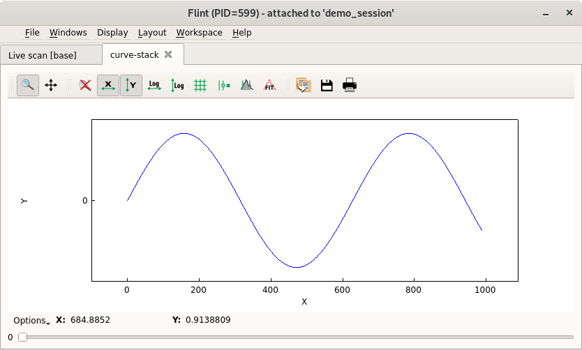

# Flint Data Plotting

During a BLISS session users may create data (other than scan data) that needs to be displayed graphically. Flint offers a collection of different type of plots (curve, scatter, image...) so user can select the one that best fits with the data to be displayed.

## Plot types

The **bliss.common.plot** module offers several types of plot:

### Curve plot

`class CurvePlot(BasePlot)`

  * plotting of one or several 1D data as curves
  * Optional x-axis data can be provided
  * the plot is created using `plot_curve`

```python
import numpy
from bliss.common import plot as plot_mdl

# Function
t = numpy.linspace(0, 10 * numpy.pi, 100)
y = numpy.sin(t)
plot_mdl.plot_curve(data=y, name="My sin")

# Parametric function
t = numpy.linspace(-3, 3, 50)
x = 16 * numpy.sin(t)**3
y = 13 * numpy.cos(t) - 5 * numpy.cos(2*t) - 2 * numpy.cos(3*t) - numpy.cos(4*t)
plot_mdl.plot_curve(data=y, x=x, name="My heart")
```

### Scatter plot

`class ScatterPlot(BasePlot)`

  * plotting one or several scattered data
  * each scatter is a group of three 1D data of same length
  * the plot is created using `plot_scatter`

### Image plot

`class ImagePlot(BasePlot)`

  * plots one or several images on top of each other
  * the images order can be controlled using a depth parameter
  * the plot is created using `plot_image`

### Image + histogram plot

`class HistogramImagePlot(BasePlot)`

  * plot a single 2D image (greyscale or colormap)
  * two histograms along the X and Y dimensions are displayed
  * the plot is created using `plot_image_with_histogram`

### Curve stack

This plot displays a single curve from a selectable list of curves.

THe selection is done with a slider.

```python
f = flint()

p = f.get_plot(plot_class="curvestack", name="curve-stack")

curves = numpy.empty((10, 100))
for i in range(10):
    curves[i] = numpy.sin(numpy.arange(100) / 30 + i * 6)
x = numpy.arange(100) * 10
p.set_data(curves=curves, x=x)
```



### Image stack plot

`class ImageStackPlot(BasePlot)`

  * plot a single stack of image
  * a slider is provided to browse the images
  * the plot is created using `plot_image_stack`

An extra helper called `plot` is provided to automatically infer
a suitable type of plot from the data provided.

## Basic interface

All the above plot types provide the same interface. They take the data
as an argument and return a plot. Here's an example on how to display a cosine wave in a curve plot.

```python
xx = numpy.linspace(0, 4*3.14, 50)
yy = numpy.cos(xx)
plot(yy, name="Plot 0")
```

After the execution of these commands, Flint interface will show up, with a main tab named "Plot 0" (below application's main menu) with a plot with a cosine wave on it.


We can add extra keyword arguments that are forwarded to silx. and recover a plot object to interact with it lately:

```python
p = plot(mydata, xlabel='A', ylabel='b')
```

From then on, all the interaction with the corresponding plot window goes
through the plot object `p`. For instance, it provides a ``plot`` method
to add and display extra data:

```python
p.plot(some_extra_data, yaxis='right')
```

## Advanced interface

To be able to reuse a plot you can use the function from Flint object.
Based on the unique name, this will create a plot only if needed, else it will
retrieve the existing plot.

```python
f = flint()
p = f.get_plot("plot1d", "My title", "uniquename999")
```

For a finer control over the plotted data, the data management is
separated from the plot management. In order to add more data to
the plot, use the following interface:

```python
p.add_data(cos_data, field='cos')
```

This data is now identified using its field, ``'cos'``. A dict or
a structured numpy array can also be provided. In this case,
the fields of the provided data structure are used as identifiers:

```python
p.add_data({'cos': cos_data, 'sin': sin_data})
```

Note that ``add_data`` does not plot the data on the chart. The plot selection is then done through the ``select_data`` method.
For a curve plot, the expected arguments are the names of the data
to use for X and Y:

```python
p.select_data('sin', 'cos')
```

Again, the extra keyword arguments will be forwarded to silx:

```python
p.select_data('sin', 'cos', color='green', symbol='x')
```

The curve can then be deselected:

```python
p.deselect_data('sin', 'cos')
```

And the data can be cleared:

```python
p.clear_data()
```

To sum up, here's how to achieve the same cosine chart of the previous section in a different way:

```python
from bliss.common import plot as plot_mdl
import numpy

# create plot object
p = plot_mdl.plot_curve()

# create data : x and y values
xx = numpy.linspace(0, 4*3.14, 50)
yy = numpy.cos(xx)

# add data to plot: this does not show it up
p.add_data(yy, field='cos')
p.add_data(xx, field='x')

# select x and y data to display them
p.select_data('x', 'cos')
```
