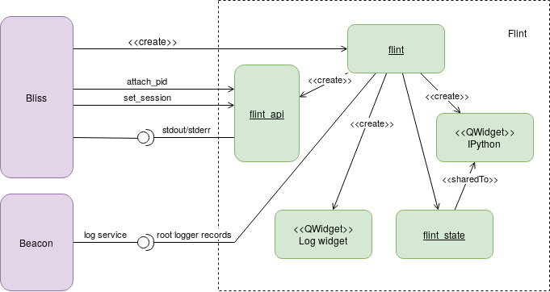
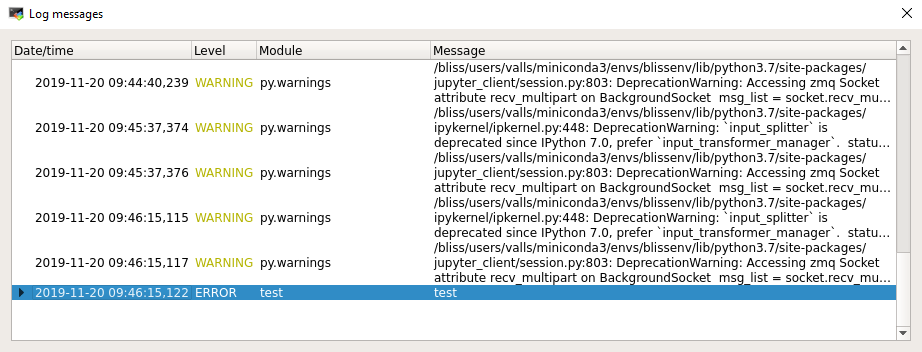
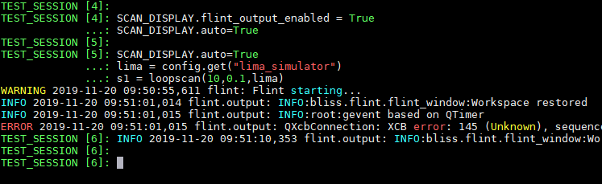
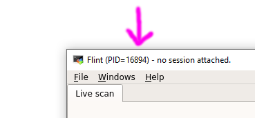
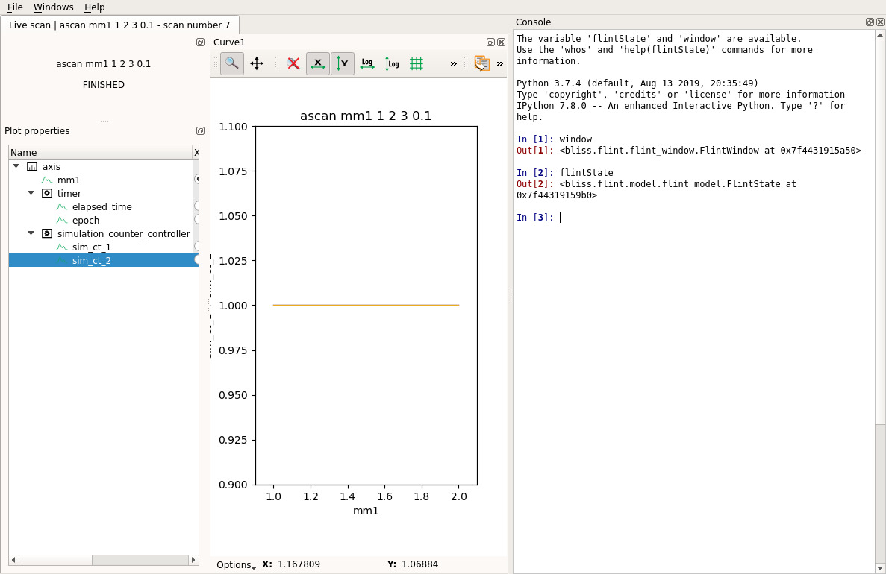

# Flint debugging

Here are few tips in order to ease debugging of BLISS display in Flint.

First of all, Flint does not run in the same process than BLISS, it uses it's
own process.

This allows the GUI to segfault without breaking the sequencer. But it can make
the debugging a little more complex.

Here is an overview of available solutions to debug problems.



## Default beacon logging

By default Flint uses a Beacon service to store logging inside a file.

Beacon will create a dedicated Flint logging per session.

By default the Beacon logging service will create new files for Flint together
with BLISS logging: inside `/var/log/bliss/`. But logs for Flint are stored
in a dedicated file: `/var/log/bliss/flint_{session}.log`.

As the beacon service have to be retrieved first, early logging messages are
not saved. First the bliss session have to be set to Flint. After than
messages are send to the log server.

## Logging inside Flint

Flint can display logs on a separated window using the standard python logging
system. This can catch early messages.

To show *Log messages* window:

!!!note
    Menu: `Windows` ▶ `Show log`.

All the caught exceptions will be displayed there.



## Flint `stdout`/`stderr` in BLISS shell



Flint standard output streams can be displayed inside bliss.

It allows to display not only information from the logging system, but also
other things uncaught.

THe service is enabled by default but not displayed.
It can be displayed on the BLISS console via `SCAN_DISPLAY`:

```python
SCAN_DISPLAY.flint_output_enabled = True
```

All the outputs from Flint will be redirected to the BLISS session.

* If Flint was created by this BLISS process, the output comes from 2 pipes (for
  both output).
* If Flint was attached, the output comes from RPC events. This technique does
  not allow to catch the early output.

## Flint `stdout`/`stderr` in a console

Flint can be create independently and then attached to a BLISS session. This
way, early logs can be displayed.

First create flint:
```shell
python -m bliss.flint
```

The header of the Flint window will display the PID of the process.

This information must be used in order to attach the Flint process to BLISS.



Then, from the BLISS session:

```python
from bliss.common import plot
plot.attach_flint(PID)
```

## Save Flint logs into a specific file

The Flint application support command line argument to specify an extra file
in which logs will be saved.

This can be used together with the beacon log service.

```shell
flint --log-file myfile.log
```

It also can be setup from BLISS:

```python
SCAN_DISPLAY.extra_args = ["--log-file", "myfile.log"]
flint()
```

## IPython

Flint also provides an `IPython` console embedded in the GUI.

To show the console:

!!!note
    Menu: `Windows` ▶ `IPython console`.

!!!note
    The console can be detached from the main window to avoid to lose
    display space.



This `IPython` session contains 2 initial objects:

* `window`: a reference to the main Qt window of Flint.
* `flintState`: a reference to all the data and process provided by Flint.

Here is a way to check a channel's data which was received by Flint:

```python
scan = flintState.currentScan()
channel = scan.getChannelByName("lima_simulator:image")
array = channel.data().array()
# Here we have a numpy array
array.shape
```

This can be used to check the structure of a plot (a plot is about modelization,
not about widget and GUI):

```python
workspace = flintState.workspace()
plots = workspace.plots()
plot = plots[0]
# For a plot of curves, this will list each displayed curves
plot.items()
```
