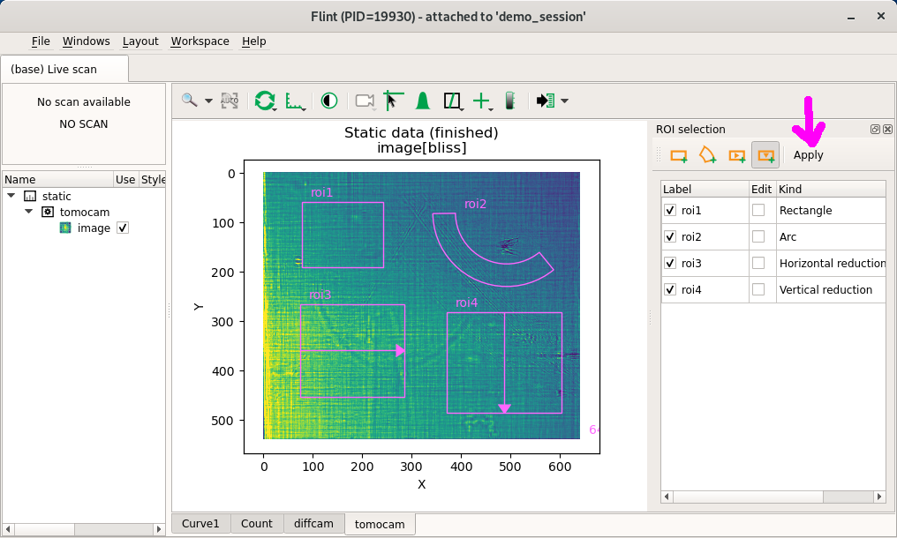

# Editing Lima ROIs

BLISS provides a helper function to edit Lima ROI (region of interest) via Flint,
to create counters automatically from areas defined by the user graphically using
mouse dragging.

The `edit_roi_counters` function takes:
* a Lima detector object
* an optional acquisition time

If an acquisition time is given, `ct(acq_time, detector)` is executed before the
ROI counter edition is started.

!!! note
    Flint will start anyway `SCAN_DISPLAY.auto` was set to true or not

If no acquisition time is given, **no acquisition is done**.

It assumes the last scan was made with the detector, and the image from the
last scan will be used for ROI editing. If the detector do not contain yet
images, an empty image pattern is generated using the image size of the
detector.

```py
DEMO_SESSION [1]: edit_roi_counters(tomocam, 1.0)
WARNING 2020-10-16 15:39:45,049 flint: Flint starting...
Waiting for ROI edition to finish on tomocam [default, default]...
WARNING 2020-10-16 15:39:46,999 flint: Waiting for selection in Flint window.
```



The previous ROIs are editable or removable. And new ROIs can be created.

With BLISS 1.6 four kind of ROIs are supported for Lima detectors:

- Rectangle ROI counter
- Arc ROI counter
- Rectangle ROI with vertical profile
- Rectangle ROI with horizontal profile

Clicking on the `Apply` button once ROI edition is terminated returns to the
BLISS shell prompt.

Back on BLISS shell the ROIs can be summarized this way:

```python
DEMO_SESSION [2]: tomocam.roi_counters
         Out [2]: ROI Counters: default
                     Name                 ROI coordinates
                  ---------- ------------------------------------------
                     roi1               <77,58> <164 x 132>
                     roi2    <492.5, 79.9> <104.0, 149.8> <179.3, 50.7>
```
This ROIs are used by Lima to compute pixel based statistics like sum,
average, standard deviation, min, max.

```python
DEMO_SESSION [3]: tomocam.roi_profiles
         Out [3]: Roi Profile Counters: default
                     Name           <x, y> <w, h> <mode>
                  ---------- ----------------------------------
                     roi3     <74,265> <210 x 187> <vertical>
                     roi4    <371,281> <232 x 203> <horizontal>
```
This ROIs are used by Lima to compute vertical or horizontal data reduction.
