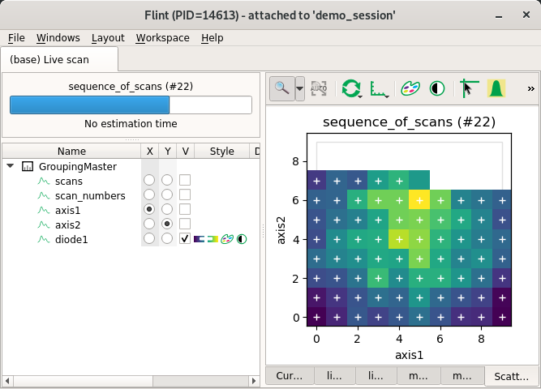
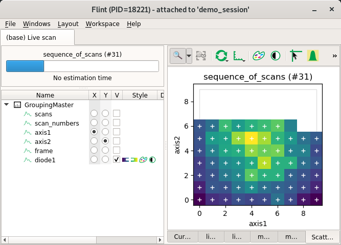
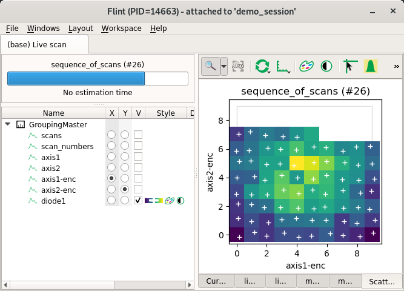
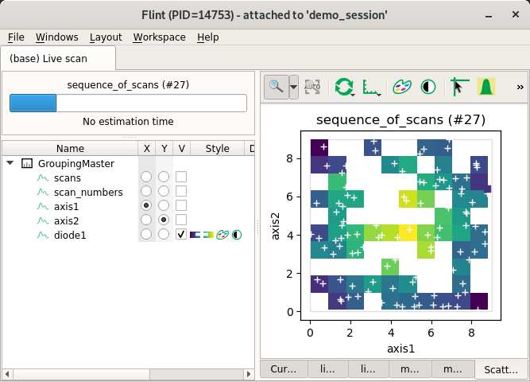
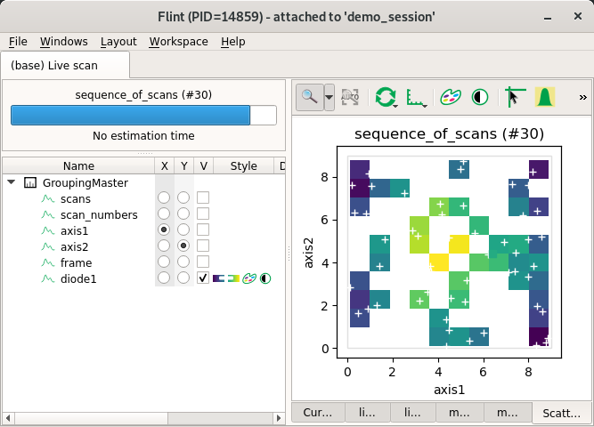

# Example of custom scan_info

This examples show how to describe metadata in `scan_info` for few specific
scans.

The main use case is to:
- Allow to display scatter as a solid regular 2D image.
- Display the entire region of the scan before the end

Displaying scatter data as a scatter of points is not a problem.

With this extra metadata, the user can decide to use a solid or point based
rendering.

## Setup

This scans have to be created usually per beamline in a very specific way.

For this examples we will use a function to simulate them.

```
import gevent
import numpy
from bliss.scanning.group import Sequence
from bliss.scanning.chain import AcquisitionChannel

def simulate_scan(scan_info, data):
    """
    Simulate a scan.

    It uses a sequence to emit custom channels.

    Arguments:
        scan_info: Dictionary contanining metadata to store with the scan
        data: Dictionary containing numpy array per channel name
    """
    step = 2
    seq = Sequence(scan_info=scan_info)
    for channel_name, array in data.items():
        seq.add_custom_channel(AcquisitionChannel(channel_name, numpy.float, ()))
    with seq.sequence_context() as scan_seq:
        array = list(data.values())[0]
        for i in range(0, len(array) - 1, step):
            selection = slice(i, i + step)
            for channel_name, array in data.items():
                seq.custom_channels[channel_name].emit(array[selection])
            gevent.sleep(0.1)
```

## Regular scatter

This example create a regular scatter.



```
from bliss.scanning.scan_info import ScanInfo
import numpy

scan_info = ScanInfo()

# Specify the same group for all this channels (axis or values)
scan_info.set_channel_meta("axis1",
                           # The group have to be the same for all this channels
                           group="foo",
                           # This is the fast axis
                           axis_id=0,
                           # In forth direction only
                           axis_kind="forth",
                           # The grid have to be specified
                           start=0, stop=9, axis_points=10,
                           # Optionally the full number of points can be specified
                           points=100)
scan_info.set_channel_meta("axis2", group="foo", axis_id=1,
                           axis_kind="forth",
                           start=0, stop=9,
                           axis_points=10, points=100)
scan_info.set_channel_meta("diode1", group="foo")

# Request a specific scatter to be displayed
scan_info.add_scatter_plot(x="axis1", y="axis2", value="diode1")

# Generate the data
slow, fast = numpy.mgrid[0:10, 0:10]
dist = (((slow - 4.5) ** 2 + (fast - 4.5) ** 2) ** 0.5)
dist = (dist.max() - dist) * 10
data = {
    "axis1": fast.flatten(),
    "axis2": slow.flatten(),
    "diode1": numpy.random.poisson(dist.flatten())
}

SCAN_DISPLAY.auto = True
simulate_scan(scan_info, data)
```

## Regular 3D scatter

3D of more dimensions are supported.

Flint only can display it using the 2 fastest axes.

Other axes have to be stepper and are considered as an ndim index for the
displayed frame.

displayed.

For now only Flint will only display the last frame.



```
from bliss.scanning.scan_info import ScanInfo
import numpy

scan_info = ScanInfo()

scan_info.set_channel_meta("axis1", group="foo", axis_id=0,
                           axis_kind="forth",
                           start=0, stop=9, axis_points=10,
                           points=1000)
scan_info.set_channel_meta("axis2", group="foo", axis_id=1,
                           axis_kind="forth",
                           start=0, stop=9, axis_points=10,
                           points=1000)
# The slowest axes have to be describe as stepper
scan_info.set_channel_meta("frame", group="foo", axis_id=2,
                           axis_kind="step",
                           start=0, stop=9, axis_points=10,
                           points=1000)
scan_info.set_channel_meta("diode1", group="foo")

# Request a specific scatter to be displayed
scan_info.add_scatter_plot(x="axis1", y="axis2", value="diode1")

# Generate the data
frame, slow, fast = numpy.mgrid[0:10, 0:10, 0:10]
dist = (((slow - 4.5) ** 2 + (fast - 4.5) ** 2) ** 0.5)
dist = (dist.max() - dist) * 10
data = {
    "axis1": fast.flatten(),
    "axis2": slow.flatten(),
    "frame": frame.flatten(),
    "diode1": numpy.random.poisson(dist.flatten())
}

SCAN_DISPLAY.auto = True
simulate_scan(scan_info, data)
```

## Theorical and encoder position together in scatter

The same axis can be describe many time using many channels.

That's what we simulate here. `axis1` and `axis2` are also provided as
`axis1-enc`, `axis2-enc`.



```
from bliss.scanning.scan_info import ScanInfo
import numpy

scan_info = ScanInfo()

scan_info.set_channel_meta("axis1", group="foo", axis_id=0, axis_kind="forth",
                           start=0, stop=9, axis_points=10, points=100)
scan_info.set_channel_meta("axis2", group="foo", axis_id=1, axis_kind="forth",
                           start=0, stop=9, axis_points=10, points=100)
# Index are reused for the encoded
scan_info.set_channel_meta("axis1-enc", group="foo", axis_id=0, axis_kind="forth",
                           start=0, stop=9, axis_points=10, points=100)
scan_info.set_channel_meta("axis2-enc", group="foo", axis_id=1, axis_kind="forth",
                           start=0, stop=9, axis_points=10, points=100)
scan_info.set_channel_meta("diode1", group="foo")

# Request a specific scatter to be displayed
scan_info.add_scatter_plot(x="axis1", y="axis2", value="diode1")

# Generate the data
slow, fast = numpy.mgrid[0:10, 0:10]
dist = (((slow - 4.5) ** 2 + (fast - 4.5) ** 2) ** 0.5)
dist = (dist.max() - dist) * 10
data = {
    "axis1": fast.flatten(),
    "axis2": slow.flatten(),
    "axis1-enc": fast.flatten() + (numpy.random.rand(100) * 0.4 - 0.2),
    "axis2-enc": slow.flatten() + (numpy.random.rand(100) * 0.4 - 0.2),
    "diode1": numpy.random.poisson(dist.flatten())
}

SCAN_DISPLAY.auto = True
simulate_scan(scan_info, data)
```

## Back and forth axis scatter

For now Flint is not able to display it with a solid rendering.
It could be displayed as a regular grid.

For now you can use metadata for non-regular scatters.

## Non-regular scatters

Flint can display non regular scatters with solid rendering using 2D histogram.

This create a regular 2D mesh, and each cells can contain more than one value.
The cell (the pixel) value is computed using a reduction function (for now it
uses `mean` function).

Hint have to be provided to describe the size of the histogram grid.
`axis-points` can not be specified because the axis is not regular.
But `axis-points-hint` have to be used (with `start` and `stop`) and will be
used to know the amount of pixels to used per axis.

`start` and `stop` have maybe no meaning here, so you can use `min` and `max`.



```
from bliss.scanning.scan_info import ScanInfo
import numpy

scan_info = ScanInfo()

# There is no hint for axis kind, and axis npoints is a hint
scan_info.set_channel_meta("axis1", group="foo", axis_id=0,
                           min=0, max=9, axis_points_hint=10, points=500)
scan_info.set_channel_meta("axis2", group="foo", axis_id=1,
                           min=0, max=9, axis_points_hint=10, points=500)
scan_info.set_channel_meta("diode1", group="foo")

# Request a specific scatter to be displayed
scan_info.add_scatter_plot(x="axis1", y="axis2", value="diode1")

# Generate the data
axis1 = numpy.random.rand(500) * 9
axis2 = numpy.random.rand(500) * 9
frame = numpy.mgrid[0:5, 0:100][0]
dist = (((axis1 - 4.5) ** 2 + (axis2 - 4.5) ** 2) ** 0.5)
dist = (dist.max() - dist) * 10
data = {
    "axis1": axis1,
    "axis2": axis2,
    "diode1": numpy.random.poisson(dist)
}

SCAN_DISPLAY.auto = True
simulate_scan(scan_info, data)
```

## Non-regular 3D scatters

This also can work for extra dimensions with steppers.



```
from bliss.scanning.scan_info import ScanInfo
import numpy

scan_info = ScanInfo()

# There is no hint for axis kind, and axis npoints is a hint
scan_info.set_channel_meta("axis1", group="foo", axis_id=0,
                           min=0, max=9, axis_points_hint=10, points=500)
scan_info.set_channel_meta("axis2", group="foo", axis_id=1,
                           min=0, max=9, axis_points_hint=10, points=500)
scan_info.set_channel_meta("frame", group="foo", axis_id=2,
                           axis_kind="step",
                           start=0, stop=4, axis_points=5,
                           points=500)
scan_info.set_channel_meta("diode1", group="foo")

# Request a specific scatter to be displayed
scan_info.add_scatter_plot(x="axis1", y="axis2", value="diode1")

# Generate the data
axis1 = numpy.random.rand(500) * 9
axis2 = numpy.random.rand(500) * 9
frame = numpy.mgrid[0:5, 0:100][0]
dist = (((axis1 - 4.5) ** 2 + (axis2 - 4.5) ** 2) ** 0.5)
dist = (dist.max() - dist) * 10
data = {
    "axis1": axis1,
    "axis2": axis2,
    "frame": frame.flatten(),
    "diode1": numpy.random.poisson(dist)
}

SCAN_DISPLAY.auto = True
simulate_scan(scan_info, data)
```
