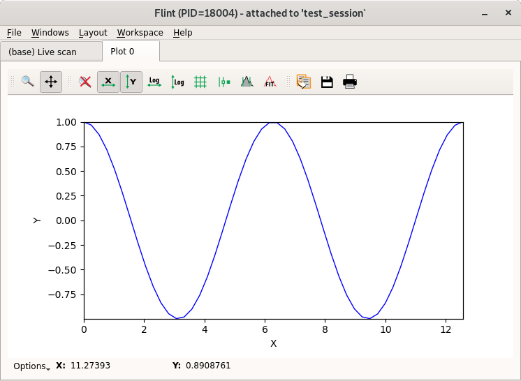

# Flint Data Plotting

During a BLISS session users may create data (other than scan data) that needs to be displayed graphically. Flint offers a collection of different type of plots (curve, scatter, image...) so user can select the one that best fits with the data to be displayed.

## Plot types

The **bliss.common.plot** module offers several types of plot:


### curve plot

`class CurvePlot(BasePlot)`

  * used for `ascan`, `a2scan`, etc.
  * plotting of one or several 1D data as curves
  * Optional x-axis data can be provided
  * the plot is created using `plot_curve`




### scatter plot

`class ScatterPlot(BasePlot)`

  * used for `amesh` scan etc.	
  * plotting one or several scattered data
  * each scatter is a group of three 1D data of same length
  * the plot is created using `plot_scatter`


### image plot

`class ImagePlot(BasePlot)`

  * plots one or several images on top of each other
  * the images order can be controled using a depth parameter
  * the plot is created using `plot_image`

### image + histogram plot

`class HistogramImagePlot(BasePlot)`

  * plot a single 2D image (greyscale or colormap)
  * two histograms along the X and Y dimensions are displayed
  * the plot is created using `plot_image_with_histogram`

### curve list plot

`CurveListPlot(BasePlot)`

  * plot a single list of 1D data as curves
  * a slider and an envelop view are provided
  * the plot is created using `plot_curve_list`
  * this widget is not integrated yet!

### image stack plot

`class ImageStackPlot(BasePlot)`

  * plot a single stack of image
  * a slider is provided to browse the images
  * the plot is created using `plot_image_stack`

An extra helper called `plot` is provided to automatically infer
a suitable type of plot from the data provided.


## Basic interface

All the above plot types provide the same interface. They take the data
as an argumentand return a plot. Here's an example on how to display a cosinus wave in a curve plot.

```python
from bliss.common.plot import *
import numpy

xx = numpy.linspace(0, 4*3.14, 50)
yy = numpy.cos(xx)

plot(yy, name="My Cosinus Wave")
```

We can add extra keyword arguments that are forwarded to silx. and recover a plot object to interact with it lately:

```python
p = plot(mydata, xlabel='A', ylabel='b')
```

From then on, all the interaction with the corresponding plot window goes
through the plot object `p`. For instance, it provides a ``plot`` method
to add and display extra data:

```python
p.plot(some_extra_data, yaxis='right')
```

## Advanced interface


For a finer control over the plotted data, the data management is
separated from the plot management. In order to add more data to
the plot, use the following interface:

```python
p.add_data(cos_data, field='cos')
```

This data is now identified using its field, ``'cos'``. A dict or
a structured numpy array can also be provided. In this case,
the fields of the provided data structure are used as identifiers:

```python
p.add_data({'cos': cos_data, 'sin': sin_data})
```

Note that ``add_data`` does not plot the data on the chart. The plot selection is then done through the ``select_data`` method.
For a curve plot, the expected arguments are the names of the data
to use for X and Y:

```python
p.select_data('sin', 'cos')
```

Again, the extra keyword arguments will be forwarded to silx:

```python
p.select_data('sin', 'cos', color='green', symbol='x')
```

The curve can then be deselected:

```python
p.deselect_data('sin', 'cos')
```

And the data can be cleared:

```python
p.clear_data()
```

To sum up, here's how to achieve the same cosinus chart of the previous section in a different way:

```python
from bliss.common.plot import *
import numpy

# create plot object
p = bliss.common.plot.CurvePlot()

# create data : x and y values
xx = numpy.linspace(0, 4*3.14, 50)
yy = numpy.cos(xx)

# add data to plot: this does not show it up
p.add_data(yy, field='cos')
p.add_data(xx, field='x')

# select x and y data to display
p.select_data('x', 'cos')
```
