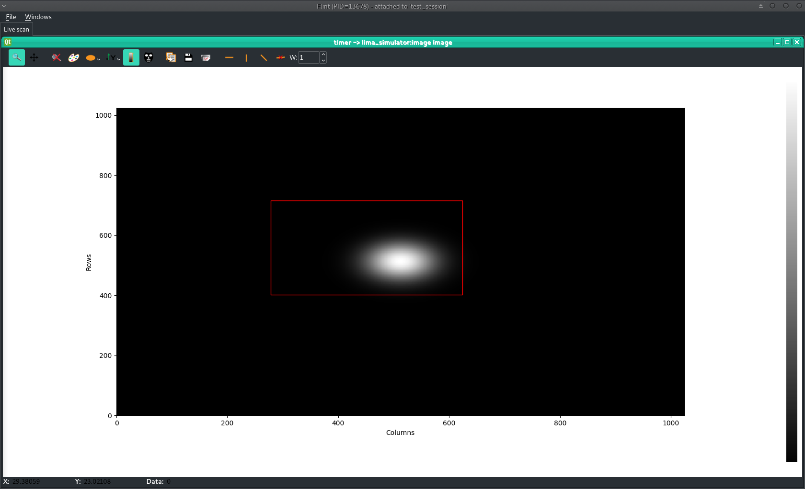

# Flint interaction

In order to interact with a given plot, several methods are provided.


```python
s = loopscan(5, 0.1, lima, return_scan=True)

Activated counters not shown: image

Scan 2 Wed Apr 18 11:36:11 2018 /tmp/scans/test_session/
                                test_session user = matias
timescan 0.1

       #         dt(s)
       0      0.959486
       1        1.0913
       2       1.23281
       3       1.36573
       4       1.50349

Took 0:00:01.666654

p = s.get_plot(lima)
p
         Out [10]: ImagePlot(plot_id=2, flint_pid=13678, name=u'')
```

Starting from the `ImagePlot` object, it is possible to ask user for
making a rectangular selection for example:

`TEST_SESSION [11]: p.select_shape("rectangle")`

BLISS shell is blocked until user makes a rectangular selection:



Then, result is returned by the `.select_shape` method:

` Out [11]: ((278.25146, 716.00623), (623.90546, 401.82913)`


The ``select_points`` method allows the user to select a given number of point
on the corresponding plot using their mouse.

```python
a, b, c = p.select_points(3)
# Blocks until the user selects the 3 points
a
(1.2, 3.4)
```

The ``select_shape`` methods allows the user to select a given shape on the
corresponding plot using their mouse. The available shapes are:

- ``'rectangle'``: rectangle selection
- ``'line'``: line selection
- ``'hline'``: horizontal line selection
- ``'vline'``: vertical line selection
- ``'polygon'``: polygon selection

The return values are shown in the following example:

```python
topleft, bottomright = p.select_shape('rectangle')
start, stop = p.select_shape('line')
left, right = p.select_shape('hline')
bottom, top = p.select_shape('vline')
points = p.select_shape('polygon')
```


