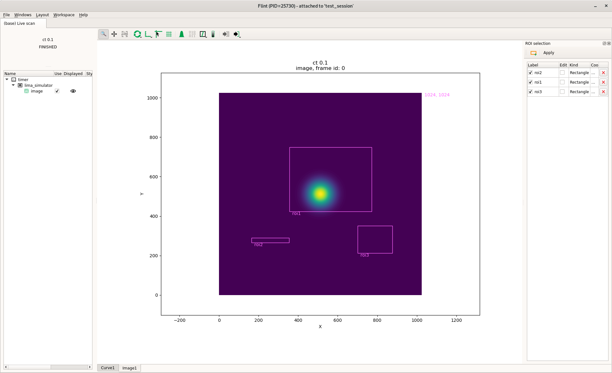

# Editing Lima ROI counters

BLISS provides a helper function to edit Lima ROI (*Region-Of-Interest*) via Flint,
to create counters automatically from areas defined by the user graphically using
mouse dragging.

The `edit_roi_counters` function takes:
* a Lima detector object
* an optional acquisition time

If an acquisition time is given, `ct(acq_time, detector)` is executed before the
ROI counter edition is started.

!!! note
    SCAN_DISPLAY.auto is set to True in order to make sure Flint will display the image

If no acquisition time is given, it assumes the **last scan** was made with the detector,
and the image from the last scan will be used for ROI editing.

```py
lima_simulator = config.get("lima_simulator")
edit_roi_counters(lima_simulator, 0.1)

Waiting for ROI edition to finish on lima_simulator [default]...

# be sure that the ROI Selection press button (orange square and green plus symbol) is pressed.
# then create (mouse dragging), edit or remove the ROIs
```
Clicking on the `Apply` button once ROI edition is terminated returns to the BLISS
shell prompt.

Back on BLISS shell

```py
lima
	
	Out [120]: Simulator - Generator (Simulator) - Lima Simulator

                    Image:
                    bin = [1 1]
                    flip = [False False]
                    height = 1024
                    roi = <0,0> <1024 x 1024>
                    rotation = rotation_enum.NONE
                    sizes = [   0    4 1024 1024]
                    type = Bpp32
                    width = 1024

                    Acquisition:
                    expo_time = 0.1
                    mode = mode_enum.SINGLE
                    nb_frames = 1
                    status = Ready
                    status_fault_error = No error
                    trigger_mode = trigger_mode_enum.INTERNAL_TRIGGER_MULTI

                    ROI Counters: default
                    Name    ROI (<X, Y> <W x H>)
                    ----  ----------------------
                    roi1  <356, 424> <416 x 325>
                    roi2  <164, 266> <190 x  24>
                    roi3  <701, 212> <176 x 139>

                    BPM Counters:
                    acq_time, intensity, x, y, fwhm_x, fwhm_y

# ROIs are stored in lima object as a dictionary in 'roi_counters' member
lima.roi_counters['roi1']

         Out [123]: <356,424> <416 x 325>

```




