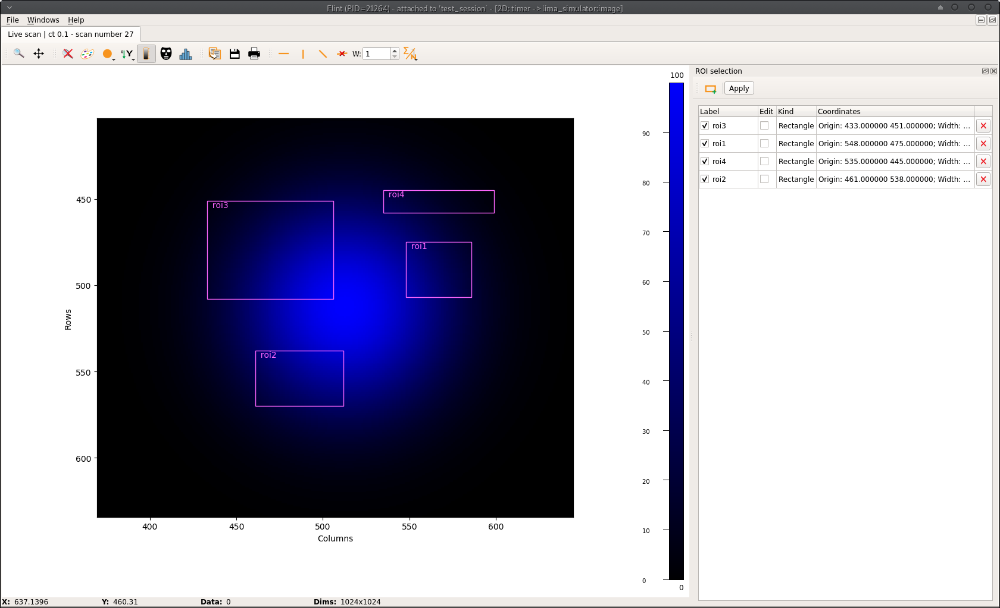

# Editing Lima ROI counters

BLISS provides a helper function to edit Lima ROI (*Region-Of-Interest*) via Flint,
to create counters automatically from areas defined by the user graphically using
mouse dragging.

The `edit_roi_counters` function takes:
* a Lima detector object
* an optional acquisition time

If an acquisition time is given, `ct(acq_time, detector)` is executed before the
ROI counter edition is started.

!!! note
    SCAN_DISPLAY.auto is set to True in order to make sure Flint will display the image

If no acquisition time is given, it assumes the **last scan** was made with the detector,
and the image from the last scan will be used for ROI editing.

```py
>>> edit_roi_counters(lima_simulator, 0.1)
Waiting for ROI edition to finish on lima_simulator [default]...                                                             
```



Clicking on the `Apply` button once ROI edition is terminated returns to the BLISS
shell prompt.

```py
>>> lima_simulator                                                                 

Out [5]: Simulator - Generator (Simulator) - Lima Simulator                                                         
                                                                                                                             
	  Image:                                                                                                     
	  bin = [1 1]                                                                                                
	  flip = [False False]                                                                                       
	  height = 1024                                                                                              
	  roi = <0,0> <1024 x 1024>                                                                                  
	  rotation = rotation_enum.NONE                                                                              
	  sizes = [   0    4 1024 1024]                                                                              
	  type = Bpp32                                                                                               
	  width = 1024                                                                                               
														     
	  Acquisition:                                                                                               
	  expo_time = 0.1                                                                                            
	  mode = mode_enum.SINGLE                                                                                    
	  nb_frames = 1                                                                                              
	  status = Ready                                                                                             
	  status_fault_error = No error                                                                              
	  trigger_mode = trigger_mode_enum.INTERNAL_TRIGGER_MULTI                                                    
														     
	  ROI Counters:                                                                                              
	  [default]                                                                                                  
														     
	  Name  ROI (<X, Y> <W x H>)                                                                                 
	  ----  --------------------                                                                                 
	  roi1  <548, 475> <38 x 32>                                                                                 
	  roi2  <461, 538> <51 x 32>                                                                                 
	  roi3  <433, 451> <73 x 57>                                                                                 
	  roi4  <535, 445> <64 x 13>
```


