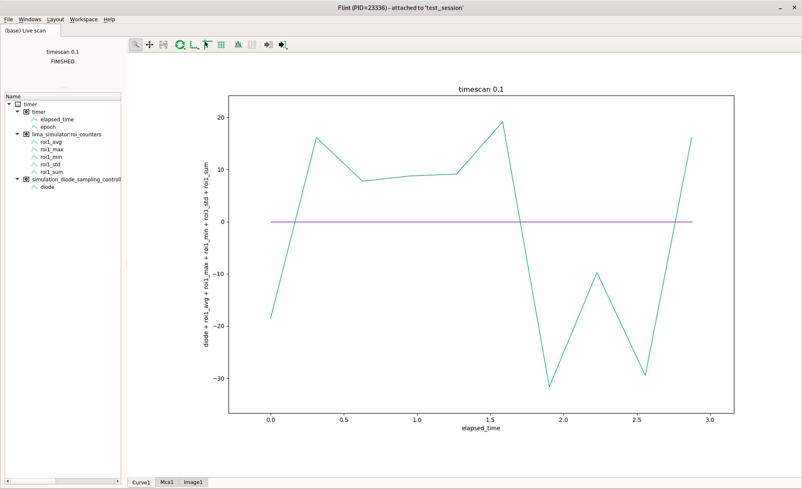
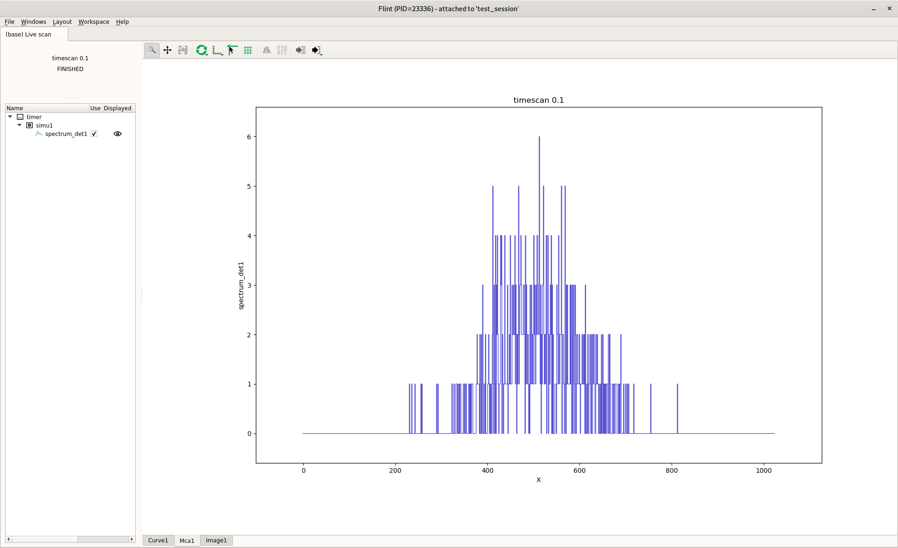
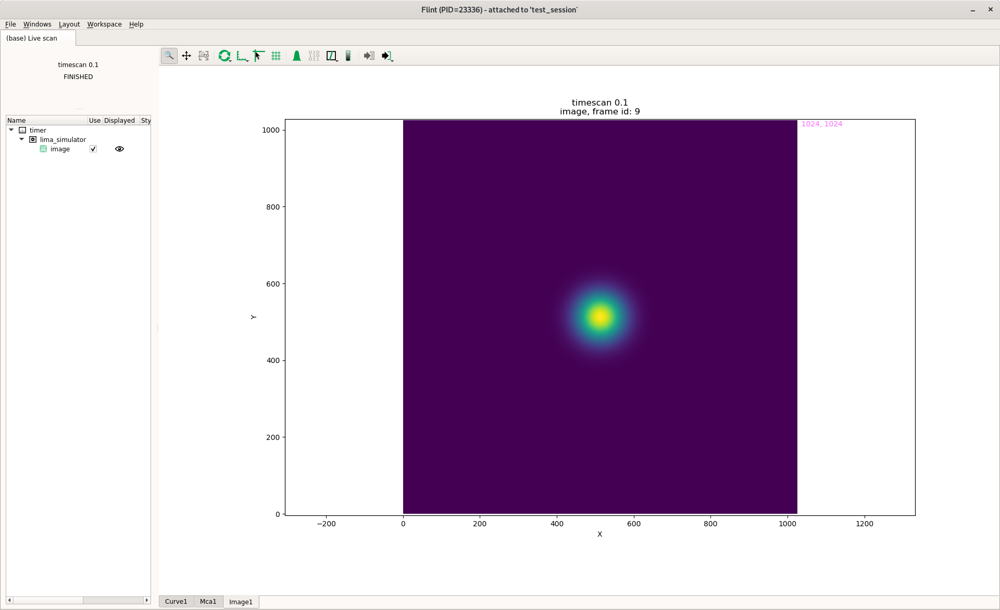

# Flint Scan Plotting

On BLISS, online data display relies on **flint**, a graphical application built
on top of [silx][1] (ScIentific Library for eXperimentalists).
This application can be started automatically when a new plot is created if the
`SCAN_DISPLAY` variable is properly configured in the BLISS shell.

Flint listens to scan data source to know if there's something to display.
The chart type (*curve*, *scatter plot*, *image*...) is automatically determined
using the kind of the data. The data display is updated in real time as it is
created.

```python
SCAN_DISPLAY.auto=True
lima = config.get("lima_simulator")

timescan(0.1, lima, diode, diode2, simu1.counters.spectrum_det1, npoints=10)

# Output on Scans view in BLISS shell (press F5 to get it)
Activated counters not shown: simu1:spectrum_det1, lima_simulator:image

Scan 13 Fri Feb 14 17:11:53 2020 /tmp/scans/test_session/data.h5 test_session user = vergaral
timescan 0.1

           #         dt[s]      roi1_avg      roi1_max      roi1_min      roi1_std      roi1_sum         diode
           0             0             0             0             0             0             0      -18.5556
           1      0.312813             0             0             0             0             0       16.1111
           2      0.627234             0             0             0             0             0          7.75
           3      0.951656             0             0             0             0             0          8.75
           4       1.26912             0             0             0             0             0       9.11111
           5       1.58386             0             0             0             0             0        19.125
           6       1.90216             0             0             0             0             0      -31.6667
           7       2.22766             0             0             0             0             0         -9.75
           8       2.55771             0             0             0             0             0         -29.5
           9       2.87415             0             0             0             0             0        16.125

Took 0:00:03.367694
```
If automatic display is activated, Flint application will display with three tabs
on the bottom of the main window (Curve1, Mca1, Image1).

Curve1 tab:



Mca1 tab:



Image1 tab:




[1]: http://silx.org