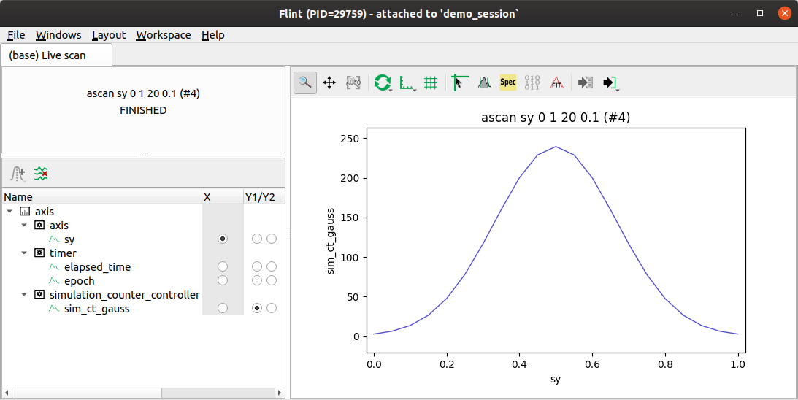
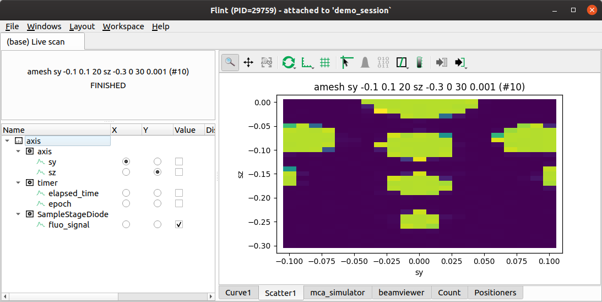
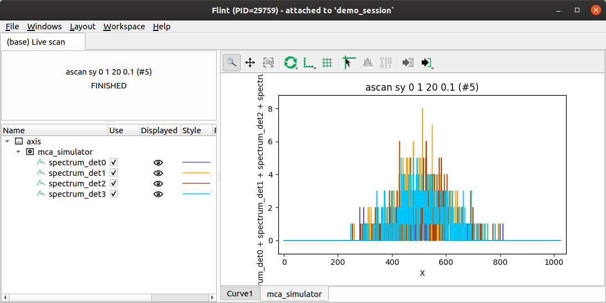
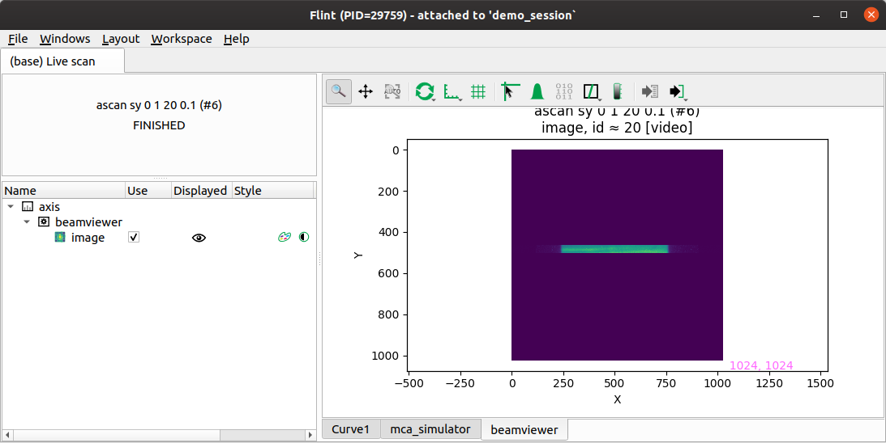
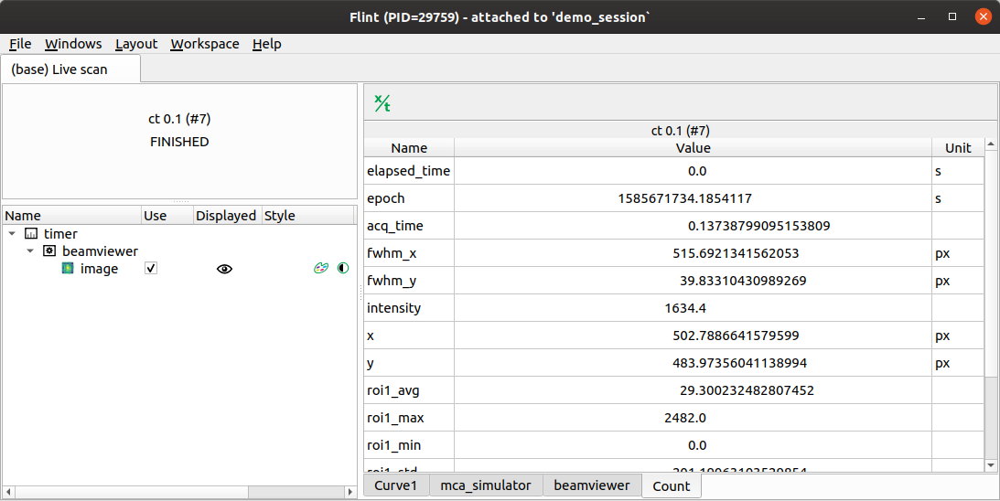
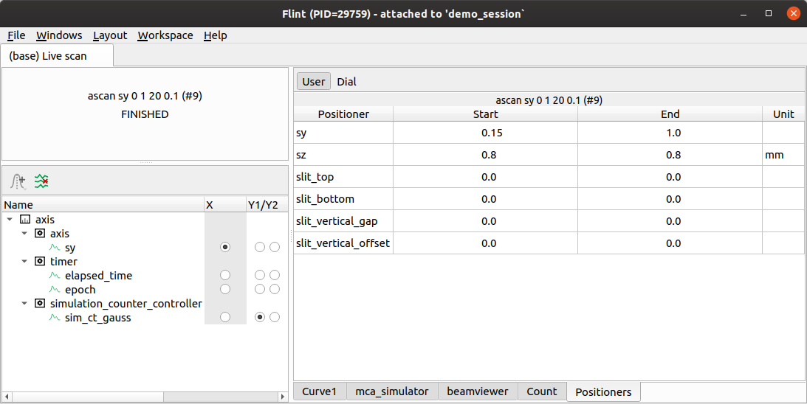

# Flint Scan Plotting

On BLISS, online data display relies on **flint**, a graphical application built
on top of [silx][1] (ScIentific Library for eXperimentalists).
This application can be started automatically when a new plot is created if the
`SCAN_DISPLAY` variable is properly configured in the BLISS shell.

Flint listens to scan data source to know if there's something to display.
The chart type (*curve*, *scatter plot*, *image*...) is automatically determined
using the kind of the data. The data display is updated in real time as it is
created.

## Curve widget

If the scan contains counters, the curve widget will be displayed automatically.

It will also be displayed mesh scans.

## Scatter widget

If the scan contains counters data which have to be displayed is 2D, the
scatter widget will be displayed automatically.

That's the case for `mesh` scans.

## MCA widget

For scans containing MCAs data, the MCA widget will be displayed automatically.

A specific widget will be created per detector.

Only the last retrieved data will be displayed, so for a time scan you have to
create first ROIs on the MCAs to display data in time.

## Image widget

For scans containing image data, the image widget will be displayed automatically.

A specific widget will be created per detector.

Only the last retrieved data will be displayed, so for a time scan you have to
create first ROIs on the MCAs to display data in time.

## Count widget

For `ct` scans, the count widget will be automatically displayed.

## Positioners widget

Usually a scan contains information on the positioners, which is the location
of all the motors before and after the scan.

The positioners widget **can** be displayed. The 📜 `Windows` menu provides an
entry to show/hide this widget.

[1]: http://silx.org