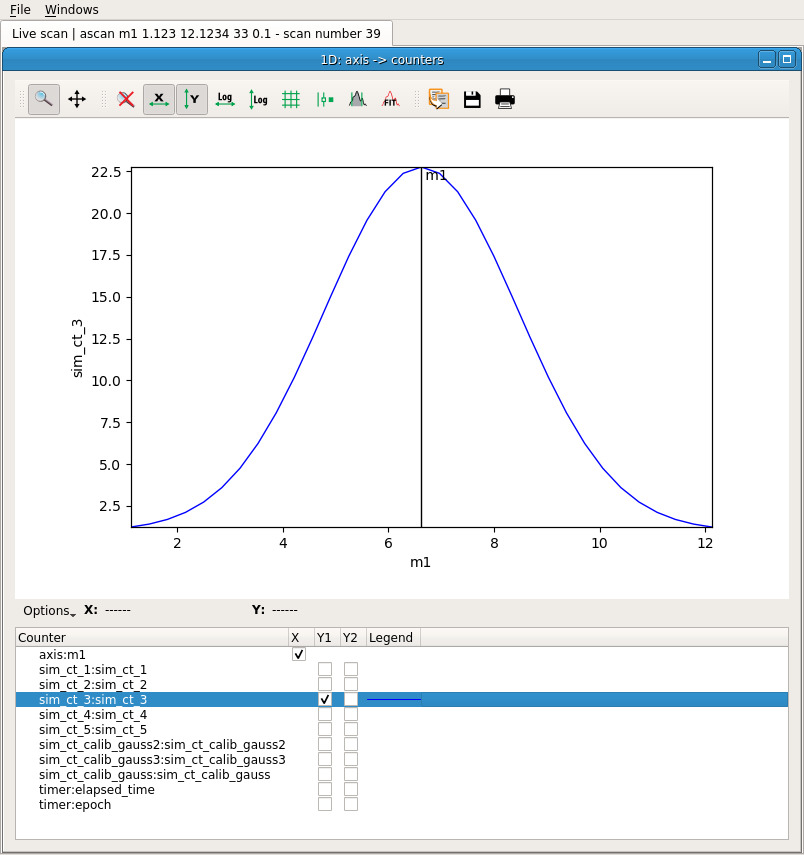

# Flint Scan Plotting

On BLISS, online data display relies on **flint**, a graphical application built on top of [silx][1] (ScIentific Library for eXperimentalists).
This application can be started automatically when a new plot is created if properly configured.

Flint listens to scan data source to know if there's something to display. The chart type (*curve*, *scatter plot*, *image*...) is automatically determined using the shape of the data.

```python
SCAN_DISPLAY.auto=True

timescan(0.1, lima, diode, diode2, simu1.counters.spectrum_det 0, npoints=10)

Activated counters not shown: spectrum_det0, image

Scan 145 Wed Apr 18 11:24:06 2018 /tmp/scans/ test_session user = matias
timescan 0.1

       #         dt(s)        diode2         diode
       0     0.0219111       12.5556      -9.33333
       1      0.348005        30.625         0.125
       2      0.664058       2.88889      -10.2222
       3      0.973582       7.11111       8.44444
       4       1.28277       21.7778       36.3333
       5       1.59305      -15.8889             5
       6       1.90203       43.4444       19.4444
       7       2.21207       20.7778       11.6667
       8       2.52451      -7.88889       24.2222
       9       2.83371        24.125         7.625

Took 0:00:03.214453
```

Flint screenshot:


## Plot types

This interface supports several types of plot:

`bliss.common.plot` module

### curve plot

`class CurvePlot(BasePlot)`

  * used for `ascan`, `a2scan`, etc.
  * plotting of one or several 1D data as curves
  * Optional x-axis data can be provided
  * the plot is created using `plot_curve`




### scatter plot

`class ScatterPlot(BasePlot)`

  * used for `amesh` scan etc.	
  * plotting one or several scattered data
  * each scatter is a group of three 1D data of same length
  * the plot is created using `plot_scatter`


### image plot

`class ImagePlot(BasePlot)`

  * plots one or several images on top of each other
  * the images order can be controled using a depth parameter
  * the plot is created using `plot_image`

### image + histogram plot

`class HistogramImagePlot(BasePlot)`

  * plot a single 2D image (greyscale or colormap)
  * two histograms along the X and Y dimensions are displayed
  * the plot is created using `plot_image_with_histogram`

### curve list plot

`CurveListPlot(BasePlot)`

  * plot a single list of 1D data as curves
  * a slider and an envelop view are provided
  * the plot is created using `plot_curve_list`
  * this widget is not integrated yet!

### image stack plot

`class ImageStackPlot(BasePlot)`

  * plot a single stack of image
  * a slider is provided to browse the images
  * the plot is created using `plot_image_stack`

An extra helper called `plot` is provided to automatically infer
a suitable type of plot from the data provided.


## Basic interface

All the above functions provide the same interface. They take the data
as an argument and return a plot:

```python
from bliss.common.plot import *

plot(mydata, name="My plot")
ImagePlot(plot_id=1, flint_pid=17450)
```

Extra keyword arguments are forwarded to silx:

```python
p = plot(mydata, xlabel='A', ylabel='b')
```

From then on, all the interaction with the corresponding plot window goes
through the plot object. For instance, it provides a ``plot`` method
to add and display extra data:

```python
p.plot(some_extra_data, yaxis='right')
```

## Advanced interface


For a finer control over the plotted data, the data management is
separated from the plot management. In order to add more data to
the plot, use the following interface:

```python
p.add_data(cos_data, field='cos')
```

This data is now identified using its field, ``'cos'``. A dict or
a structured numpy array can also be provided. In this case,
the fields of the provided data structure are used as identifiers:

```python
p.add_data({'cos': cos_data, 'sin': sin_data})
```

The plot selection is then done through the ``select_data`` method.
For a curve plot, the expected arguments are the names of the data
to use for X and Y:

```python
p.select_data('sin', 'cos')
```

Again, the extra keyword arguments will be forwarded to silx:

```python
p.select_data('sin', 'cos', color='green', symbol='x')
```

The curve can then be deselected:

```python
p.deselect_data('sin', 'cos')
```

And the data can be cleared:

```python
p.clear_data()
```

[1]: http://silx.org