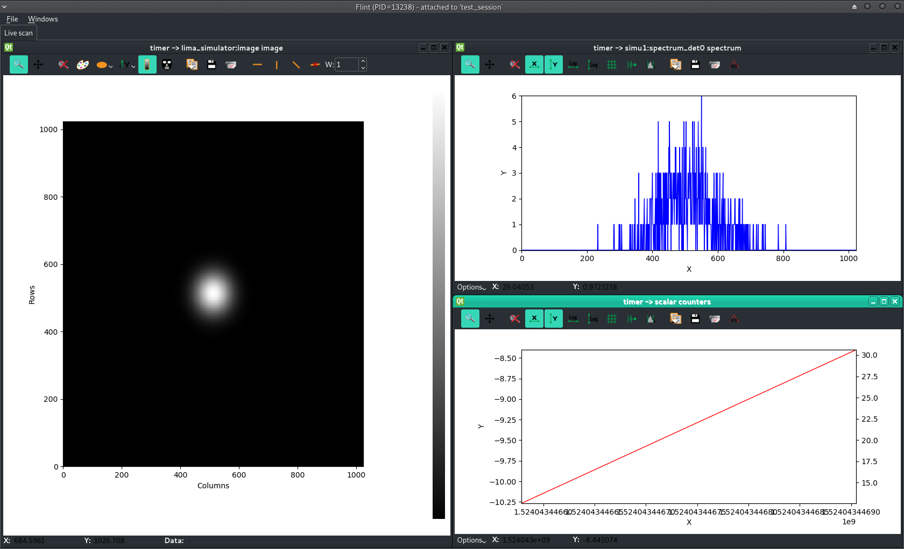
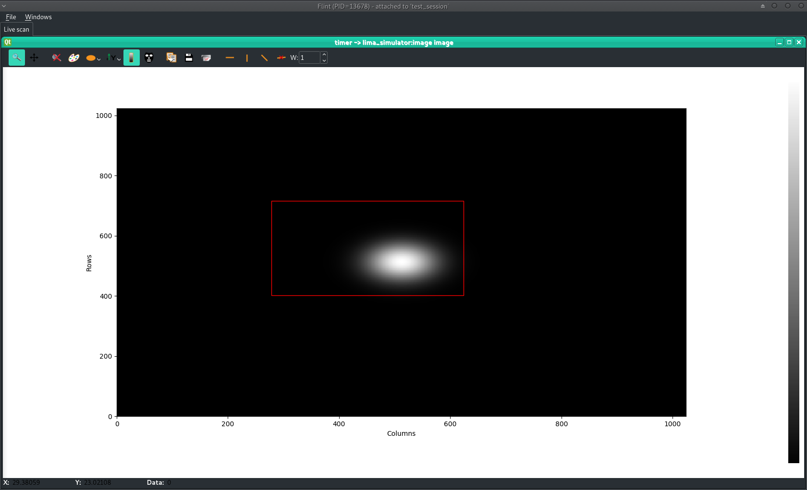

# Getting started with BLISS

This page will present what is the **BLISS control system** and how to start using
it.

## BLISS presentation

*BLISS control system* provides a global approach to run synchrotron
experiments requiring to synchronously control motors, detectors and
various acquisition devices thanks to hardware integration, Python
sequences and an advanced scanning engine.

As a Python package, BLISS can be easily embedded into any Python
application and data management features enable online data analysis.
In addition, BLISS ships with tools to enhance scientists user
experience and can easily be integrated into TANGO based environments,
with generic TANGO servers on top of BLISS controllers.

On user point of view, BLISS presents different aspects:

* [BLISS shell](shell_cmdline.md): a command line interface to
  interact with devices and to run sequences
* Sequences programming to create customized experiments
* Configuration of all devices involved in the experiments


## BLISS shell

BLISS comes with a command line interface based on [ptpython][8].

BLISS uses the concept of *session* to allow user to define a set of procedures
and devices to use in a particular circumstance (like alignment, specific hutch
or specific experiment).


```
bliss -s eh1
```

```python
                       __         __   __
                      |__) |   | /__` /__`
                      |__) |__ | .__/ .__/


Welcome to BLISS version 0.01 running on pcsht (in bliss Conda environment)
Copyright (c) 2015-2019 Beamline Control Unit, ESRF
-
Connected to Beacon server on pcsht (port 3412)
eh1: Executing setup...
Initializing 'pzth`
Initializing 'simul_mca`
Initializing 'pzth_enc`
Done.

EH1 [1]:
```

The `-s` command line option loads the specified session at startup,
i.e. configuration objects defined in the session are initialized,
then the setup file is executed. Finally the prompt returns to user.


`-h` option allows to get an overview of other command-line features.

```
% bliss -h
Usage: bliss [-l | --log-level=<log_level>] [-s <name> | --session=<name>]
             [--no-tmux] [--tmux-debug]
       bliss [-v | --version]
       bliss [-c <name> | --create=<name>]
       bliss [-d <name> | --delete=<name>]
       bliss [-h | --help]
       bliss --show-sessions
       bliss --show-sessions-only

Options:
  -l, --log-level=<log_level>   Log level [default: WARN]
                                (CRITICAL ERROR INFO DEBUG NOTSET)
  -s, --session=<session_name>  Start with the specified session
  -v, --version                 Show version and exit
  -c, --create=<session_name>   Create a new session with the given name
  -d, --delete=<session_name>   Delete the given session
  -h, --help                    Show help screen and exit
  --no-tmux                     Deactivate Tmux usage
  --tmux-debug                  Allow debugging keeping tmux alive after
                                Bliss shell exits
  --show-sessions               Display sessions and tree of sub-sessions
  --show-sessions-only          Display available sessions names only
```

A session can be created using `-c` option:

```
% bliss -c eh1
creating 'eh1' session
Creating: /blissadm/local/beamline_configuration/sessions/eh1_setup.py
Creating: /blissadm/local/beamline_configuration/sessions/eh1.yml
Creating: /blissadm/local/beamline_configuration/sessions/scripts/eh1.py
```

[Learn more about BLISS sessions](config_sessions.md)

[Learn more about BLISS shell](shell_cmdline.md)

### Examples of standard shell functions

Once BLISS shell is launched, user can use it as a typical python
shell in addition to be able to act on configured devices.

Most common devices are *counters* and *motors*.

Most common actions a user would like to perform are *counting* and *scaning*.

Many standard functions are then provided to help user to perform such
actions on such devices.


* `wa()`: shows a table of all motors in the session, with positions.
* `lscnt()`: shows a table of all counters in the session.
* `ascan(axis, start, stop, n_points, count_time)`: moves an axis from
  *start* to *stop* in *n_points* steps and counts *count_time* at each step.


### Help
Help about BLISS functions can be accessed with `help(<command_name>)`:

```
BLISS [2]: help(wa)
Help on function wa in module bliss.common.standard:

wa(**kwargs)
    Displays all positions (Where All) in both user and dial units
``


Learn more about other [standard shell functions](shell_std_func.md).

[Learn more about BLISS shell](shell_cmdline.md).


## Counters

First fundamental objects to consider in BLISS are the *counters*. A
counter is used to depict the reading of a device.

The most simple function to read all defined counters is
`ct(<counting_time>)`.

```python
DEMO [3]: ct(0.1)
Fri Jun 7  16:32:17 2018
   dt[s] = 0.0     (    0.0/s)
  simct1 = 0.50109 ( 5.0109/s)
  simct2 = 0.49920 ( 4.9920/s)
  simct3 = 0.50403 ( 5.0403/s)
  simct4 = 0.50311 ( 5.0311/s)

  Out [3]: Scan(name=ct_1, run_number=1)
```

To use only a sub-set of counters, they have to be specified in argument:

```python
DEMO [5]: ct(1, simct1, simct4)

Fri Nov 16 16:37:43 2018

   dt[s] = 0.0    (    0.0/s)
  simct1 = 0.49872 ( 0.49872/s)
  simct4 = 0.50021 ( 0.50021/s)
  Out [20]: Scan(name=ct_3, run_number=3)
```

### Using measurement groups

An alternative of specifying counters for each scan is to rely on *measurement groups*.

    DEMO [1]: align_counters
      Out [1]: MeasurementGroup:  align_counters (default)

               Enabled  Disabled
               -------  -------
               simct1
               simct2
               simct3

The measurement group can be passed to a `scan` or `ct` procedure to
define counters for the scan:

    DEMO [4]: ascan(simot1, -2, 2, 7, 0.1, align_counters)

    Scan 5 Wed Feb 21 15:26:31 2018 /tmp/scans/demo/ demo user = guilloud
    ascan simot1 -2 2 7 0.1

            #         dt(s)        simot1        simct1        simct2        simct3
            0       4.18972            -2      0.501319     0.0165606    0.00511711
            1       5.12933         -1.33      0.728287     0.0236184     0.0073165
            2       6.06347         -0.67      -0.33863      0.257847      0.251785
            3       6.98862             0     -0.608677       1.01518      0.997982
            4       7.92987          0.67      -2.29062      0.261047      0.249959
            5       8.86126          1.33      0.219424      0.023286     0.0137307
            6       9.78928             2     -0.558003    0.00988632     0.0165549

    Took 0:00:09.993863

Multiple measurement groups can be passed:

    DEMO [20]: print MG1.available, MG2.available   #  4 counters defined in 2 MG
    ['simct2', 'simct3'] ['simct4', 'simct5']

    DEMO [21]: timescan(0.1, MG1, MG2, npoints=3)

    Scan 15 Wed Feb 21 16:31:48 2018 /tmp/scans/demo/ demo user = guilloud
    timescan 0.1

            #         dt(s)        simct2        simct3        simct4        simct5
            0     0.0347409       0.50349      0.494272      0.501698      0.496145
            1       0.13725       0.49622      0.503753      0.500348      0.500601
            2        0.2391      0.502216      0.500213      0.494356      0.493359

    Took 0:00:00.395435

### Active measurement group

If no counter and no measurement group is specified to the scan
command, a default one is used: the **active measurement
group**. Indeed, there is always only one active measurement group at
a time.

`ACTIVE_MG` is a global variable to know the active measurement group:

     DEMO [1]: ACTIVE_MG
       Out [1]: MeasurementGroup:  align_counters (default)

                 Enabled  Disabled
                 -------  -------
                 simct2
                 simct3

The active measurement group is the one used by default by a `scan` or a `ct`:

    DEMO [32]: ct(0.1)

    Wed Feb 21 15:38:51 2018

       dt(s) = 0.016116142272 ( 0.16116142272/s)
      simct2 = 0.499050226458 ( 4.99050226458/s)
      simct3 = 0.591432432452 ( 5.91432432452/s)

The `set_active()` method can be used to change the active measurement group:

    DEMO [33]: ACTIVE_MG
      Out [33]: MeasurementGroup:  align_counters (default)

                     Enabled  Disabled
                     -------  -------
                     simct1
                     simct2
                     simct3

        DEMO [34]: MG2.set_active()

        DEMO [35]: ACTIVE_MG
          Out [35]: MeasurementGroup:  MG2 (default)

                      Enabled  Disabled
                      -------  -------
                      simct4
                      simct5

!!! note
    The default active measurement group is the last defind in config.

Learn more about [measurement groups](config_mg.md).

## Motors

Second fundamental objects to consider in BLISS are the *motors*.

Motors are used to reflect a change of a device. It can be an object
movement or a device set-point.

Motors main parameters are:

* *user* and *dial* positions (potentially differing by an *offset* and a *sign*)
* *velocity* and *acceleration*
* *high_limit* and *low_limit*


`wa()` standard command is provided to show positions of all motors
defined in the current session.


```python
DEMO [21]: wa()
Current Positions (user, dial)

simot1    simot2    simot3    simot4    simot5
--------  --------  --------  --------  --------
2.00000   4.00000   6.00000   8.00000   9.00000
2.00000   4.00000   6.00000   8.00000   9.00000
```

`wm([motor]+)` shows dial, limits and offset in addition to positions of one or
many motors.

To use only a sub-set of motors, they have to be specified in argument:

```
DEMO [24]: wm('simot1', 'simot4')
           simot1    simot4
-------  --------  --------
User
 High     10.00000  10.00000
 Current   2.00000   8.00000
 Low     -10.00000 -10.00000
Offset    -1.00000   4.00000

Dial
 High     11.00000   6.00000
 Current   3.00000   4.00000
 Low      -9.00000 -14.00000
```

Learn more about [IcePap motors configuration](config_icepap.md).

Learn more about [motor usage](motion_axis.md).


## Basic scans

To perform a realistic acquisition, counters and motors have now to be
used simultaneously. This is done using *scans*.

BLISS relies on a powerful scanning engine based on the principle of
an **acquisition chain**, i.e. a tree of master and slave devices:
master devices trigger acquisition, whereas slave devices take
data. Complex acquisition chains can be built to perform any kind of
data acquisition
sequence. [Read more about the BLISS scanning engine](scan_engine.md)

The acquisition chain for each scan has to be provided by the user. In
order to help with simple scans, BLISS provides a default acquisition
chain to perform scans similar to the default, step-by-step, ones in
Spec.

### Default step-by-step scans

BLISS provides functions to perform scans a user would need for usual
step-by-step measurements.

Most common are :

* `ascan(axis, start, stop, n_points, count_time, *counters, **kwargs)`
* `dscan` : same as `ascan`, with `start`, `stop` as relative positions
   to current axis position
* `a2scan` : same as ascan but with 2 motors
* `mesh` to makes a grid using 2 motors
* `timescan` to count without moving a motor

All scans can take counters in the arguments list. This is to limit
the scan to the provided list of counters.

More about [default scans](scan_default.md).


#### `ascan`

`ascan` example with 1 motor and 2 counters.

```python
TEST_SESSION [1]: ascan(roby, 0, 10, 10, 0.1, diode, diode2)

Scan 1 Wed Apr 18 08:46:20 2018 /tmp/scans/ test_session user = matias
ascan roby 0 10 10 0.1

    #         dt(s)          roby        diode2         diode
    0     0.0341308             0       5.88889       7.44444
    1      0.298563        1.1111      -2.88889      -6.88889
    2      0.529942        2.2222           -34       1.33333
    3      0.761447        3.3333      -30.1111      -11.7778
    4       1.00202        4.4444      -6.22222       11.3333
    5       1.23181        5.5556           -17      -5.11111
    6       1.46598        6.6667       12.5556      -8.44444
    7       1.69842        7.7778     -0.777778      -6.55556
    8       1.92679        8.8889      -10.5556            34
    9       2.16557            10            18      -25.5556

Took 0:00:02.328219
```


### One-shot acquisition with integration time

The `ct(time_in_s, *counters)` function counts for the specified
number of seconds. It is equivalent of a `timescan` with `npoints` set
to 1.


### Scan saving

The `SCAN_SAVING` global is a structure to tell BLISS where to save scan data:

```python
ID29 [1]: SCAN_SAVING
 Out [1]: Parameters (default)
            .base_path      = '/users/blissadm/scans'
            .date_format    = '%Y%m%d'
            .template       = '{session}/{date}'
            .user_name      = 'opid29'
            .writer         = 'hdf5'
```

Find more info about how to use it in [SCAN_SAVING section](scan_saving.md#scan_saving)


### Retrieving scan data

The `get_data()` function takes a scan object and returns scan data in
a `numpy` array. Scan data is retrieved from **redis**. Data
references are not resolved, which means 2D data is not returned.

Example:

```python
TEST_SESSION [4]: myscan = ascan(roby, 0, 1, 10, 0.001, diode,
                                 simu1.counters.spectrum_det0, return_scan=True)
Activated counters not shown: spectrum_det0

Scan 3 Fri Apr 20 11:26:55 2018 /tmp/scans/test_session/
                                test_session user = matias
ascan roby 0 1 10 0.001

       #         dt(s)          roby         diode
       0      0.337308             0            83
       1      0.759228        0.1111           -10
       2       1.17105        0.2222            57
       3       1.58996        0.3333            43
       4       2.00024        0.4444           -44
       5       2.41497        0.5556           -16
       6       2.83309        0.6667           -74
       7       3.23919        0.7778            18
       8       3.65932        0.8889            74
       9       4.07872             1           -43

Took 0:00:04.441955

TEST_SESSION [5]: data = get_data(myscan)
```

The numpy array is built with fields, it is easy to get data for a
particular column using the counter name:

```python
TEST_SESSION [8]: data['diode']
         Out [8]: array([ 83., -10., 57., 43., -44., -16., -74., 18., 74., -43.])
```

## Online data display

Online data display relies on **Flint**, a graphical application
shipped with BLISS and built on top of [silx][9].

**Flint** can be started automatically when a new scan begins, by
configuring `SCAN_DISPLAY`:

`SCAN_DISPLAY.auto = True`

Plots are displayed in the **Live** tab. Depending on the scan acquisition chain,
3 types of plots can be shown:

* 1D plots, showing curves from the scan scalar counters
* 1D spectra, showing 1D scan counters (like MCA)
* 2D images, showing 2D data counters (typically, Lima detectors data)

Plots are grouped by the topmost master, i.e. as long as the number of points for a
master corresponds to its parent, the plots are attached to this master (recursively,
up to the root master if possible).
If number of points diverges between 2 masters, then underlying data is represented in
another set of plot windows.
So, there is no limit to the number of windows in the **Live** tab, it depends on the
scan being executed.

!!! note
    2D images are always represented in their own plot window.

### Live scan data in Flint

```python
TEST_SESSION [8]: SCAN_DISPLAY.auto=True

TEST_SESSION [9]: timescan(0.1, lima, diode, diode2, simu1.counters.spectrum_det
         ...: 0, npoints=10)
Activated counters not shown: spectrum_det0, image

Scan 145 Wed Apr 18 11:24:06 2018 /tmp/scans/ test_session user = matias
timescan 0.1

       #         dt(s)        diode2         diode
       0     0.0219111       12.5556      -9.33333
       1      0.348005        30.625         0.125
       2      0.664058       2.88889      -10.2222
       3      0.973582       7.11111       8.44444
       4       1.28277       21.7778       36.3333
       5       1.59305      -15.8889             5
       6       1.90203       43.4444       19.4444
       7       2.21207       20.7778       11.6667
       8       2.52451      -7.88889       24.2222
       9       2.83371        24.125         7.625

Took 0:00:03.214453

TEST_SESSION [9]:
```

Flint screenshot:



[Read more about Online Data Display](flint_scan_plotting.md)


## BLISS as a library

BLISS is primarily a Python library, thus BLISS can be embedded into any Python
program.

BLISS is built on top of [gevent](http://www.gevent.org/), a
coroutine-based asynchronous networking library. Under the hood,
gevent works with a very fast control loop based on
[libev](http://software.schmorp.de/pkg/libev.html) (or
[libuv](http://docs.libuv.org/en/v1.x/)).

The loop has to be running in the host program. When BLISS is
imported, gevent monkey-patching is applied automatically (except for
the threading module). In most cases, this is transparent and does not
require anything from the host Python program.

!!! note
    When using BLISS from a command line or from a graphical
    interface, gevent needs to be inserted into the events loop.

For example a BLISS-friendly IPython console can be started like this:

    python -c "import gevent.monkey; gevent.monkey.patch_all(thread=False); import IPython; IPython.start_ipython()"

The line above launches Python, makes sure Python standard library is
patched, without replacing system threads by gevent greenlets (which
seems like a reasonable option), then starts the IPython interpreter.

From now on it is possible to use BLISS as any Python library:

```python
    In [1]: from bliss.common.axis import Axis

    In [2]: from bliss.controllers.motors import icepap

    In [3]: ice = icepap.Icepap("iceid2322", {"host": "iceid2322"},
                               [("mbv4mot", Axis,
                               {"address":1,"steps_per_unit":817,
                               "velocity": 0.3, "acceleration": 3
                               })], [], [], [])

    In [4]: ice.initialize()

    In [5]: mbv4 = ice.get_axis("mbv4mot")

    In [6]: mbv4.position()
    Out[6]: 0.07099143206854346

    In [7]:
```

The example above creates an IcePAP motor controller instance,
configured with a `mbv4mot` axis on IcePAP channel 1. Then, the
controller is initialized and the axis object is retrieved to read the
motor position.

!!! note
    This example is meant to demystify BLISS -- the only recommended
    way to use BLISS is to rely on BLISS Beacon to get configuration
    and to use the BLISS shell as the preferred command line
    interface.


### Interacting with plots

BLISS provides tools to interact with plot windows in **Flint**. Each
scan object has a `.get_plot()` method, that returns a `Plot`
object. The argument to pass to `.get_plot` is a counter -- thus, the
plot containing this counter data is returned:

```python
TEST_SESSION [8]: s = loopscan(5, 0.1, lima, return_scan=True)
Activated counters not shown: image

Scan 2 Wed Apr 18 11:36:11 2018 /tmp/scans/test_session/
                                test_session user = matias
timescan 0.1

       #         dt(s)
       0      0.959486
       1        1.0913
       2       1.23281
       3       1.36573
       4       1.50349

Took 0:00:01.666654

TEST_SESSION [9]: p = s.get_plot(lima)
TEST_SESSION [10]: p
         Out [10]: ImagePlot(plot_id=2, flint_pid=13678, name=u'')
```

Starting from the `ImagePlot` object, it is possible to ask user for
making a rectangular selection for example:

`TEST_SESSION [11]: p.select_shape("rectangle")`

BLISS shell is blocked until user makes a rectangular selection:



Then, result is returned by the `.select_shape` method:

` Out [11]: ((278.25146, 716.00623), (623.90546, 401.82913)`

[Read more about interactions with plots](flint_interaction.md)


[8]: https://github.com/prompt-toolkit/ptpython
[9]: http://silx.org
