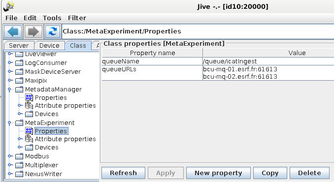
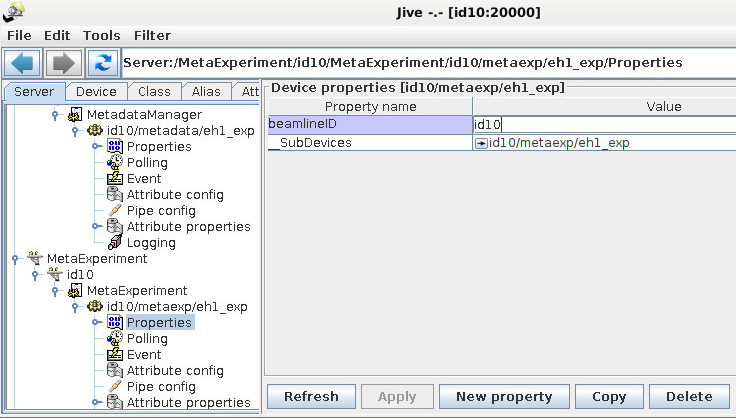
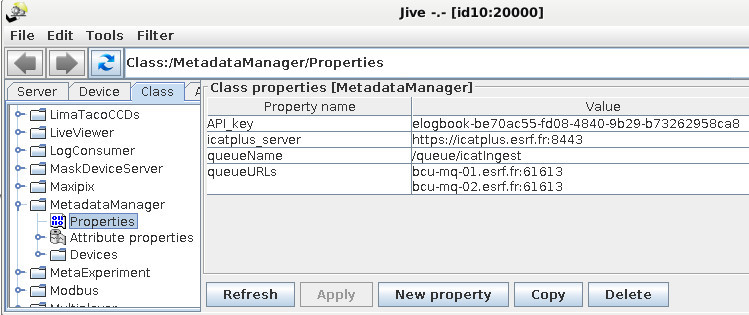
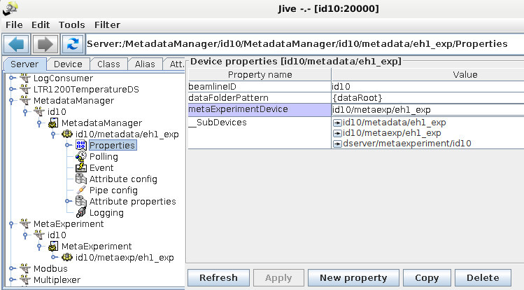

# Installing BLISS at ESRF

At the ESRF, it is recommended to follow the Beamline Control Unit guidelines
for software installation. In the case of BLISS, a special [deployment procedure
using the Ansible tool](https://bliss.gitlab-pages.esrf.fr/ansible/index.html)
has been put in place in order to ease the work on beamlines.

## Updating BLISS installation

To update BLISS on an ESRF installation:

### release version (bliss)

For the "release" version in the `bliss` Conda environement, update the conda package:

```
conda update --channel esrf-bcu bliss
```
or
```
conda install bliss=X.Y.Z
```

### development version (bliss_dev)

For the development version, i.e in the `bliss_dev` Conda environement:

* update bliss repository:

    `cd local/bliss.git/`
    `git checkout master`
    `git pull`

* install up-to-date dependencies:

    `conda install --file ./requirements-conda.txt`

* **Exit and re-enter** into the conda environment to ensure using up-to-date modules.

* Pip-install BLISS by creating a link in the conda environment directory pointing to the git repository:

    `pip install --no-deps -e .`

!!! note

    Make sure to keep the Conda channels up-to-date (using `conda info`) and correct, if
    needed:

    ```bash
    conda config --env --add channels conda-forge
    conda config --env --append channels defaults
    conda config --env --append channels esrf-bcu
    conda config --env --append channels tango-controls
    ```
    NB:

    * `add` prepends
    * `append` moves to the bottom if already exists.


### About BLISS version

At BLISS startup, its version is printed. This version's format depend on the
installation mode. If using a package-installed BLISS version, the package
number is printed:

```python
...
Welcome to BLISS version 1.1.0-359-gff1e64292 running on pcsht
Copyright (c) 2015-2019 Beamline Control Unit, ESRF
...
```

If using a `git`-installed BLISS, a cryptic `git` version number like
`1.1.0-359-gff1e64292` is printed. the three fields correspond to:

* `1.1.0`: last git tag number
* `359`: number of git commits since last tag
* `gff1e64292`: git hash: `ff1e64292`  (! without the `g`)


```python
...
Welcome to BLISS version 1.1.0-359-gff1e64292 running on pcsht
Copyright (c) 2015-2019 Beamline Control Unit, ESRF
...
```

The version can also be printed with:
```python
DEMO [1]: import bliss.release
DEMO [2]: bliss.release.version
 Out [2]: '1.1.0-359-gff1e64292'
```

## Post-installation configuration

### Instrument name

In order to properly fill information about the *instrument* on which data has
been collected in future data files, do not forget to set the `instrument`
field.

Format is free, but it is a good idea to put "ESRF-" followed by the
beamline or endstation name. In capital letters.

Example, in file:`__init__.yml` located at beamline configuration root, add:

```yaml
    ...
    instrument: ESRF-ID42A
    ...
```

### Nexus writer service

A TANGO device referred to as the *[Nexus writer](dev_data_nexus_server.md)*
saves all data produced by BLISS. It comes with any BLISS installation (no
additional package is required). Refer to the linked page to know about
installing this server.

!!! warning
    There must be **one Nexus writer device** per BLISS session. Do not
    forget to add a device when a new BLISS session is created.


### ESRF data policy

The ESRF data policy allows users to access their data and electronic logbook at
https://data.esrf.fr Data is registered with [ICAT](https://data.esrf.fr) and
the data written in [Nexus compliant](https://www.nexusformat.org/) HDF5 files
in a specific directory structure.

Two additional TANGO devices, installed automatically with BLISS (as
dependencies), need to be running and enabled for this. BLISS also needs to be
configured to use ESRF data policy.

!!! warning
    There must be **two ICAT server** per BLISS session. Do not
    forget to add the two devices when a new BLISS session is created.


#### ICAT Tango severs configuration

* `MetaExperiment` server handles the proposal and the sample
* `MetadataManager` server handles the dataset

These are referred to as the ICAT servers. They will inform the ICAT database
about the collected datasets during an experiment and they allow BLISS to
communicate with the **electronic logbook**.

On a beamline there can be multiple `MetadataManager` servers, each serving a
specific technique that needs a specific set of metadata parameters to be
registered with the ICAT database.

#### Using BEACON as the tango database

The registration can be done by defining servers and devices properties in the
beamline configuration.

```yaml
- class: MetaExperiment
  properties:
    queueName: "/queue/icatIngest"
    queueURLs:
        - bcu-mq-01.esrf.fr:61613
        - bcu-mq-02.esrf.fr:61613
- class: MetadataManager
  properties:
    queueName: "/queue/icatIngest"
    queueURLs:
        - bcu-mq-01.esrf.fr:61613
        - bcu-mq-02.esrf.fr:61613
    API_KEY: elogbook-be70ac55-fd08-4840-9b29-b73262958ca8
    icatplus_server: "https://icatplus.esrf.fr"
    server: "icat.esrf.fr"
    port: 443
    username: reader
- server: MetadataManager
  personal_name: icatservers
  device:
  - tango_name: id00/metadata/test
    class: MetadataManager
    properties:
      beamlineID: id00
      dataFolderPattern: "{dataRoot}"
      metaExperimentDevice: "id00/metaexp/test"
- server: MetaExperiment
  personal_name: icatservers
  device:
  - tango_name: id00/metaexp/test
    class: MetaExperiment
    properties:
      beamlineID: id00
```


#### Using the traditional tango database

The registration can be done by defining servers and devices properties in Jive.

A kind way to proceed is:

* to get templates files `manager.tango` and `experiment.tango`
* to adapt templates files:
    - replace `idXX` by bemaline name
    - replace `session_WWZ` by the session name
* to load templates in Jive
* to create device for other sessions, just copy devices using Jive:
    - in **Server** tab
    - unfold  `MetadataManager` ; `idxx` ; `MetadataManager` ; `idxx/metadata/sessionXXX`
    - right clic on existing device and then :  **rename**   or  **create device** / **copy**


`manager.tango`:
```
MetadataManager/idXX/DEVICE/MetadataManager: "idXX/metadata/session_WWZ"

idXX/metadata/session_WWZ->beamlineID: idXX
idXX/metadata/session_WWZ->dataFolderPattern: {dataRoot}
idXX/metadata/session_WWZ->metaExperimentDevice: "idXX/metaexp/idXX"

idXX/metadata/session_WWZ/dataFolder->__value: ""
idXX/metadata/session_WWZ/datasetName->__value: ""
idXX/metadata/session_WWZ/metadataFile->__value: ""

CLASS/MetadataManager->API_key: elogbook-be70ac55-fd08-4840-9b29-b73262958ca8
CLASS/MetadataManager->icatplus_server: "https://icatplus.esrf.fr"
CLASS/MetadataManager->queueName: "/queue/icatIngest"
CLASS/MetadataManager->queueURLs: bcu-mq-01.esrf.fr:61613,\
                                  bcu-mq-02.esrf.fr:61613
```


`experiment.tango`:
```
MetaExperiment/idXX/DEVICE/MetaExperiment: "idXX/metaexp/session_WWZ"

idXX/metaexp/session_WWZ->beamlineID: idXX

idXX/metaexp/session_WWZ/dataRoot->__value: ""
idXX/metaexp/session_WWZ/proposal->__value: ""
idXX/metaexp/session_WWZ/sample->__value: ""

CLASS/MetaExperiment->queueName: "/queue/icatIngest"
CLASS/MetaExperiment->queueURLs: bcu-mq-01.esrf.fr:61613,\
                                 bcu-mq-02.esrf.fr:61613
```


##### MetaExperiment server

Class properties:



These properties are used to register [datasets](data_policy.md#change-dataset).

They are the same for all the beamlines.

* `queueName`: "/queue/icatIngest"
* `queueURLs`:
      - `bcu-mq-01.esrf.fr:61613`
      - `bcu-mq-02.esrf.fr:61613`


Devices:



The devices have only one property to be adapted for the beamline:

* `beamlineID`: `id00`


##### MetadataManager server


These properties are used to send messages to the [electronic
logbook](data_metadata.md#electronic-logbook).

They are the same for all the beamlines.

* `API_KEY`:`elogbook-be70ac55-fd08-4840-9b29-b73262958ca8`
    - security key to connect to elogbook
* `icatplus_server`: `https://icatplus.esrf.fr`
* `queueName`: "/queue/icatIngest"
* `queueURLs`:
    - `bcu-mq-01.esrf.fr:61613`
    - `bcu-mq-02.esrf.fr:61613`

```
Not present in jive ???
 server: "icat.esrf.fr"
 port: 443
 username: reader
```

Class properties:



Devices:



!!! note
     `MetaExperiment` must be started **before** `MetadataManager`.

#### Enable in BLISS

Finally, data policy must be enabled in BLISS. This is done by adding a
dedicated section in the BLISS configuration, either:

* In file: `__init__.yml` at beamline configuration root
* or together with a session configuration
    - this is particularly useful when the same Beacon configuration is used by
      multiple endstations

The section that has to be added is:

```yaml
...
scan_saving:
    class: ESRFScanSaving
    beamline: id00
    tmp_data_root: /data/{beamline}/tmp
    visitor_data_root: /data/visitor
    inhouse_data_root: /data/{beamline}/inhouse
...
```


!!! note
    The beamline name specified under `scan_saving:` will be used to find
    the metadata servers: `id00/metadata/<session_name>` and
    `id00/metaexp/<session_name>`. So it must correspond to the Tango
    device domain name.
    **There must be 2 metadata Tango devices running per BLISS session.**
    (+1 nexus writer) Do not forget to add them for each new BLISS session.

##### Multiple mount points

Multiple mount points can be configured for each proposal type (visitor, inhouse and temp) and optionally for the icat servers (`MetadataManager` and `MetaExperiment`)

```yaml
...
scan_saving:
    inhouse_data_root:
        nfs: /data/{beamline}/inhouse
        lsb: /lsbram/{beamline}/inhouse
    icat_inhouse_data_root: /data/{beamline}/inhouse
...
```

The active mount points can be selected in BLISS

```python
DEMO [1]: SCAN_SAVING.mount_point = "lsb"
```

The default mount point is `SCAN_SAVING.mount_point == ""` which selects the first mount point in the configuration.
