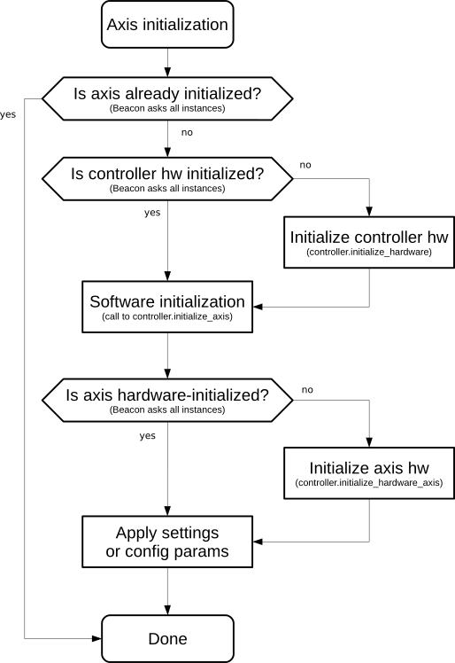
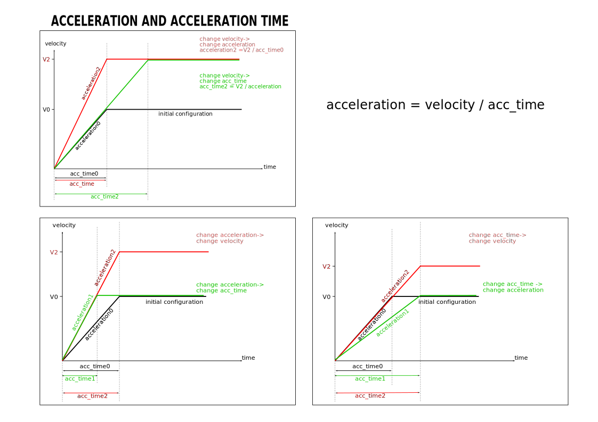
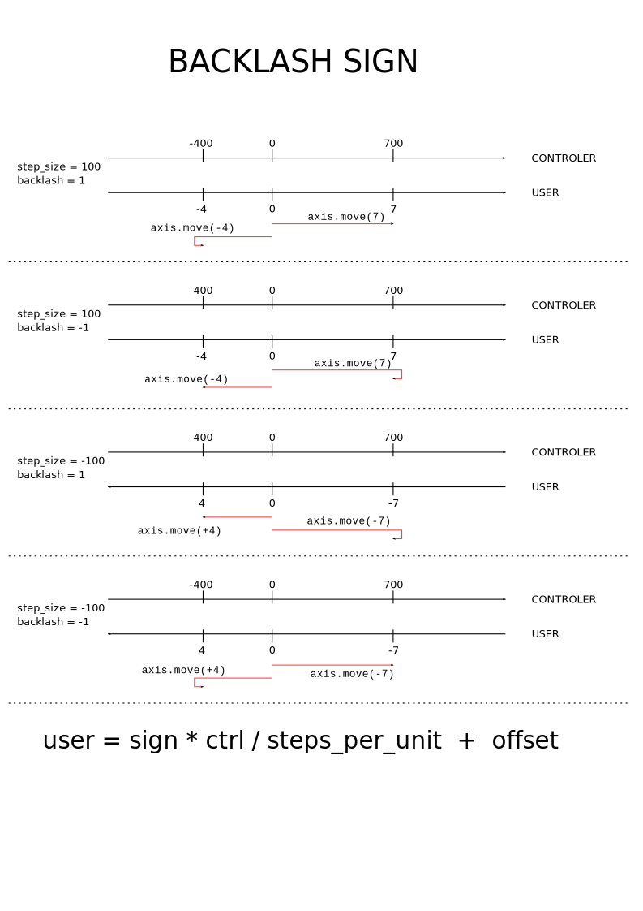
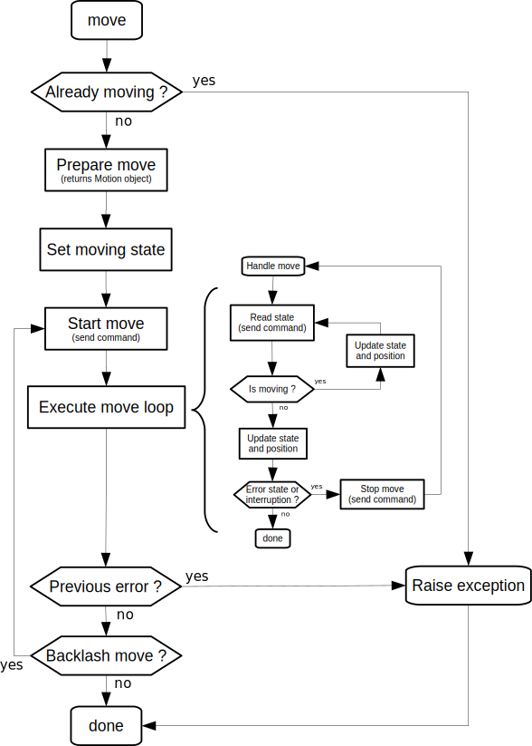

# The BLISS Axis object

In most cases a **BLISS Axis** represents a motor driven by a physical
motor controller.

This page presents the detailed usage of a BLISS axis.

Other more or less related pages:

* [Short presentation of Bliss Axis usage in BLISS shell](index.md#motors)
* [BLISS Shell standard functions to drive motors](shell_std_func.md#motors)
* [How to write a new class to support a motor controller in BLISS](dev_write_motctrl.md)
* [How to write a Calculational Motor Controller](dev_write_calc_ctrl.md)
* [Usual scans](scan_default.md)
* [Shutters](using_shutter.md)

## Configuration

The `Axis` objects need to be declared along their controller
in the BLISS configuration with an unique name, and a set of
configuration parameters.

!!! note
    See the motor controller configuration templates to learn
    about how to configure axes. For example, see [Icepap configuration](config_icepap.md)
    to declare Icepap motor controller axes.

### Default configuration parameters

Configuration parameters from Beacon YAML files are passed to
the `Axis` constructor.

Parameter name                              |  Required | Setting?  | Type   | Description
------------------------------------------- |-----------|-----------|--------|------------
[name](motion_axis.md#name)                 |  yes      | no        | string | An unique name to identify the `Axis` object
[steps_per_unit](motion_axis.md#position)   |  yes      | no        | float  | Number of steps to send to the controller to make a *move of 1 unit* (eg. 1 mm, 1 rad)
[velocity](motion_axis.md#velocity)         |  yes      | yes       | float  | Nominal axis velocity in *units.s<sup>-1</sup>*
[acceleration](motion_axis.md#acceleration) |  yes      | yes       | float  | Nominal acceleration value in *units.s<sup>-2</sup>*
[sign](motion_axis.md#position)             |  no       | no        | int    | Accepted values: 1 or -1. User position = (sign * dial_position) + offset ; *defaults to 1*
[low_limit](motion_axis.md#limits)          |  no       | yes       | float  | **Dial** Lower limit for a move (*None* or not specified means: unlimited) ; *defaults to unlimited*
[high_limit](motion_axis.md#limits)         |  no       | yes       | float  | **Dial** Higher limit for a move (*None* or not specified means: unlimited) ; *defaults to unlimited*
[backlash](motion_axis.md#backlash)         |  no       | no        | float  | Axis backlash in user units ; *defaults to 0*
[tolerance](motion_axis.md#tolerance)       |  no       | no        | float  | Accepted discrepancy between controller position and last known axis dial position when starting a move ; *defaults to 1E-4*
[encoder](motion_axis.md#encoder)           |  no       | no        | string | Name of an existing **Encoder** object linked with this axis
[unit](motion_axis.md#unit)                 | no        | no        | string | *Informative only* - Unit (for steps per unit), e.g. mm, deg, rad, etc.

!!! note
    Motor controllers with extra features may require more parameters. See the
    documentation of individual motor controllers to known about specific
    parameters.

Some configuration parameters are translated into *settings*, which means
the corresponding value is also stored in redis (see [Settings documentation](beacon_settings.md)).

### Applying configuration changes

A change in YML configuration can be applied with use `apply_config()`
method of `Axis` objects.

`apply_config()` has got a `reload` parameter which is `False` by default.

This parameter forces the reload on YAML from file, otherwise, the
configuration to apply is the one in memory (in redis ???).

Example: after changing velocity of **ssu** motor in YML file:
    ssu.apply_config(reload=False)   # <--- will apply old configuration
    ssu.apply_config(reload=True)    # <--- will apply new configuration

`ssu.apply_config(reload=False)` is a common way to reset parameters
after changes of settings in a session for example.

see [beacon db](beacon_db.md#configuration-behavior) for usage
examples of `apply_config()`.


## Axis in BLISS shell

The typing helper allowing to print info in BLISS shell will print the following
info by default for all 'Axis' objects:

example for an Icepap:
```python

DEMO [1]: samy
 Out [1]: axis name (R): samy
               state (R): READY (Axis is READY)
               unit (R): None
               offset (R): 0.0
               backlash (R): -0.00571429
               sign (R): 1
               steps_per_unit (R): 52500.0
               tolerance (R) (to check pos. before a move): 0.005
               motion_hooks (R): []
               dial (RW): 7.40000
               position (RW): 7.40000
               _hw_position (R): 7.40000
               hw_state (R): READY (Axis is READY)
               limits (RW):      (0.0, 15.8)  (config: (0.0, 15.8))
               acceleration (RW):    0.95238  (config:    0.95238)
               acctime (RW):         0.50000  (config:    0.50000)
               velocity (RW):        0.47619  (config:    0.47619)
          ICEPAP:
               host: iceid212 (ID: 0008.01A1.49C6) (VER: 3.17)
               address: 42
               status: POWER: ON    CLOOP: ON    WARNING: NONE    ALARM: NO
          ENCODER:
               tolerance (to check pos at end of move): 0.001
               encoder value: 388498
               dial_measured_position:    7.39998
```


## Custom axis classes

`Axis` is the default class that corresponds to controller motors,
however it is possible to specify *a derived class* with extra features
if needed. Some controllers may return instances of a special class
(for example, the **IcePAP** controller has a special class for linked axes).
User can also force a particular class to be instanciated, by adding
a `class` item within the YAML configuration for the axis.

### ModuloAxis

An `Axis` whose positions are always between 0 and a modulo value set in the
YAML configuration (`modulo` parameter). For example, a motor for a rotation
can be configured with `class: ModuloAxis` and `modulo: 360`.

### NoSettingsAxis

An `Axis` which does not store settings in redis -- will always refer to hardware.


## Implementation details

This chapter concerns who want to understand the internal mechanisms
of BLISS Axis object.

* `bliss/common/`
    * `axis.py`
    * `motor_config.py`
    * `motor_group.py`
    * `motor_settings.py`
    * `scans.py`
* `bliss/controllers/motor.py`


## Initialization

Motor controllers follow the following sequence to initialize `Axis` objects:



When the `Axis` object is initialized, settings have prevalence over static
configuration parameters, i.e. the axis velocity will be changed to the
one in redis, not to the nominal value from the configuration.

!!! note
    Axis initialization does not happen when the motor controller is
    loaded, or when an `Axis` object is retrieved from Beacon. Indeed
    `Axis` objects implement the *lazy initialization pattern*: the
    initialization sequence described above only happens the first
    time the object is accessed.

## Axis properties

Axis properties are built on top of the Python language *properties*,
which provide an elegant way to implement "getters and setters"
mechanisms. Assigning a value to a property sets the value, i.e. an
action may be triggered by the object when the descriptor gets
written. In the case of the `Axis` object, it can trigger a
communication with the motor controller to set the velocity for
example.

It is enough to call the property to read the property value.
Depending on the property, this can also trigger an action on
the motor controller.

Property name                                       | R/W? | Type   | Description
----------------------------------------------------|------|--------|-------------
[name](motion_axis.md#name)                         | R    | string | Axis name
[velocity](motion_axis.md#velocity)                 |  R+W | float  | Get or set the axis velocity in *units.s<sup>-1</sup>*
[config_velocity](motion_axis.md#velocity)          | R    | float  | Returns the nominal velocity value from the configuration
[acceleration](motion_axis.md#acceleration)         | R+W  | float  | Get or set the axis acceleration in *units.s<sup>-2</sup>*
[config_acceleration](motion_axis.md#acceleration)  | R    | float  | Returns the nominal acceleration value from the configuration
[acctime](motion_axis.md#acceleration)              | R+W  | float  | Get or set the acceleration time; note: depends on both velocity and acceleration ; *acctime = velocity / acceleration*
[config_acctime](motion_axis.md#acceleration)       | R    | float  | Returns the acceleration time taking into account nominal values for velocity and acceleration
[low_limit](motion_axis.md#limits)                  | R+W  | float or None | Get or set the soft low limit **in user units**
[high_limit](motion_axis.md#limits)                 | R+W  | float or None | Get or set the soft high limit **in user units**
[limits](motion_axis.md#limits)                     | R+W  | (float or None, float or None) | Get or set soft limits **in user units**
[config_limits](motion_axis.md#limits)              | R    | (float or None, float or None) | Returns (low_limit, high_limit), from the in-memory configuration **in user units**
[steps_per_unit](motion_axis.md#position)           | R    | float | Number of steps to send to the controller to make a *move of 1 unit* (eg. 1 mm, 1 rad)
[backlash](motion_axis.md#backlash)                 | R    | float | Returns the backlash applied to the axis
[is_moving](motion_axis.md#is_moving)               | R    | bool  | Returns whether the axis is moving
[dial](motion_axis.md#position)                     | R+W  | float | Get or set the axis *dial* position
[offset](motion_axis.md#position)                   | R    | float | Returns the current offset for user position calculation
[sign](motion_axis.md#position)                     | R    | int   | Returns the sign for user position calculation
[position](motion_axis.md#position)                 | R+W  | float | Get or set the axis *user* position ; User position = (sign * dial_position) + offset
[_hw_position](motion_axis.md#hardware_position)    | R    | float | Returns the controller position for the axis ; *forces a read on the controller*
[_set_position](motion_axis.md#hardware_position)   | R+W  | float | Last set position for the axis (target of last move, or current position)
[tolerance](motion_axis.md#tolerance)               | R    | float | Accepted discrepancy between controller position and last known axis dial position when starting a move ; *defaults to 1E-4*
[state](motion_axis.md#axis-state)                  | R    | AxisState     | Returns the state of the axis (*MOVING*, *READY*, *ON_LIMIT*, etc)
[encoder](motion_axis.md#encoder)                   | R    | Encoder[None] | Returns the encoder object associated to this axis


### position

* `position`
* `sign`
* `user`
* `dial`
* `offset`
* `steps_per_unit`

!!! note
    About units management

    * On the user point of view, axes are moved in **user units**,
      whatever unit is used in the controller API
    * **user unit** can be millimeter, micron, degree etc.
    * **controller unit** is often *steps* or *micron*
    * On the programmer point of view, the BLISS plugin is dealing with
      controller units (steps, microns, ...)
    * The programmer should not have to deal with units conversions.

`Axis` object keeps track of both a **dial** and a **user** position.

The dial position is meant to agree with the readout of the physical
dial on the hardware stage. The value and the sign of the
*.steps_per_unit* parameter should be chosen so that the dial position
and its direction agree with the physical dial reading. Assigning a
value to the writable `.dial` property *sets the position on the motor
controller register*.

The user position allows to use a logical reference frame, that does
not interfere with the motor controller.

```python
    user_position = (sign * dial_position) + offset
```

Assigning a value to the `.position` property sets the user
position. *The offset is determined automatically, using the above
formula.* The offset value can be retrieved with the `.offset`
property (read-only).  The sign is read from the configuration. The
sign value can be retrieved with the `.sign` property (read-only).

Changing the user position does not change anything on the motor
controller. No communication with hardware is involved.

Resetting offset to 0 can be achieved with:

```python
>>> axis.position = axis.dial
>>> axis.offset
0.0
```

#### Position change events

Internally, the axis position is kept in a
[`Channel` object](beacon_channels.md), which makes it is possible to
register a callback function to be called whenever the axis position
changes:

```python
>>> from bliss.common import event
>>> def example_callback(new_pos):
      print(f"I moved to {new_pos}")
>>> event.connect(m0, "position", example_callback)
>>> m0.rmove(1)
I moved to 0.0
I moved to 0.241
I moved to 0.486
I moved to 0.691
I moved to 0.880
I moved to 1.0
>>>
```

Frequency: 20 ms ?

!!! note
    The events can be used in particular for GUI

!!! note
    The same applies for any setting or channel: dial, state, limits,
    velocity, acceleration


### hardware_position
* `_hw_position`
* `_set_position`


m1._hw_position        # just read (no cache), does not update settings
m1._hw_position = 36   # ---> INVALID
m1._set_position = 36  # ---> VALID

### limits

A particular attention must be paid to the units of the limits.

In user interactions, limits are treated in *USER units*, but internaly and in
the config, limits are managed in *DIAL units*.

Configuring limits in DIAL units in the config is relevant to avoid to impact
them with `sign` and `offset`.

Properties related to limits:
* `limits` (R+W): Get or set soft limits **in user units**
* `low_limit` (R+W): Get or set the soft low limit **in user units**
* `high_limit` (R+W): Get or set the soft high limit **in user units**
* `config_limits` (R): Returns (low_limit, high_limit), from the in-memory configuration **in user units**

#### Pushing the limits

Examples of limits behavior.

in config:
```yaml
...
  - acceleration: 10
    name: m4
    steps_per_unit: 100
    velocity: 10
    high_limit: 90.0
    low_limit: -90.0
...
```

```python
DEMO [2]: wm(m4)
                m4
-------  ---------
User
High      90.00000
Current    3.00000
Low      -90.00000
Offset     0.00000
Dial
High      90.00000
Current    3.00000
Low      -90.00000
```

Setting the user position creates an offset. USER limits are impacted but not
DIAL limits.

```
DEMO [3]: m4.position = 12
DEMO [4]: wm(m4)
                m4
-------  ---------
User
High      99.00000
Current   12.00000
Low      -81.00000
Offset     9.00000
Dial
High      90.00000
Current    3.00000
Low      -90.00000
```


### velocity
* `velocity`
* `config_velocity`

### acceleration
* `acceleration`
* `config_acceleration`
* `acctime`
* `config_acctime`

Changing acceleration:




### backlash




### is_moving

### tolerance

!!!

There is also a tolerance parameter for encoder, see:


### encoder


### Axis state

The `.state` property returns the current state of an axis. The
returned value is an `AxisState` instance, which holds **a list of
states**.

A description is associated to each state. The string representation
of the `AxisState` object shows a human-readable description of the
state. Example here present the `READY` state with its *"Axis is
READY"* description:
```python
DEMO [1]: m0.state
 Out [1]: AxisState: READY (Axis is READY)
```

Pre-defined standard states are:

* `MOVING`, *'Axis is moving'*
* `READY`, *'Axis is ready to be moved'*
* `FAULT`, *'Error from controller'*
* `LIMPOS`, *'Hardware high limit active'*
* `LIMNEG`, *'Hardware low limit active'*
* `HOME`, *'Home signal active'*
* `OFF`, *'Axis is disabled'*

A motor can then have more than one state at once, states can be
combined to represent complex situations. For example, a motor can be
both ready to move and still touching a limit or being at home
position.

```python
DEMO [1]: m0.state
 Out [1]: AxisState: MOVING (Axis is moving)

DEMO [2]: m1.state
 Out [2]: AxisState: READY (Axis is READY) | LIMPOS (Hardware high limit active)
```

A given state can be tested to know if a motor is in this state:
```python
if m0.state.MOVING:
    print ("m0 motor is moving, please wait...")
```

!!! note
    The `in` operator of the Python language can be used to check
    whether an axis is in a certain state.
    
    ``` TEST_SESSION [2]: 'READY' in m0.state
         Out [2]: True```
    means:
    
    ```
    "m0 has 'READY' state in it's current states list."```

*READY* and *MOVING* are the states tested by the Axis engine to
 determine allowed actions on an axis object.

It is possible to define custom states (see
[how to write motor controllers](dev_write_motctrl.md)).

!!! note
    `state` property is the list of current states, not the list
    of all existing states.

    To get the list of all existing states for a motor, use
    `states_list()` method:
    
    ```
    DEMO [16]: m1.state.states_list()
     Out [16]: ['READY', 'MOVING', 'FAULT', 'LIMPOS', 'LIMNEG', 'HOME', 'OFF']
    ```


#### Caching

For performance considerations, the state of an axis is managed via a
*caching mechanism*. There can be a discrepancy between real state of
a motor and BLISS returned state.

To get a direct reading of the hardware, use: `hw_state` property.

The reading `hw_state` property does not update `state` property.

It is possible to disable the caching mechanism in the config file ???


#### State change events

Similarly to the `.position` property, it is possible to be notified
of state changes by registering to the state change event:

```python
TEST_SESSION [12]: def state_change(new_state):
              ...:     print(f"State changed to {str(new_state)}")
TEST_SESSION [13]: event.connect(m0, "state", state_change)
TEST_SESSION [14]: m0.rmove(1)
State changed to MOVING (Axis is MOVING)
State changed to MOVING (Axis is MOVING)
State changed to READY (Axis is READY)
```


## Axis commands

### settings_to_config()

Saves settings (`velocity` `acceleration` `limits`) into config (XML file or
beacon YML).


### on()

### off()

### get_info()

### dial2user() user2dial()

### sync_hard() Synchronization with hardware

The `Axis` object tries to minimize access to the physical motor
controller. In particular, it is assumed BLISS takes ownership of the
hardware devices, i.e. devices are *not* supposed to be driven
"externally", by another software for example. Indeed, all `Axis`
settings are cached.

In some cases, though, another application (like **icepapcms** for the
**IcePAP** motor controller) can control a BLISS axis. Then any
further action on the `Axis` object would end up with an exception
being raised, because of discrepancies between the axis cached state
and the hardware state.

In order to solve the problem, and to empty the internal cache, the
`.sync_hard()` method can be called.


## Moving stop() move() home() jog()


The `Axis` object provides the following methods to start, monitor and
stop a movement:

* `.move(target_user_position, wait=True, relative=False)`
    - move to target position (absolute, except if relative=True)
* `.rmove(target_user_position, wait=True)`
    - do a relative move to target position
* `.home(switch=1, wait=True)`
    - do a home search
* `.jog(velocity, reset_position=None)`
    - start to move at constant speed ; *velocity* can be negative to
      indicate the opposite direction
    - if reset position is set to 0, the controller position is set to
      0 at the end of the jog move
    - if reset position is a callable, it is called at the end of the
      jog move, passing the Axis object as first argument
* `.hw_limit(limit, wait=True)`
    - do a limit search
    - a positive limit value means 'limit + switch', whereas a
      negative value means 'limit - switch'
* `.wait_move()`
    - for motions started with `wait=False`, this allows to join with the end of the move
* `.stop()`
    - send a stop command to the controller
    - the move loop will exit


*Before* a movement, the position of the axis is read and compared to
the BLISS Axis internal position. In case of difference outside the
limit fixed by **Axis tolerance** configuration parameter, an
exception is raised with message:

```
"discrepancy between dial (0.123) and controller position (0.100), aborting"
```

*After* a movement, if:

* an [encoder is associated to the axis](motion_encoder.md)
* AND `check_encoder` is set to True in config

then the encoder position is read and compared to the target position
of the movement. In case of difference outside the limit fixed by
**Encoder tolerance**, an exception is raised with message:

```
"didn't reach final position"
```


### Move loop


