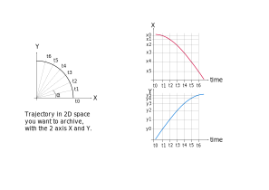

# Trajectories

For a motor controller supporting the use of a trajectory, and for
which the support is effective in BLISS (cf
[writing a motor controller](dev_write_motctrl.md#trajectory-motion)),
*trajectories* can be defined and used to move axes in complex
movements.

##Simple example

Here is a simple arc trajectory with two axis (X and Y). So axis `X`
will have a *cosin* trajectory and axis `Y` a *sin* trajectory.  In
this example we want to move from 0 deg to 90 deg in 10 seconds.



First let define the `alpha`, 10 points from 0 deg to 90 deg:

```python
import numpy
alpha = numpy.linspace(0,90,10) #deg
```

Then build position for the two axis:

```python
x_positions = numpy.cos(numpy.deg2rad(alpha))
y_positions = numpy.sin(numpy.deg2rad(alpha))
```

Then build the time array.

```python
times = numpy.linspace(0,10,10)
```

At `t0` == 0 and `t9` == 10 seconds in 10 points.
 
In `Bliss` all trajectory are defined by the triplet **PVT** =>
**P** osition,  **V** elocity, **T** ime. To achive this, use
the `PointTrajectory` object to create the **PVT** array:

```python
from bliss.physics import trajectory
pt = trajectory.PointTrajectory()
pt.build(times,{'X':x_positions,'Y':y_positions})
```

Create one trajectory object per each axis:

```python
from bliss.common import axis

pvt = pt.pvt() # calculate pvt array
x_trajectory = axis.Trajectory(X,pvt['X'])
y_trajectory = axis.Trajectory(Y,pvt['Y'])
```

An finally create the `TrajectoryGroup`. This object group the
movement for this two axis along the trajectory. 

```python
from bliss.common.motor_group import TrajectoryGroup
#Create the Trajectory group
group = TrajectoryGroup(x_trajectory,y_trajectory)
#load trajectories into the motor controller
group.prepare()
#linear move to the first point
#In this example will move X to 1 and Y to 0
group.move_to_start()
#move to the end of the trajectory.
#After this command X will be near 0 and Y near 1
group.move_to_end()
```

The calling sequence of this object must always be the same:

* call `prepare` first
* then `move_to_start`
* finally `move_to_end`

It's possible to repeat the sequence but always in this order.