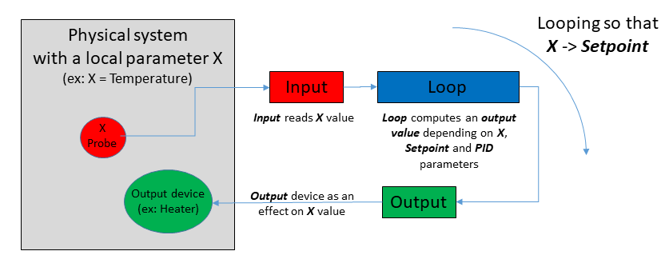
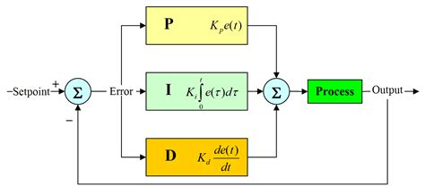
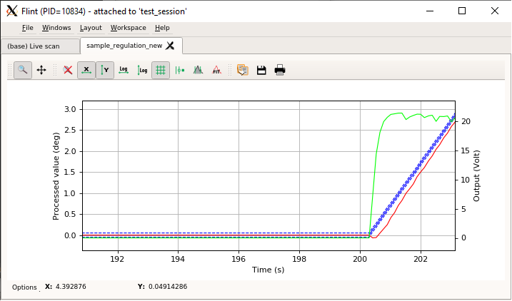
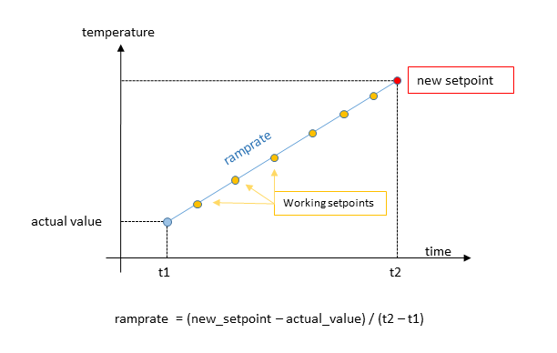
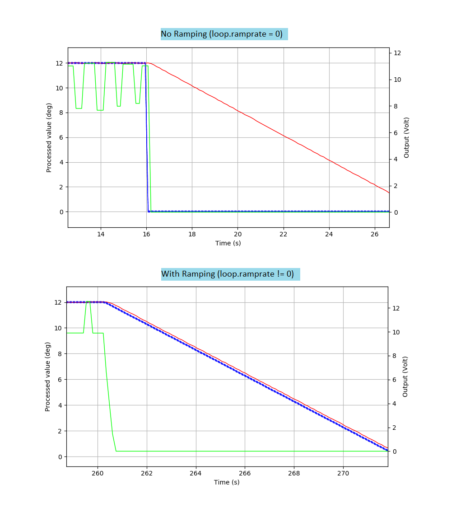
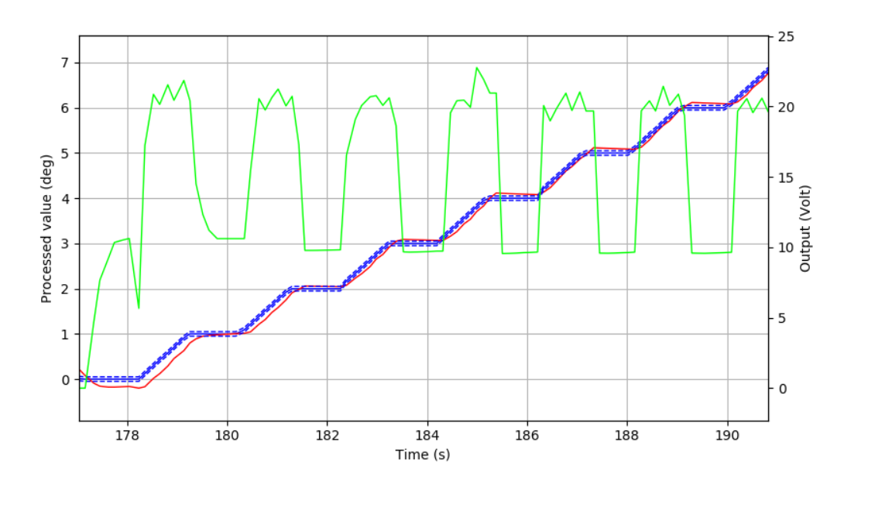
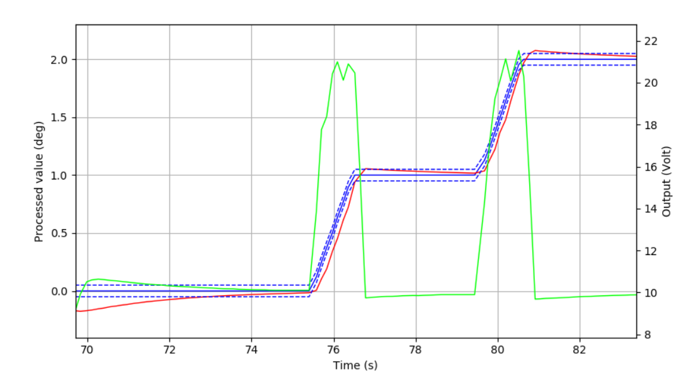
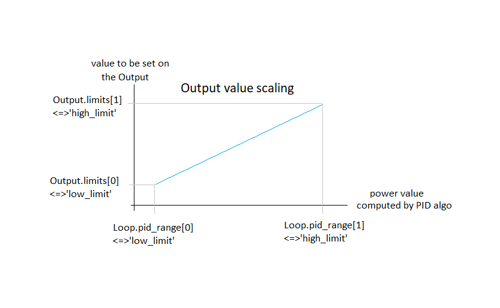

# Regulation framework

**The Regulation framework provides 3 kinds of objects:**

* `Input`  to evaluate the actual state of the system (like the room temperature).
* `Output` to perform an action on the system (like an heater).
* `Loop`   to manage the regulation of the system via the *PID* parameters and a given setpoint (like the target temperature for the room).

**For regulation purposes only the Loop object has to be imported in the Bliss session.**

The Input and Output associated to a Loop are accessed via `Loop.input` and `Loop.output`.

The regulation controller can be accessed with the `.controller` property (ex: `Loop.controller`).


**The regulation process can be described by the following steps:**



1. **Input** reads the actual value of the processed variable (i.e. the physical parameter that is monitored by the regulation).
2. **Loop** computes an *output_value* that depends on the actual value of the Input, the "distance" to the setpoint and the *PID* parameters.
3. The *output_value* is sent to the **Output**. The output device has an effect on the system and modifies the value of the processed variable.
4. back to step 1) and loop forever so that the processed value reaches the setpoint value and stays stable around that value (deadband).


See [Interacting with the Loop object](regul_regulation_fw.md#interacting-with-the-loop-object) for further details about the usage of the Loop object within a Bliss session.


!!! info
    The `Regulation` framework replaces the older [Temperature](regul_temperature_fw.md) framework.

    The hardware controllers based on the new Regulation framework  are:

    - eurotherm nanodac
    - lakeshore 331/332/335/336/340
    - linkam TMS94/T95
    - oxford cryosrtream 700/800

    In addition to the management of a regulation hardware, this new framework brings solutions to:

    - creating a software regulation Loop using any Bliss object as Input or Output ([SoftLoop](#softloop))
    - using a Loop as a pseudo axis for scanning purpose ([Loop.axis](#scanning))
    - monitoring the regulation with a Live plot in Flint ([Loop.plot](#start-and-monitor-the-regulation-loop))

!!! note
    In the older `Temperature` framework:

    - the methods `set`, `ramp`, `stop` were accessible from both the `Loop` or the associated `Loop.output`
    - the `deadband` was defined on the `Output`


    In the `Regulation` framework:

    - the methods `setpoint`, `ramprate`, `stop`, `deadband` are accessed via the `Loop` object
    - `setpoint` method does the same as the old `ramp` method.
    - if the `ramprate` is set to zero, the `setpoint` method does the same as the old `set` method.


## Configure a regulation hardware

The `hardware regulation` case corresponds to the situation, where a regulation hardware exists and the regulation input and output devices are connected to that hardware (like a lakeshore controller with temperature probes and heaters).

A controller can declare multiple inputs, outputs and loops. But one loop is always associated to one input and one output.

**The loops, inputs and outputs linked to that controller are declared within the configuration of the controller.**

**These objects are the ones that should be imported in a Bliss session, not the controller!**

**Input**, **Output** and **Loop** objects will access the **Controller** class written for the equipment.

The regulation controller can be accessed via these object with the `.controller` property (ex: `Loop.controller`).


To define a new controller class based on the regulation framework for a new hardware, see [Writing a custom controller for a regulation hardware](regul_regulation_fw.md#writing-a-custom-controller-for-a-regulation-hardware).

!!! example "YML file example"

```yaml
- class: LakeShore336
  module: temperature.lakeshore.lakeshore336
  plugin: regulation
  name: lakeshore336
  timeout: 3
  tcp:
     url: lakeshore336se2:7777
     eol: "\r\n"  # the usual EOL but could have been modified through the hardware interface
  inputs:   # the section to declare Inputs
    - name: ls336_A     # one input
      channel: A
      unit: Kelvin
    - name: ls336_A_c   # another input, same hw channel but using Celsius
      channel: A
      unit: Celsius
    - name: ls336_A_su  # another input, same hw channel but using sensor unit
      channel: A
      unit: Sensor_unit

    - name: ls336_B     # another input, different hw channel
      channel: B
      unit: Kelvin
    - name: ls336_B_c
      channel: B
      unit: Celsius
    - name: ls336_B_su
      channel: B
      unit: Sensor_unit

  outputs:  # the section to declare Outputs
    - name: ls336o_1    # one output
      channel: 1
      unit: Kelvin
    - name: ls336o_2    # another output
      channel: 2
      unit: Kelvin

  ctrl_loops:
    - name: ls336l_1    # one loop
      input: $ls336_B   # a reference to one of the inputs above
      output: $ls336o_1 # a reference to one of the outputs above
      channel: 1
    - name: ls336l_2    # another loop
      input: $ls336_B   # a reference to another input from above
      output: $ls336o_2 # a reference to another output from above
      channel: 2

```

**In a bliss session import the Loop objects ls336l_1 or ls336l_2 but not the controller lakeshore336.**

The controller can be accessed via `Loop.controller` (ex: `ls336l_1.controller`).

The Input and Output of the Loop can be accessed via `Loop.input` and `Loop.output`.

The Input and Output objects can also be imported in a Bliss session (for example when the regulation loop is not used and when the output is used in a direct control).


## Configure a software regulation

`Software regulation` can be applied, where no existing hardware for regulation is available.
For example, it may be necessary to regulate a temperature by moving a cryostream with a motor (axis) or a beam position by
reading a diode and moving an axis.

**ExternalInput**, **ExternalOutput** encapsulate any object of the Bliss configuration into Input/Output
and can be used by a **SoftLoop**.

**SoftLoop** runs a software PID algorithm using any pair of Input/Output.


### External Input/Output

Any [SamplingCounter](bliss_counters.md#sampling-counters) can be directly interfaced with an `ExternalInput` and any [Axis](bliss_motion_control_basics.md#what-is-a-bliss-axis-?) with a `ExternalOutput` or `ExternalInput`.

```yaml
-   class: ExternalInput  # an ExternalInput object to interface a counter as an input
    plugin: regulation    # use the regulation plugin for standard regulation classes
    name: myinput         # a name for this input
    device: $mycnt        # a reference to a SamplingCounter that must exist in the configuration
    unit: volt            # (optional) unit for this input

-   class: ExternalOutput   # an ExternalOutput object to interface an axis as an output
    plugin: regulation      # use the regulation plugin for standard regulation classes
    name: myoutput          # a name for this output
    device: $robz           # a reference to an axis that must exist in the configuration
    unit: mm                # (optional) unit for this output
    low_limit: -0.06        # (optional) low limit for a value applied to this output
    high_limit: 0.06        # (optional) high limit for a value applied to this output
    ramprate: 0.0           # (optional) usually no ramping for an axis as output
    mode: relative          # (optional) type of axis motion, in ['relative', 'absolute']
```

All other Bliss objects can be interfaced as a regulation input/output by implementing a custom class inheriting
from the `ExternalInput` or the `ExternalOutput` classes.

```yaml
-   class: Chi2DiodeInput     # a custom object implemented by the user and inheriting from the ExternalInput base class
    package: id26.controllers.chi2_diode_device  # where to find the object class definition
    plugin: bliss             # custom object uses the standard bliss plugin
    name: chi2_diode_pos      # a name for this input
    device: $moco_chi2        # a reference to an object of the config that will be interfaced as an input
    unit: log(finm/foutm)     # (optional) unit for this input
    signal_beam_limit: 1e-07     # (custom) extra attribute
    offset_finm: 1.70147994e-11  # (custom) extra attribute
    offset_foutm: 1.5094417e-11  # (custom) extra attribute

```

The custom `Chi2DiodeInput` is defined somewhere else (e.g *'id26/controllers/chi2_diode_device.py'*):

```python
from bliss.common.regulation import ExternalInput

class Chi2DiodeInput(ExternalInput):

    def __init__(self, name, config): # (name, config) args to satisfy bliss plugin requirements
        super().__init__(config)

        # custom attributes
        self.offset_finm = config['offset_finm']
        self.offset_foutm = config['offset_foutm']
        self.signal_beam_limit = config['signal_beam_limit']
        self._last_value = 0

    def _get_chi2_counts(self):  # custom method
        count_chi2 = self.device.comm('?fbeam') # self.device is defined via the yml config (see 'device: $moco_chi2')
        count_finm = float(count_chi2.split()[0])
        count_foutm = float(count_chi2.split()[1])
        return count_finm, count_foutm

    def read(self): # MANDATORY: must be implemented (not implemented in the base class)
        """ """
        count_finm, count_foutm = self._get_chi2_counts()

        d1 = count_finm - self.offset_finm
        d2 = count_foutm - self.offset_foutm

        if d1 > 0 and d2 > 0:
            self._last_value = (d1 - d2)/(d1+d2)

        return self._last_value

    def state(self):   # override base class implementation
        """ returns the input device state """
        return "READY"

    def allow_regulation(self): # override base class implementation
        """ this method inhibits the SoftLoop regulation if returning False """

        count_finm, count_foutm = self._get_chi2_counts()

        d1 = count_finm - self.offset_finm
        d2 = count_foutm - self.offset_foutm

        if d1 <= 0 or d2 <= 0:
            return False

        signal_beam = d1 + d2
        if signal_beam >= self.signal_beam_limit:
            return True
        else:
            return False

```


The YML configuration of the `ExternalInput` and `ExternalOutput` objects has a special keyword `device` to
make a reference to the Bliss object that should be interfaced. It can be accessed via the Input/Output object with `.device`.

For `ExternalOutput` interfacing an axis, a special keyword `mode` exist to define the kind of motion.
The mode value can be **'relative'** or **'absolute'**. It can be accessed and modified with the `ExternalOutput.mode` property.
Default mode is 'relative'.

!!! Note
    **About Axis interfaced as ExternalOutput:**

    The *relative* motion mode is usually the most adapted.

    The *low_limit* and the *high_limit* values should be chosen carefully.

    In combination with the *relative* motion mode, users should use:

        high_limit = - low_limit = maximum_step_size


    The loop waits for the axis to reach its new position before doing the next PID iteration.
    Therefore, a small value for the *maximum_step_size* is preferred in order to perform the motion in a short delay,
    and then perform the next PID iteration as soon as possible.

    The motion time should be smaller than *1/SoftLoop.sampling_frequency*.

    On the other hand if the *maximum_step_size* is too small, the expected effect of
    moving the axis is too weak and has a negligible effect on the system.

    Start with a small value (like 2 times the axis tolerance) and increase slightly until
    you obtain significant effects on the system.


### SoftLoop

To perform a regulation with the `ExternalInput`/`ExternalOutput` objects, users must declare a `SoftLoop`.

The `SoftLoop` object inherits from the `Loop` class and implements its own PID algorithm (using the *simple_pid* Python module).


Because there is no shared hardware controller for the regulation, `ExternalInput`, `ExternalOutput` and `SoftLoop` have independent configurations (i.e. not all declared under the same Controller class).

Inside the SoftLoop configuration section, there are references (`$`) to the input and output objects that should be used for the regulation. Notice that a SoftLoop can reference both the standard and the external types of Input/Output objects.

!!! example "YML file example"

```yaml
-   class: SoftLoop           # a SoftLoop object
    plugin: regulation        # use the regulation plugin for standard regulation classes
    name: chi2_regul          # a name for this loop
    input: $chi2_diode_pos    # the Input object to be used
    output: $chi2_motor_pos   # the Output object to be used
    P: -25                    # positive or negative Kp 'switches the output direction'
    I: 0.0
    D: 0.0
    low_limit: -1.0           # low limit of the PID output range. Usually equal to 0 (absolute) or -1 (relative).
    high_limit: 1.0           # high limit of the PID output range. Usually equal to 1.
    frequency: 10.0           # frequency of the regulation loop evaluation
    deadband: 0.00025         # deadband width (like a tolerance for the setpoint)
    deadband_time: 3.0        # minimum time (sec) to consider that the setpoint has been reached
    ramprate: 1               # ramprate is used as a 'speed' toward setpoint (ramprate=0 to apply setpoint immediately)
    wait_mode: deadband       # wait_move mode for the loop as a pseudo axis (loop.axis)
    max_attempts_before_failure: 5 # number of failed attempts to input.read or output.set_value before stopping the loop

-   class: Chi2DiodeInput     # A custom object implemented by the user and inheriting from the ExternalInput base class
    package: id26.controllers.chi2_diode_device  # where to find the object class definition
    plugin: bliss             # Custom object uses the standard bliss plugin
    name: chi2_diode_pos      # a name for this input
    device: $moco_chi2        # a reference to an object of the config that will be interfaced as an input
    unit: log(finm/foutm)     # (optional) a unit for this input
    signal_beam_limit: 1e-07     # (custom) extra attribute
    offset_finm: 1.70147994e-11  # (custom) extra attribute
    offset_foutm: 1.5094417e-11  # (custom) extra attribute


-   class: ExternalOutput   # a ExternalOutput object to interface an axis as an output
    plugin: regulation      # use the regulation plugin for standard regulation class
    name: chi2_motor_pos    # a name for this output
    device: $CHI2           # a reference to an axis name that must exist in the configuration
    unit: CHI2_position     # (optional) a unit for this output
    low_limit: -0.06        # (optional) the low limit for a value applied to this output
    high_limit: 0.06        # (optional) the high limit for a value applied to this output
    ramprate: 0.0           # (optional) usually no ramping for an axis as output
    mode: relative          # (optional) type of axis motion, in ['relative', 'absolute']
```

!!! tip "`SoftLoop` timeout resilience"
    You can make the `SoftLoop` more resilient to transitory communication errors like timeouts by increasing `SoftLoop.max_attempts_before_failure`. It can be specified in yml config like so:

    ```yaml
    max_attempts_before_failure: 100  # the loop will stop after 100 contiguous failed attempts to input.read or output.set_value
    ```

## Interacting with the Loop object

Type the name of the regulation loop in a Bliss shell to print information.

```python

TEST_SESSION [3]: sample_regulation_new
Out [3]:
                  === Loop: sample_regulation_new ===
                  controller: Mockup
                  Input: thermo_sample_new @ 0.000 deg
                  output: heater_new @ 0.000 Volt
                  setpoint: 0.0 deg
                  ramp rate: 1.0 deg/s
                  ramping: False
                  kp: 0.5
                  ki: 0.2
                  kd: 0.0
```


**Main methods:**

- `Loop.setpoint`: get/set the setpoint (target value). Starts the regulation (if not active already) and starts the ramping toward the setpoint using the actual ramp rate.
- `Loop.ramprate`: get/set the ramping rate. Set to zero to deactivate the ramping.
- `Loop.is_ramping`: return *True* until the loop is ramping to the setpoint.
- `Loop.stop`: stop the ramping (regulation will be maintained at current working setpoint).
- (`Loop._stop_regulation`): to stop the regulation process (not usual, be very careful)

**Linked objects:**

- `Loop.controller`: return the controller object associated to the loop and shared with the input and output objects. A `SoftLoop` doesn't have a controller.
- `Loop.input`: return the Input object associated to the loop.
- `Loop.output`: return the Output object associated to the loop.

**PID tunning methods:**

- `Loop.kp`: get/set the proportional coefficient of the PID regulation algorithm.
- `Loop.ki`: get/set the integral coefficient of the PID regulation algorithm.
- `Loop.kd`: get/set the derivative coefficient of the PID regulation algorithm.




**Pseudo-axis methods:**

- `Loop.axis`: return the loop as a pseudo axis for scanning purpose.
- `Loop.deadband`: get/set the setpoint tolerance (half width of the band centred around setpoint value).
- `Loop.is_in_deadband`: return *True* if the input value is in the dead band.
- `Loop.deadband_time`: the minimum time to be 'stabilized' in the deadband (default 1s).
- `Loop.wait_mode`: this mode is used by the pseudo axis to determine if the axis is MOVING or READY.

    mode=1: `WaitMode.RAMP`    : READY as soon as the `Loop.axis` has finished ramping to the setpoint.

    mode=2: `WaitMode.DEADBAND`: READY when the Input value is stabilized in the `deadband` for
    a time longer than `deadband_time` (default mode).

**Counters:**

A `Loop` is `SamplingCounterController` which as 3 sampling counters (`Loop.counters`):

- one for the *setpoint* value
- one for the *input* value (retrieved from loop.input)
- one for the *output* value (retrieved from loop.output)


### Start and monitor the regulation loop

The regulation is started by setting the setpoint for the first time: `loop.setpoint = value`.

The `Loop` always uses ramping while moving to a new setpoint, unless `ramprate==0`.

The regulation can be monitored through a plot in Flint using the command `plt = loop.plot()`.

The plot can be closed by pressing the little cross on the top right corner of the plot tab in Flint.

The plot can be stopped and restarted using the commands `plt.stop()` and `plot.start()`.

The refresh time of the plot can be modified with `plt.sleep_time = 0.1`.

The size of stored data for the plot can be modified: `loop.history_size = 150`.

The stored data can be cleared with: `loop.clear_history_data()`

```python

TEST_SESSION [4]: loop.plot()
TEST_SESSION [5]: loop.setpoint=10

```




The left y-axis is the value read from the Input (red curve, *processed value*).

The right Y axis is the value read from the Output (green curve, *Output*).

The solid blue curve is the setpoint and the dashed blue curve is the deadband.


### Ramping

The Loop object has a ramping feature in order to control the progression toward the setpoint value.
When setting a new setpoint (`loop.setpoint=10`) the `Loop` always uses a ramp, unless `ramprate==0`.
While ramping, the Loop computes intermediate setpoints (`workingsetpoints`) matching the ramping slope.

The ramprate is a positive floating number and its unit is *[input unit]/[sec]*.






The method `Loop.is_ramping` returns *True* if the Loop is currently ramping to the setpoint value.
It returns *False* if the ramping is disabled or if the `workingsetpoint` is equal to the `setpoint` (i.e. ramping has finished).

!!! Note
    Some regulation hardware may prevent the ramprate to be set to zero.

If the controller hardware doesn't have the ramping feature, the Loop object will automatically provide a software ramping object (`regulation.SoftRamp`). The `SoftLoop` is using a `SoftRamp`. Use `Loop.soft_ramp` to access the object.


The Output object also has a ramping feature (same behaviour as the Loop soft_ramp).
If `loop.output.ramprate != 0` then any new value sent to the output will use a ramp to reach that value.
The output ramping is useful when the hardware must be protected against brutal variations (like a high voltage output).
By, default the output ramprate is set to zero.

### Scanning

The Loop object has a special method `Loop.axis` that returns the loop as an `Axis`.

```python
TEST_SESSION [3]: sample_regulation_new.axis.name
         Out [3]: 'sample_regulation_new_axis'
TEST_SESSION [4]: sample_regulation_new.axis
         Out [4]: AXIS:
                name (R): sample_regulation_new_axis
                unit (R): deg
                offset (R): 0.00000
                backlash (R): 0.00000
                sign (R): 1
                steps_per_unit (R): 1.00
                tolerance (R) (to check pos. before a move): 0.1
                limits (RW):    Low: -inf High: inf    (config Low: -inf High: inf)
                dial (RW): 0.00000
                position (RW): 0.00000
                state (R): READY (Axis is READY)
                acceleration: None
                velocity: None
            ERROR: Unable to get info from controller
            <bliss.controllers.motors.soft.SoftController object at 0x7fcecaf39f50>
            ENCODER:
                None
```

The axis is created once at the Loop initialization and is a standard Bliss Axis.

The axis name (*{Loop.name}+'_axis'*) is exported in the session and can by found in `wa()`.

The axis `tolerance` parameter is set to the same value as the `loop.deadband` value.

The `Loop.axis` can be used like a motor in a scan and the `Loop` as counters.

```python
TEST_SESSION [9]: ascan(loop.axis, 0, 10, 10, 1, loop)
Out [9]: Scan(number=252, name=ascan, path=/tmp/scans/test_session/data.h5)
```

!!! Note
    The Loop is a `CounterController` with 3 counters for the *setpoint*, *input* and *output* values.
    Actually only the setpoint counter is owned by the Loop, the 2 others are respectively owned by
    the loop.input and the loop.output objects.
    However they are all retrieved by the `Loop.counters` method for convenience.
    Therefore, `lscnt()` does not list all under the Loop.


#### Motion state and waiting mode

Behind the scene, while moving the `Loop.axis` to a new position,
the Loop sets a new setpoint and waits until it reaches the deadband around the new setpoint.

The axis is considered `MOVING` until the input value as reached the setpoint value.

If the `Loop.wait_mode` is:

- `WaitMode.RAMP` (=1): the axis is READY as soon as the Loop has finished ramping to the setpoint.




- `WaitMode.DEADBAND` (=2): the axis is READY when the Input value is stabilized within the `deadband` for
a time longer than `deadband_time` (default mode).




## SoftLoop specificities

With a standard `Loop` the PID algorithm is handled by the controller hardware and
the controller sends the new values directly to the output device.

With a `SoftLoop` the PID algorithm is handled by Bliss in a parallel task.

- `SoftLoop.sampling_frequency`: adjust the update frequency of the PID algorithm.
- `SoftLoop.pid_range`: adjust the PID min/max range (*output power range*).

    [ 0, 1] for unidirectional 'moves' on the output (like heating more or less, [0% <=> 100%])

    [-1, 1] for bidirectional 'moves' on the output (like heating/cooling or the moving direction for a motor, [-100% <=> +100%]).

    Under the YML configuration of the `SoftLoop` the corresponding keywords are `low_limit` and `high_limit`.

    ```yml
    -
        class: SoftLoop
        plugin: regulation
        name: chi2_regul
        input: $chi2_diode_pos
        output: $chi2_motor_pos

        low_limit: -1.0  # <-- low limit for the value computed by PID algo. Usually equal to 0 (absolute) or -1 (relative).
        high_limit: 1.0  # <-- high limit for the value computed by PID algo. Usually equal to 1.

    ```

#### PID range and Output limits

When the PID algorithm computes a value for the Output to reach the setpoint:

- the PID algorithm computes the *output power* value (restricted to `pid_range`)
- the *output power* value is rescaled using the min/max range defined on the Output (`Loop.output.limits`)
- the rescaled value is applied to the Output (`Loop.output.set_value`)



!!! Note
    The min/max range of the Output can be defined in its configuration with the keywords `low_limit` and `high_limit`.
    Also can be accessed via the output object with `Loop.output.limits`.


## Writing a custom controller for a regulation hardware

The custom controller class must inherit from the Regulation `Controller` class:

`from bliss.controllers.regulator import Controller`

The `Controller` class has pre-defined methods, which must be filled in the child class (the `raise NotImplementedError` methods). Other methods or attributes (custom methods or attributes) can be freely defined by the developer.

```python

from bliss.controllers.regulator import Controller

class MyCustomController(Controller):

    # ------ init methods ------------------------

    def initialize_controller(self):

    def initialize_input(self, tinput):

    def initialize_output(self, toutput):

    def initialize_loop(self, tloop):

    # ------ get methods ------------------------

    def read_input(self, tinput):

    def read_output(self, toutput):

    def state_input(self, tinput):

    def state_output(self, toutput):

    # ------ PID methods ------------------------

    def set_kp(self, tloop, kp):

    def get_kp(self, tloop):

    def set_ki(self, tloop, ki):

    def get_ki(self, tloop):

    def set_kd(self, tloop, kd):

    def get_kd(self, tloop):

    def start_regulation(self, tloop):

    def stop_regulation(self, tloop):

    # ------ setpoint methods ------------------------

    def set_setpoint(self, tloop, sp, **kwargs):

    def get_setpoint(self, tloop):

    def get_working_setpoint(self, tloop):

    # ------ setpoint ramping methods (optional) ------------------------

    def start_ramp(self, tloop, sp, **kwargs):

    def stop_ramp(self, tloop):

    def is_ramping(self, tloop):

    def set_ramprate(self, tloop, rate):

    def get_ramprate(self, tloop):

```

