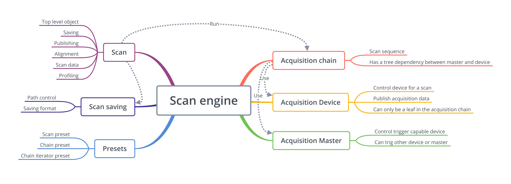

The *Scan engine* is build around several object which has defined roles.

  * [Scan](scan_engine_scan.html) top level object
  * [Scan saving](gs_presentation.html#scan-saving) file management.
  * [Acquisition chain](scan_engine_acquisition_chain.html) define trigger sequencing
  and master slave dependencies
  * [Acquisition master/devices](scan_engine_acquisition_master_and_devices.html)
  define device trigger and data biaviour of base devices.
  * [Preset](scan_engine_preset.html) hook to control scan encironnement.

## Schema

