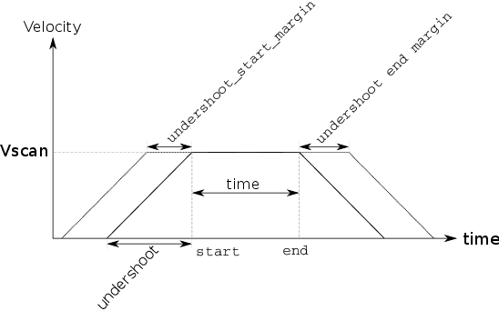
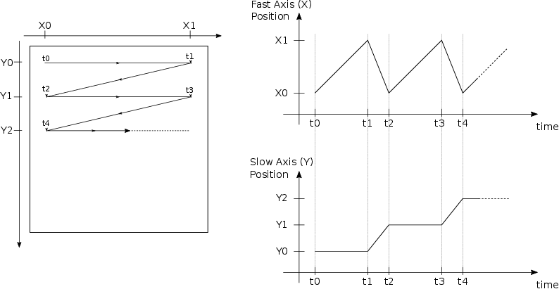
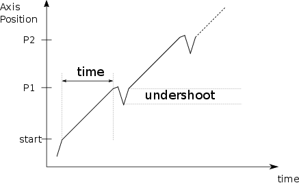

Those objects describe the behavior you need in a scan of basic device
(axis, counters...) in therm of triggering and data flow. Those objects
can be:

* `master` means that can trigger other device
* `device` any data producer device

## Master

### motors

The exhaustive list of *motor master* are available in
`bliss.scanning.acquisition.motor`

#### MotorMaster


```python
from bliss.scanning.acquisition.motor import MotorMaster
master = MotorMaster(axis, # axis you want to drive
                     start,
                     end,
                     time=0,
                     undershoot=None, # leave it to None to let it calculated
                     undershoot_start_margin=0,
                     undershoot_end_margin=0,
                     backnforth=False)
```

* Drives one motor from a `start` position to a `end` position at
a constant speed.

* If `undershoot` is None, it is calculated according
the acceleration of the motor.

* `undershoot_start_margin` and `undershoot_end_margin` can be
added to the calculated **undershoot**.

* `backnforth` option will do every even motions in one direction and
  odd motions in the other direction.



#### SoftwarePositionTriggerMaster

* Drives the axis the same way as the `MotorMaster`.
* Sends a software trigger to slaves for each step position between
  *start position* and *end position*

$$ step = (start + end)/npoints $$


```python
from bliss.scanning.acquisition.motor import SoftwarePositionTriggerMaster
master = SoftwarePositionTriggerMaster(
      axis,
      start,
      end,
      npoints=1, #number of trigger between start and end position
      time=0,
      undershoot=None, # leave it to None to let it calculated
      undershoot_start_margin=0,
      undershoot_end_margin=0,
      backnforth=False)

```
#### JogMotorMaster

On some motor controller, to reach the top speed, you need to drive it
in *speed* instead of *position*.  You may need this master to achive
that.  This master helper will calculate for you the **undershoot**
needed to reach the `jog_speed` at the `start` position. In case
of margin, just *add* or *subtract* the position value to your start
position.

* `jog_speed` is sign to control the rotation clockwise or
counterclockwise.

* To end the movement:
  * either you *stop* externally the axis
  * or you may provide a  `end_jog_function` function which will be called
during the motion. The return of this function will end the movement
if it does not return `True`.

```python
from bliss.scanning.acquisition.motor import JogMotorMaster

def end_jog_function(axis):
    """
    This function will ends the movement if returns != True.
    """
    return axis.position < 720.

master = JogMotorMaster(axis,
                        start,
                        jog_speed,
                        end_jog_function=end_jog_function)
```

#### MeshStepTriggerMaster

Control from 2 to n motors to drive them during a mesh step scan.
This master will build a position *grid* for all axis.
Arguments passed to this object is a list of:
**axis**,**start_position**,**end_position**,**nb_points**.

i.e: a 2D mesh can be written as follow:

```python
from bliss.scanning.acquisition.motor import MeshStepTriggerMaster
master = MeshStepTriggerMaster(axis1,0,1,5,
                               axis2,-1,1,10)
```

In this example **axis1** will be the fast axis => it will move on any
step. **axis1** will be move every 5 steps...
In short **axis1** is the column axis and **axis2** is the line axis.

for a 3D mesh:

```python
from bliss.scanning.acquisition.motor import MeshStepTriggerMaster
master = MeshStepTriggerMaster(axis1,0,1,5, # fast axis
                               axis2,-1,1,10,
                               axis3,-2,2,20) # slowest axis
```

**backnforth** can be activated to do a *snake style* mesh. i.e: in a
case of 2D mesh odd lines are scanned in one direction and even are
scanned in the other direction.

####LinearStepTriggerMaster

Drive axis across a n dimensional line like `anscan` command. Argument of the master are:

* first argument the **number of points**
* then a triplet with **axis** instance follow by the **start position** and the **end position**

To drive two axis here is an example:

```python
from bliss.scanning.acquisition.motor import LinearStepTriggerMaster
nb_points = 20
master = LinearStepTriggerMaster(nb_points,
                                 axis1,0,10,
                                 axis2,-1,1)
```

####VariableStepTriggerMaster

Generic motor master for arbitrary step by step acquisition.
Positions are provided via a iterable object like list, numpy array...
Argument for this master is a couple of **axis** followed by an
iterable position object.

!!! note
    All motors should have the same amount of positions.

Here is a example to do a arc scan of 90 points from -45 deg to 45 deg with *rayon*
of 5 with first axis **X** and second axis **Y**.

```python
import numpy
from bliss.scanning.acquisition.motor import VariableStepTriggerMaster
rayon = 5
angles = numpy.linspace(-45,45,90)
x_positions = rayon * numpy.cos(numpy.deg2rad(angles))
y_positions = rayon * numpy.sin(numpy.deg2rad(angles))
master = VariableStepTriggerMaster(X, x_positions,
                                   Y, y_positions)
```

####CalcAxisTrajectoryMaster

When real axis of a calculation axis have a motor controller with trajectory
capable, you can use this master to automatically calculate trajectory
of real motors. It has the same behavior of the `MotorMaster` but on a
calculation axis => constant speed on the calculation axis.

```python
from bliss.scanning.acquisition.motor import CalcAxisTrajectoryMaster
master = CalcAxisTrajectoryMaster(calc_axis,
                                  start, #start position
                                  end, #end position
                                  nb_points, # nb sampling point for trajectory
                                  time_per_point)
```

!!! warning
    **nb_points** define the sampling for the final trajectory. This will determine it's **precision**.
    It will be the number of points loaded into the motor controller.

####MeshTrajectoryMaster

This master control 2 axis to program a mesh trajectory on a motor controller capabale.



```python
from bliss.scanning.acquisition.motor import MeshTrajectoryMaster
master = MeshTrajectoryMaster(
   X,     # axis instance for colums
   X0,    # first column position
   Xend,  # last column position
   nb_columns, # number of point on column
   Y,    #axis instance for lines
   Y0,   # first line position
   Yend, # last line position
   time_per_point,
   undershoot = None,  # if None calculate it with the axes acceleration
   undershoot_start_margin=0, # margin before 1st column position for each line
   undershoot_end_margin=0    # margin at the end of each line)

```

!!! note
    `undershoot`, `undershoot_start_margin` and `undershoot_end_margin` are
    for each line of the mesh. Same meaning as `MotorMaster`
    [variables](scan_engine_acquisition_master_and_devices.md#motormaster).

#### SweepMotorMaster

Main usage of this master is to deal with a camera with a high *dead
time*. This dead time prevents you to acquire images during only one
motion (like `MotorMaster`) because the gaps between images are to
high. This master splits a continous motion into several, basically one
motion per image. Final motion looks like:



One the first iteration, the motion is at constant speed between
**start** position and *P1*, then the second iteration rewind the axis
and restart an other motion and reach the constant between *P1* and
*P2*... and so one until `end` position.  The number of movement is
defined by the `npoints`. `time` defines the elapsed time between points.

```python
from bliss.scanning.acquisition.motor import SweepMotorMaster
master = SweepMotorMaster(
    axis,  # axis instance
    start, # first point position
    end,   # last point position
    npoints=1, # number of points (images)
    time=0,    # see above schema
    undershoot=None, # if None calculated with axis acceleration
    undershoot_start_margin=0,
    undershoot_end_margin=0)
```

!!! note
    `undershoot`, `undershoot_start_margin` and `undershoot_end_margin` are
    for each point (images). Same meaning as `MotorMaster`
    [variables](scan_engine_acquisition_master_and_devices.md#motormaster).

###lima

##Device

